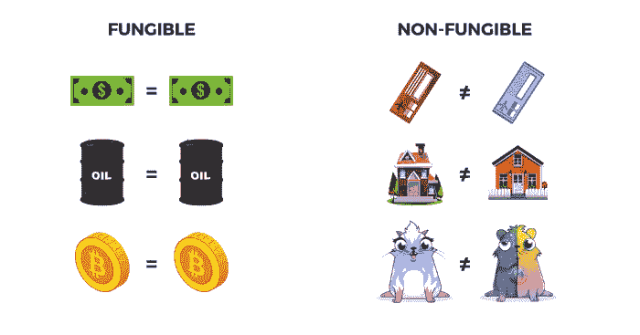

# CSC 学校:可替代物和不可替代物令牌#8

> 原文：<https://medium.com/coinmonks/csc-school-fungibles-and-non-fungibles-tokens-8-4930cec3b287?source=collection_archive---------81----------------------->

正如我们在之前的讲座中提到的，CSC 是一个基于 EVM 的区块链，这意味着它是一个多用途的平台。智能合约将在以太坊虚拟机上执行。有一些智能合约，现在我们想谈谈可替代物和非可替代物令牌。

## 可替代令牌

由于去中心化、安全性、不变性，区块链被认为是管理所有类型数字资产的完美技术。但是有了这样的可互换令牌，这是不可能的。这种代币对加密货币很有效，事实上，可替代性是任何货币的基本特征。

> 交易新手？在[最佳密码交易所](/coinmonks/crypto-exchange-dd2f9d6f3769)上尝试[密码交易机器人](/coinmonks/crypto-trading-bot-c2ffce8acb2a)或[复制交易](/coinmonks/top-10-crypto-copy-trading-platforms-for-beginners-d0c37c7d698c)

这种令牌是以这样的方式构建的，即令牌的每个部分都等价于下一个部分。例如，最受欢迎的加密货币比特币是可替代的，这意味着一个比特币等于一个比特币，它等于所有其他比特币。这种代币也被认为是可以互换和分割的。

简而言之，这些类型的加密令牌基本上是相同或统一的，可以与相同类型的其他可替换令牌互换，而不会出现任何问题。这种令牌与我们每天使用的东西相关，它适用于现实世界以及数字资产。

## **不可替换的令牌**

不可替换的令牌是代表独特的、可收集的项目的特殊令牌。它们是独一无二的，因为它们不能被其他相同类型的不可替换的令牌分割或完全改变。您可以将 NFT 视为不可替代的令牌，它为使用区块链技术提供了各种独特的机会。Crypto Kitties 是最受欢迎的不可替换的可收集令牌的例子。

每只 CryptoKitty 都是独一无二的，没有两只 crypto kitty 是一样的；与 CET 等可替代资产不同，将 CryptoKitty 拆分成更小的部分、进行交易并重新组合以创建同等价值的 CryptoKitty 是不切实际的。

可替代和不可替代代币的概念在经济学中相当古老。早在罗马帝国时期，类似硬币的物品就开始交易，显然是作为妓院或赌博的代币。在中世纪，英国修道院使用被称为“修道院院长的钱”的代币来支付外国人提供的服务。

在 17 世纪到 19 世纪之间，在不列颠群岛和北美进行贸易的商人经常使用可替换的代币——它们代表一种在国家硬币稀缺时可以兑换商品的抵押品。

快进到更近的时代，街机游戏和赌场吃角子老虎机开始使用可与金钱互换的可替换代币。其他类似的代币用于洗车、停车场或公共电话亭等服务。

在加密时代，令牌的概念保持不变:在其生态系统中有形(物理)或无形(非物理，即服务)的表示。

## 可替代和不可替代的区别是什么

现在，我们已经了解了这两种类型的令牌是什么，让我们了解两者之间的根本区别。

正如我们已经提到的，这种代币是可以互换的，并且可以与其他同类代币互换。例如，法定货币是可以互换的。例如，50 美元纸币可以与其他 50 美元纸币互换。同样，一个比特币的价值可以与其他比特币进行交换，这对持有者来说没有区别。

**不可替换不可互换** 与可替换令牌不同，此类令牌不可互换，因为它们不能被同类型的不可替换令牌替换。

**可替换代币是可分割的** 这些代币可以被分割成更小的单位，一个人可以得到任意数量的单位，只要价值不变，持有者就无所谓。

**不可替代的代币是不可分割的** 这些代币在任何意义上都是不可分割的。

**可替换令牌是统一的** 每个令牌都不同于同类型的所有其他令牌。

**不可替代的是唯一的**

每种类型的所有令牌在规范上都是相同的，并且每个令牌都是彼此相同的。

> 加入 Coinmonks [电报频道](https://t.me/coincodecap)和 [Youtube 频道](https://www.youtube.com/c/coinmonks/videos)了解加密交易和投资

# 另外，阅读

*   [如何购买 Monero](https://coincodecap.com/buy-monero) | [IDEX 评论](https://coincodecap.com/idex-review) | [BitKan 交易机器人](https://coincodecap.com/bitkan-trading-bot)
*   [CoinDCX 评论](/coinmonks/coindcx-review-8444db3621a2) | [加密保证金交易交易所](https://coincodecap.com/crypto-margin-trading-exchanges)
*   [红狗赌场评论](https://coincodecap.com/red-dog-casino-review) | [Swyftx 评论](https://coincodecap.com/swyftx-review) | [造币厂评论](https://coincodecap.com/coingate-review)
*   [Bookmap 评论](https://coincodecap.com/bookmap-review-2021-best-trading-software) | [美国 5 大最佳加密交易所](https://coincodecap.com/crypto-exchange-usa)