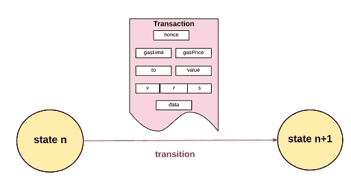

# CSC 学校:机制-1 #2

> 原文：<https://medium.com/coinmonks/csc-school-mechanism-1-2-4c076496b5ba?source=collection_archive---------28----------------------->

## 历史

在前一讲中，我们介绍了 CSC 网络。在这个讲座中，我们将讨论 CSC 的功能，但首先我们需要了解更多关于 CSC 的信息。

以太坊最初是由年轻程序员、《比特币》杂志的联合创始人维塔利克·布特林(Vitalik Buterin)提出的。他曾经在 2007-2010 年玩魔兽世界，然而，当暴雪决定从他最喜欢的术士的虹吸生命技能中移除伤害部分时，布特林非常沮丧，并彻底退出了游戏。

> 从顶级交易者那里复制交易机器人。免费试用。

2011 年，他偶然发现了比特币，并对这个想法非常着迷。他想正式投稿，于是开始写关于它的文章，每篇文章换几个比特币。2011 年末，他联合创办了《比特币》杂志，并全职研究加密技术。他周游世界考察各种加密项目，并意识到通过将图灵完全通用编程语言集成到区块链中，有可能概括这些项目中的大多数功能。

布特林试图说服比特币核心开发人员，包括其他项目的开发人员，区块链技术可以产生比货币交易更广泛的影响，区块链需要一种通用编程语言来配合它。但被现有项目拒绝后，他决定自己做。他继续前进，提议用图灵完全编程语言(Solidity)开发一个新的区块链平台，这就是我们所知的以太坊。

2014 年，该项目公开宣布，核心团队由 Vitalik Buterin、Mihai Alise、Anthony Di Iorio、Charles Hoskinson、Joe Lubin 和 Gavin Wood 组成。几个月后，该团队为以太令牌举行了首次硬币发行(ICO ),以资助开发。该团队筹集了超过 31，000 BTC，当时约为 1，800 万美元。然后他们建立了以太坊基金会，这是一个位于瑞士的非营利组织，其任务是在早期看到以太坊的开源开发。

CoinEx 成立于 2017 年 12 月，总部位于香港。它在 ViaBTC 集团下交易。目前，他们说他们在 100 多个国家和地区拥有 200 多万客户。该交流提供 15 种语言，包括中文、英文、日文、韩文、俄文等。

**杨海波**是 CoinEx 的创始人兼 CEO。他之前的经历包括就职于腾讯 TEG/微博和富途证券。来自强大的数学背景，他在 2016 年独立完成了 ViaBTC 采矿池的所有代码，然后在两个月后推出。之后，他继续建立了 CoinEx 交易所。团队的其他成员都在暗处，但该交易所的网站指出，CoinEx 的核心团队成员来自世界领先的互联网和金融公司，包括加密货币的最早采用者和专业人士，他们拥有丰富的全球运营和行业服务经验。

**CoinEx Chain** 是全球首个专为 DEX 设计的公共链。CoinEx Chain 旨在开发一个去中心化、社区驱动的交易系统，拥有自我管理的用户资产和透明的交易规则。除了 DEX Chain，CoinEx Chain 还将包括支持智能合约的智能链和保护用户隐私的隐私链。最终，CoinEx Chain 将成为一个由并行公共链架构驱动的完美生态系统。

CoinEx Chain 致力于打造下一代区块链金融基础设施。为了更好的实现这个目标， [Cionex 团队计划推出一个支持智能合约的公共链](https://coinexsmartchain.medium.com/announcement-on-the-upgrade-of-coinex-chain-to-coinex-smart-chain-7aa889535e1c):CoinEx 智能链(CSC)。2021 年 3 月 15 日，CoinEx 官方宣布，CoinEx Chain 将于 2021 年 6 月升级为 CoinEx Smart Chain (CSC)。

## 它是如何工作的？

我们讨论了 coinex 智能链的历史及其特点。该说说 CSC 工作机制了。

Coinex smart chain 是一个无权限、无层级的计算机(节点)网络，它在不断增长的一系列块或批量交易上建立并达成共识。每个块包含一个链的标识符，如果该块被认为是有效的，该标识符必须在该块之前。每当一个节点将一个块添加到它的链中时，它就按照它们被列出的顺序执行块中的事务，每个事务都可能改变 CET 余额和 CSC 账户的其他存储值。这些余额和值统称为状态，在 Merkle 树中独立于区块链在节点上维护。基本上，CSC 是基于状态的机器。

[https://www.coinex.net/block/0](https://www.coinex.net/block/0)

区块链发射时是从创世状态开始的。。区块链的第一个区块是**创世纪区块**

因为有数百万个事务，所以事务被分组在块中。因此得名。这些数据块以可加密验证的方式链接在一起，因此它们在历史上是可跟踪的。网络的当前状态可以在任何时候重新计算，方法是从源块开始，然后根据到目前为止每个块的信息转换状态。

## 结节

区块链网络通过计算机节点的对等分布式网络来自主管理。无需深入细节，您可以简单地将网络中的每个节点视为保存了一份全局事务分类帐。因此，每个节点可以单独验证和审计网络上发生的交易，并确保没有非法行为。

每个节点都与网络中相对较小的子集(对等节点)进行通信。每当一个节点希望在区块链中包含一个新的事务时，它就向它的每个对等节点发送一个事务的副本，然后对等节点向它们的每个对等节点发送一个副本，依此类推。这样，它在整个网络中传播。某些被称为挖掘器的节点维护着所有这些新事务的列表，并使用它们来创建新块，然后将这些新块发送给网络的其余部分。每当一个节点接收到一个块时，它就检查该块以及其中所有事务的有效性，如果它发现该块有效，就把它加到它的区块链中，并执行所有那些事务。因为块创建和广播是无许可的，所以节点可以接收竞争成为特定块的后继的多个块。该节点跟踪由此产生的所有有效链，并定期丢弃最短的链。

另一种类型的节点称为验证器节点，负责将网络上进行的新交易分组到一个块中，验证它们，并建议其他人将该块包括到全局分类帐中。采矿在计算上很难，而且安全地进行非常重要，所以区块被接受的矿工会因为他们的努力工作而得到象征性的奖励。

## 被推荐的

[以太坊是什么？](https://ethereum.org/en/what-is-ethereum/)

[Coinex 链条](https://www.google.com/url?sa=t&rct=j&q=&esrc=s&source=web&cd=&cad=rja&uact=8&ved=2ahUKEwjcufCC9pf8AhXM-aQKHXTKD_kQFnoECBkQAQ&url=https%3A%2F%2Fwww.coinex.com%2Ftoken&usg=AOvVaw0x3b5LzbrkHOH7qosqFZEg)

[点对点网络](https://en.wikipedia.org/wiki/Peer-to-peer)

> 加入 Coinmonks [电报频道](https://t.me/coincodecap)和 [Youtube 频道](https://www.youtube.com/c/coinmonks/videos)了解加密交易和投资

# 另外，阅读

*   [AscendEx Staking](https://coincodecap.com/ascendex-staking)|[Bot Ocean Review](https://coincodecap.com/bot-ocean-review)|[最佳比特币钱包](https://coincodecap.com/bitcoin-wallets-india)
*   [霍比审核](https://coincodecap.com/huobi-review) | [OKEx 保证金交易](https://coincodecap.com/okex-margin-trading) | [期货交易](https://coincodecap.com/futures-trading)
*   [网格交易机器人](https://coincodecap.com/grid-trading) | [Cryptohopper 审查](/coinmonks/cryptohopper-review-a388ff5bae88) | [Bexplus 审查](https://coincodecap.com/bexplus-review)
*   [7 个最佳零费用加密交易平台](https://coincodecap.com/zero-fee-crypto-exchanges)
*   [氹欞侊贸易评论](https://coincodecap.com/anny-trade-review) | [霍比保证金交易](/coinmonks/huobi-margin-trading-b3b06cdc1519)