# CSC 学校:机制-2 #3

> 原文：<https://medium.com/coinmonks/csc-school-mechanism-2-2-1ded058d7ae3?source=collection_archive---------63----------------------->

在前一部分，我们讨论了 coinex 智能链的核心。现在我们知道了 CSC 工作系统及其特点。但是我们必须知道船里发生了什么。我们需要先了解一些术语。

## 账户

包含地址、余额、随机数、可选存储和代码的对象。帐户可以是合同帐户或外部拥有的帐户(EOA)。

> 不知道什么时候买卖，试试[复制交易](http://coincodecap.com/go/bityard)。

## 地址

最常见的是，这代表一个可以在区块链上接收(目的地址)或发送(源地址)交易的 EOA 或合同。更具体地说，它是 ECDSA 公钥的 Keccak 散列的最右边的 160 位。

## 钱包

保存私钥的软件。用于访问和控制 CSC 帐户并与智能合同交互。密钥不需要存储在钱包中，而是可以从离线存储器(即存储卡或纸张)中检索，以提高安全性。尽管名字如此，钱包从来不储存真正的硬币或代币。

## 交易

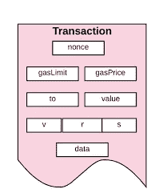

提交到 CSC 区块链的数据由发起帐户签名，目标是特定地址。该事务包含元数据，例如该事务的气体限制。

基本上，交易有以下几个重要部分:

1.  努恩斯
2.  听筒
3.  气体极限
4.  汽油价格
5.  价值
6.  数据

这是您使用 CSC 网络时需要支付的费用。示例包括从您的钱包或 dapp 互动发送资金，如交换代币或购买收藏品。你可以把这个想象成服务费。该费用将根据网络的繁忙程度而变化。这是因为负责处理你的交易的验证者可能会优先处理费用较高的交易，所以拥挤会迫使价格上涨。

网络调解交易的能力，任何参与方都不需要信任第三方。

## 街区

块是信息捆绑单元，包括交易和共识相关信息的有序列表。块由利害关系证明验证器提出，此时它们在整个对等网络中共享，在那里它们可以容易地被所有其他节点独立验证。共识规则控制块的哪些内容被认为是有效的，任何无效的块都被网络忽略。这些块的排序和其中的事务创建了一个确定性的事件链，其结束代表网络的当前状态。将确认的块传输到网络中所有其他节点的过程是块传播

## 块标题

块头是关于块的元数据的集合，是执行有效负载中包括的事务的摘要。

块可以存在的状态。可能的状态包括:

*   已建议:该块由验证程序建议
*   scheduled:验证程序当前正在提交数据
*   错过/跳过:提议者没有在合格时限内提议区块。
*   孤立的:该块被 fork choice 算法重组

## 第一步

第一步，我们需要安装一个钱包程序。如你所知，钱包是一个保存私人密钥的软件。用于访问和控制 CSC 帐户并与智能合同交互。

当你读这部分的时候，也许你正在使用网络浏览器。幸运的是，有一个很好的网络钱包叫做 Metamask。您可以从 [Metamask 官网](https://metamask.io)为您的浏览器下载 Metamask:

 [## 适用于 Defi、Web3 Dapps 和 NFTs | MetaMask 的加密钱包

### 一个安全的加密钱包的数字令牌和 NFTs。加入区块链和 DeFi 世界。

metamask.io](https://metamask.io/) 

当你第一次打开元蒙版时，你会看到类似下图的东西:

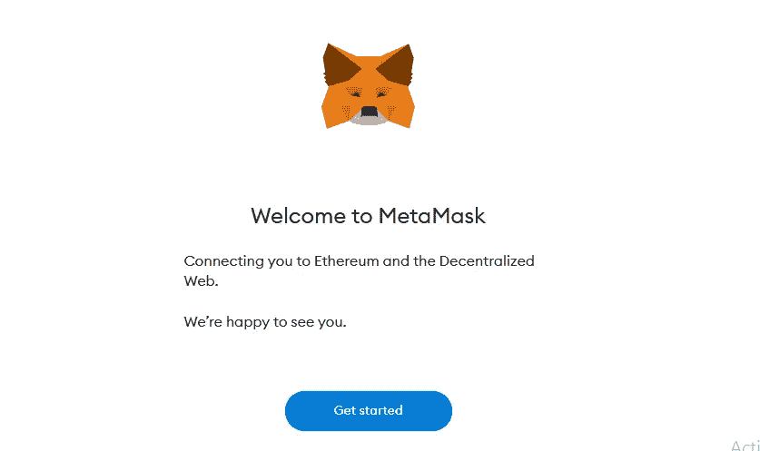

当您单击“开始”按钮时，您将转到隐私政策的条款和条件页面:

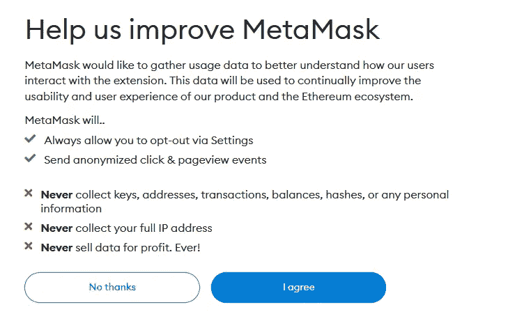

如果你想使用元掩码，你必须同意条款，所以点击“我同意”按钮。

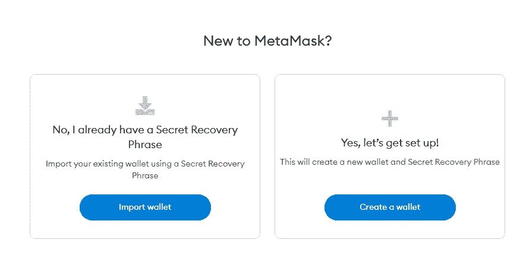

如果您已经有一个钱包，您可以点击“导入钱包”并输入您的种子短语:

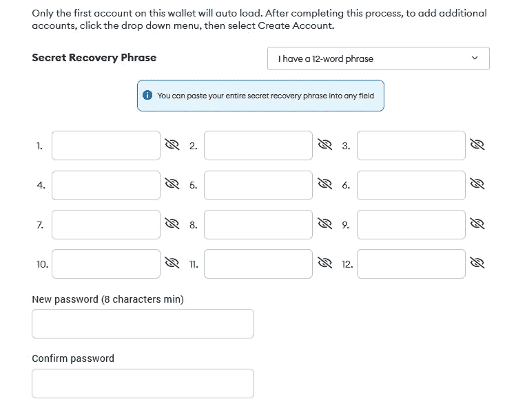

但是，如果您是加密新手，并且这是您第一次使用钱包，只需点击“创建钱包”:

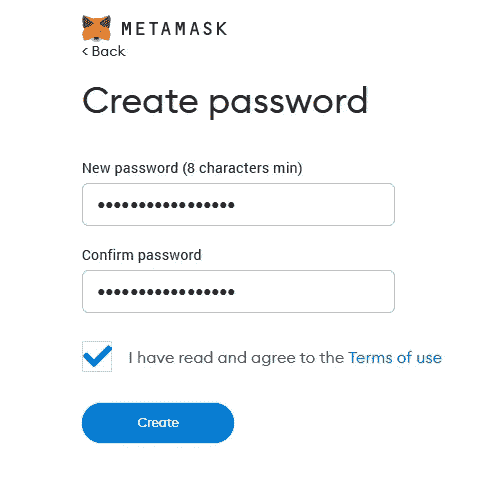

选择强密码并同意使用条款。恭喜你！您已经成功创建了加密钱包！

现在你会看到这样的东西:

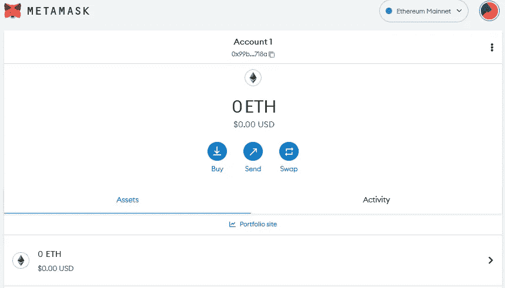

Metamask 不包含默认的 coinex 智能链，我们需要手动或自动添加。

要手动添加 CSC，请转到“设置”>“网络”>“添加网络”,然后单击页面底部的“手动添加网络”:

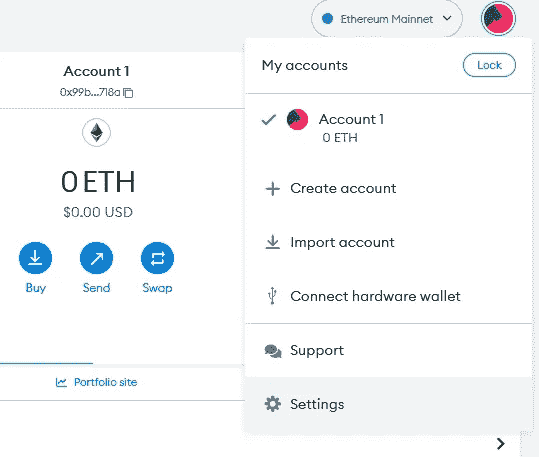

现在我们需要根据 [CSC 官方文件](https://docs.coinex.org/#/en-us/mainnet)输入 CSC 网络信息:

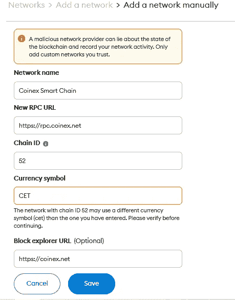

为了自动添加 CSC 网络，我们使用了[链表](https://chainlist.org/):

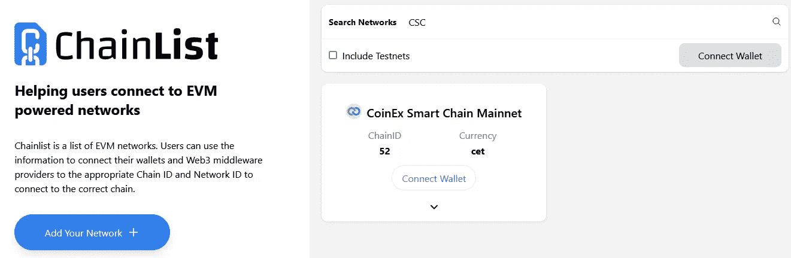

只需在“搜索网络”中搜索 CSC，然后单击“连接钱包”，它将在 Metamask 中添加 coinex 智能链 RPC 节点。

## 第二步

我们已经创建了我们的钱包，现在是在 CSC 上创建交易的时候了。但是我们需要知道什么是事务以及它是如何工作的？对于这个，我们使用 MyCrypto。

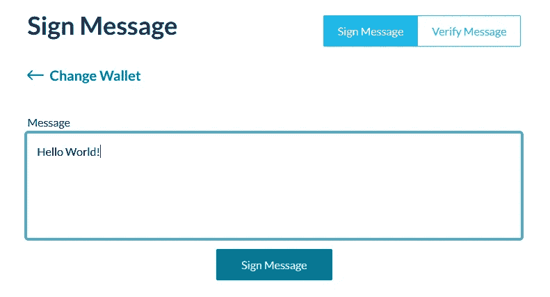

我们想用我们的钥匙签署一条信息。我输入“你好，世界！”签名。当我点击“签名邮件”时，它会要求 Metamask 用您的私钥签名此邮件。

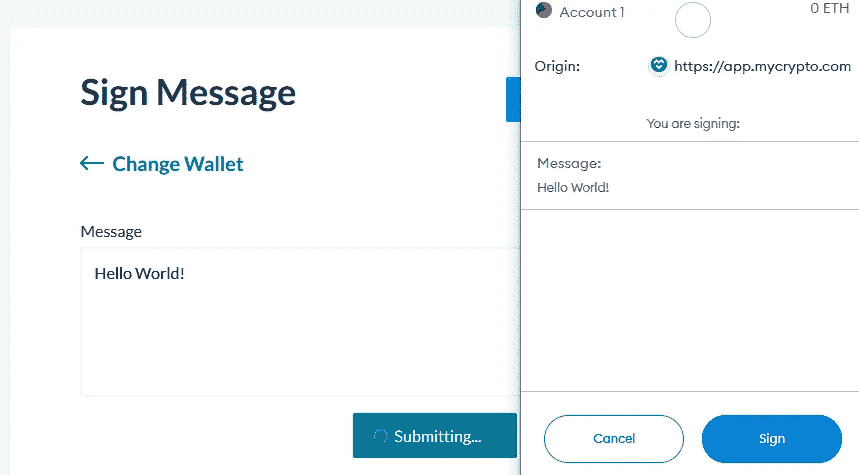

然后它会产生一个签名，看起来像这样:

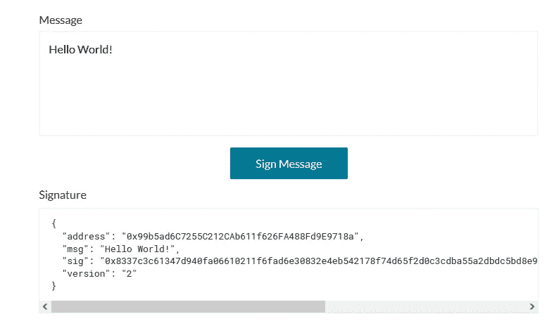

通过使用加密技术，我们现在可以验证这个消息。当我在信息框中签名时，它将验证我的身份:

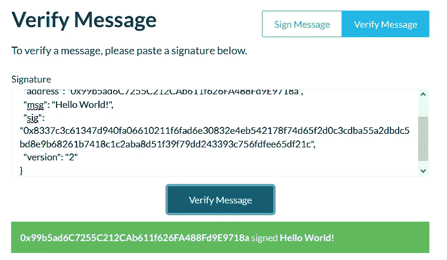

## 第三步

最后一步，我们将已签名的交易广播到网络。当您在 Metamask 中单击“发送”时，您的交易会这样进行:

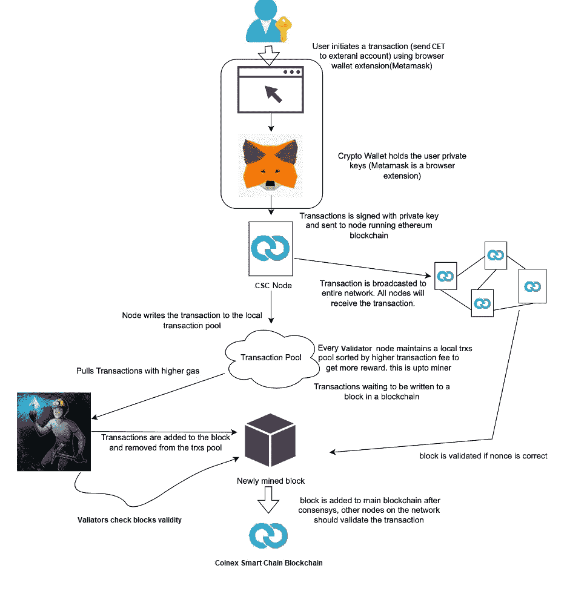

Metamask 作为客户端，通过将事务数据发送到 RPC 节点，将事务广播到网络。如果您的交易有效，它将被添加到 coinex 智能链区块链。

> 加入 Coinmonks [电报频道](https://t.me/coincodecap)和 [Youtube 频道](https://www.youtube.com/c/coinmonks/videos)了解加密交易和投资

# 另外，阅读

*   [霍比评论](https://coincodecap.com/huobi-review) | [OKEx 保证金交易](https://coincodecap.com/okex-margin-trading) | [期货交易](https://coincodecap.com/futures-trading)
*   [网格交易机器人](https://coincodecap.com/grid-trading) | [Cryptohopper 审查](/coinmonks/cryptohopper-review-a388ff5bae88) | [Bexplus 审查](https://coincodecap.com/bexplus-review)
*   [7 个最佳零费用加密交易平台](https://coincodecap.com/zero-fee-crypto-exchanges)
*   [氹欞侊贸易评论](https://coincodecap.com/anny-trade-review) | [火币保证金交易](/coinmonks/huobi-margin-trading-b3b06cdc1519)