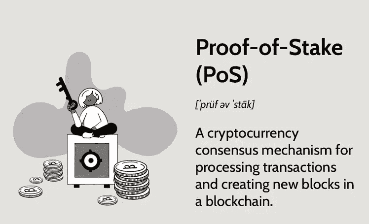
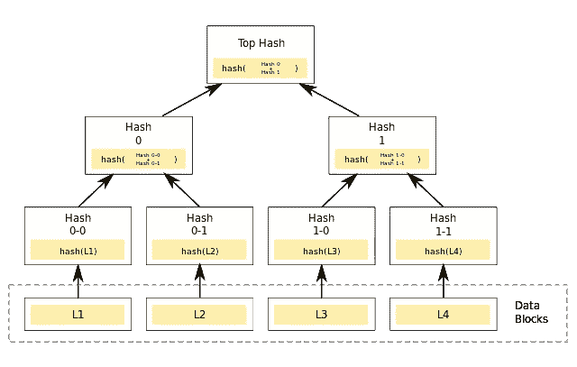

# CSC 学校:结构#5

> 原文：<https://medium.com/coinmonks/csc-school-structure-5-6ef6a695cac3?source=collection_archive---------53----------------------->

现在，我们知道了事务是如何创建并广播到网络的，但是节点是如何存储这些数据并更新状态的呢？在这一部分，我们将看看这个过程。

在上一部分中，我们确实创建了一个事务并广播到网络，我们应该知道 CSC 如何在块中验证事务并存储它们。

## 刷卡机

Source: Investopedia

股权证明是一种加密货币共识机制，用于处理交易和在区块链中创建新块。共识机制是一种用于验证进入分布式数据库的条目并保持数据库安全的方法。在加密货币的情况下，数据库被称为区块链，因此共识机制保护了区块链。

**特性**

*   借助赌注证明(POS ),加密货币所有者可以根据赌注硬币的数量来验证大宗交易。
*   利益证明(POS)是作为工作证明(POW)的替代方案而创建的，工作证明是用于验证区块链和添加新数据块的原始共识机制。
*   PoW 机制要求挖掘者解决密码难题，而 PoS 机制要求验证者持有和持有令牌以获得赚取交易费的特权。
*   就网络上的潜在攻击而言，利益证明(POS)被视为风险较低，因为它以一种使攻击不那么有利的方式来构建补偿。
*   区块链上的下一个块写入器是随机选择的，较高的概率被分配给具有较大股份位置的节点。

利益证明减少了验证数据块和交易所需的计算工作量。根据工作证明，它保证了区块链的安全。桩的证明改变了使用硬币所有者的机器来验证块的方式，因此不需要做太多的计算工作。所有者提供他们的硬币作为抵押品——赌注——以获得验证积木的机会，然后成为验证者。1

> **不知道什么时候买卖，试试** [**复制交易**](http://coincodecap.com/go/bityard) **。**

验证器是随机选择的，用于确认交易和验证块信息。该系统随机选择收费对象，而不是使用工作证明等基于奖励的竞争机制。1

要成为验证者，硬币所有者必须“下注”特定数量的硬币。例如，CSC 要求在用户可以成为验证者之前下注 1000 CET 块由多个验证者验证，并且当特定数量的验证者验证块是准确的时，它被最终确定并关闭。

Proof-of-stake 旨在减少网络拥塞和围绕工作证明(PoW)协议的环境可持续性问题。工作证明是一种验证交易的竞争性方法，它自然会鼓励人们寻找获得优势的方法，特别是因为涉及到货币价值。

比特币矿工通过验证交易和区块来赚取比特币。然而，他们用法定货币支付电费和租金等运营费用。那么真正发生的是，矿工正在用能源交换加密货币，这导致电力开采使用的能源和一些小国一样多。4

PoS 机制试图通过有效地用赌注代替计算能力来解决这些问题，由此个人的挖掘能力被网络随机化。这意味着能源消耗应该会大幅减少，因为矿商再也不能依靠大规模单一用途硬件农场来获得优势。

## 股权证明证券

长期以来被吹捧为加密货币粉丝的威胁，当使用 PoS 时，51%的攻击是一个问题，但怀疑它会发生。根据 PoW，51%攻击是指一个实体控制网络中超过 50%的矿工，并使用这一多数来改变区块链。在 PoS 中，一个团体或个人必须拥有 51%的赌注加密货币。

控制 51%的赌注加密货币是非常昂贵的。在以太坊的 PoS 下，如果发生了 51%的攻击，网络中诚实的验证者可以投票忽略被改变的区块链并烧掉攻击者的 staked ETH。这激励验证者善意地采取行动，以有利于加密货币和网络。

PoS 的大多数其他安全功能都没有公布，因为这可能会为规避安全措施创造机会。然而，大多数 PoS 系统都有额外的安全功能，增加了区块链和 PoS 机制的内在安全性

## CPOS

虽然`Proof of Work (PoW)`已经被证明是一种实用的分散式网络解决方案，然而它并不环保，并且需要大量的参与者来维护网络安全。

另一方面，以太坊和其他一些网络在不同场景下使用`Proof of Authority (PoA)`或其变体，包括测试网络和主网络。`PoA`防御 51%攻击，更有效防止一些拜占庭节点作恶。然而，`PoA`协议不够分散，因为验证者拥有极大的权力，容易受到腐败和安全攻击。

因此，一些区块链项目在不牺牲去中心化的前提下，引入了其他的共识方案，如 EOS 和 Cosmos 采用的`DPoS`，允许令牌持有者投票选举验证者节点，使区块链更加去中心化，有利于社区管理。

CoinEx 团队经过严谨的调查研究，坚持去中心化的原则，结合`PoS`和`PoA`的特点，实现`CPoS`，又不失网络稳定性和安全性。`CPoS`的特点如下:

1.  生成的块最多有 101 个验证器节点。
2.  任何人都可以在没有任何许可的情况下通过下注`CET`成为验证者。
3.  验证器轮流生成块。当验证器节点正常产生块时，难度为 2；当验证器节点不按预定顺序产生块时，难度降为 1；当方块分叉时，会系统地选择难度最大的链。
4.  任何人都可以为他们信任的验证器下注。

## Merkle 树

Merkle Tree

**Merkle tree** 是这样一种树，其中每个“叶子”(节点)用数据块的加密散列来标记，并且每个不是叶子的节点(称为*分支*、*内部节点*或*索引节点*)用其子节点的标签的加密散列来标记。散列树允许对大型数据结构的内容进行高效和安全的验证。哈希树是哈希列表和哈希链的概括。

证明叶节点是给定二进制散列树的一部分需要计算与树中叶节点数量的对数成比例的散列数量。相反，在哈希表中，数量与叶节点本身的数量成正比。因此，Merkle 树是加密承诺方案的有效示例，其中树的根被视为承诺，并且叶节点可以被揭示并被证明是原始承诺的一部分。

散列树可用于验证在计算机中和计算机之间存储、处理和传输的任何类型的数据。它们可以帮助确保从对等网络中的其他对等体接收的数据块被无损且未被更改地接收，甚至检查其他对等体没有撒谎和发送假块。

散列树是散列树，其中叶(即叶节点，有时也称为“叶”)是例如文件或文件集内的数据块的散列。树中更高的节点是它们各自子节点的散列。例如，上图中的 *hash 0* 是将*hash 0–0*和*hash 0–1*串联散列的结果。即*哈希 0* = *哈希* ( *哈希 0–0*+*哈希 0–1*)，其中“+”表示串联。

大多数散列树实现是二进制的(每个节点下有两个子节点)，但是它们也可以在每个节点下使用更多的子节点。

通常，诸如 SHA-2 的加密散列函数被用于散列。如果哈希树只需要防止意外损坏，可以使用不安全的校验和，如 CRC。

在哈希树的顶端有一个*顶哈希*(或*根哈希*或*主哈希*)。在 P2P 网络上下载文件之前，在大多数情况下，顶部散列是从可信源获得的，例如，已知具有下载文件的良好推荐的朋友或网站。当顶层散列可用时，可以从任何不可信的源接收散列树，如 P2P 网络中的任何对等体。然后，将接收到的哈希树与可信的顶层哈希进行核对，如果哈希树被破坏或伪造，将尝试来自另一个源的另一个哈希树，直到程序找到与顶层哈希匹配的哈希树。

与哈希列表的主要区别在于，一次可以下载哈希树的一个分支，并且可以立即检查每个分支的完整性，即使整个树还不可用。例如，在图中，如果树已经包含*散列 0–0*和*散列 1* ，则可以立即验证*数据块 L2* 的完整性，方法是对数据块进行散列，并迭代地将结果与*散列 0–0*和*散列 1* 进行组合，最后将结果与*顶部散列*进行比较。类似地，如果树已经具有*散列 1–1*和*散列 0* ，则可以验证*数据块 L3* 的完整性。这是一个优点，因为将文件分割成非常小的数据块是有效的，这样，如果文件损坏，只需重新下载小数据块。如果散列文件很大，这样的散列列表或散列链会变得相当大。但如果是树，可以快速下载一个小分支，检查分支的完整性，然后开始下载数据块。

> *加入 Coinmonks* [*电报频道*](https://t.me/coincodecap) *和* [*Youtube 频道*](https://www.youtube.com/c/coinmonks/videos) *了解加密交易和投资*

# 另外，阅读

*   [Bookmap 评论](https://coincodecap.com/bookmap-review-2021-best-trading-software) | [美国 5 大最佳加密交易所](https://coincodecap.com/crypto-exchange-usa)
*   [加密交易机器人](/coinmonks/crypto-trading-bot-c2ffce8acb2a) | [造币评论](https://coincodecap.com/coingate-review)
*   最佳加密[硬件钱包](/coinmonks/hardware-wallets-dfa1211730c6) | [Bitbns 评论](/coinmonks/bitbns-review-38256a07e161)
*   [新加坡十大最佳加密交易所](https://coincodecap.com/crypto-exchange-in-singapore) | [购买 AXS](https://coincodecap.com/buy-axs-token)