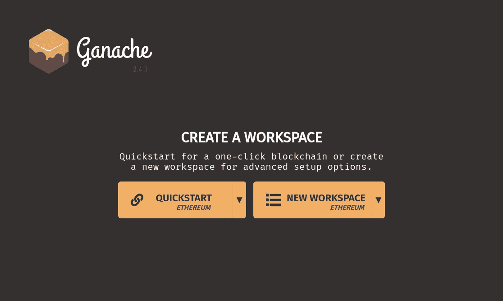
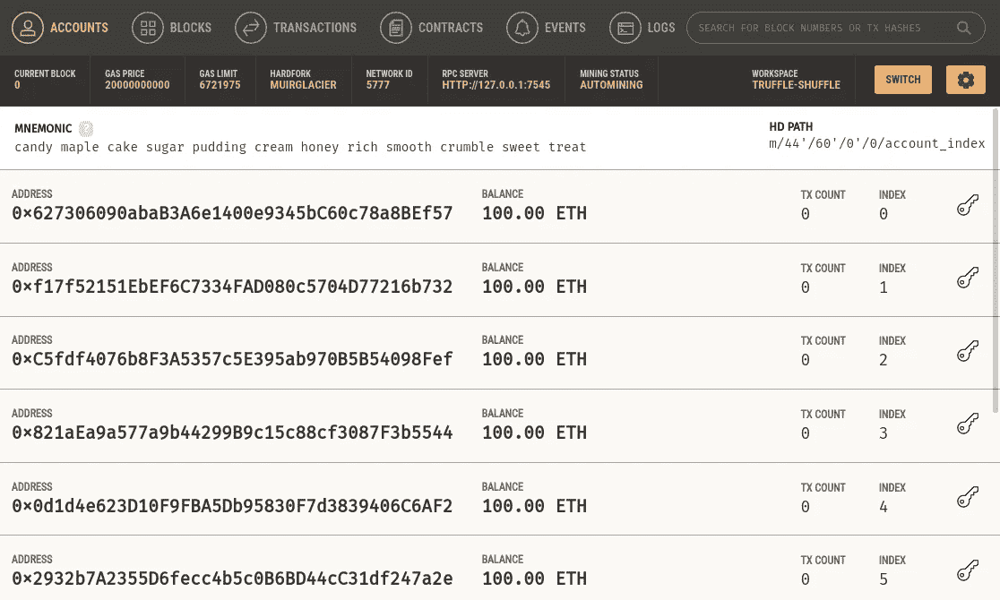
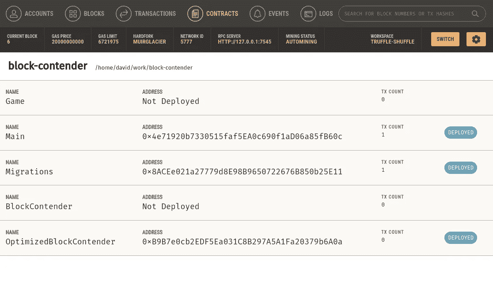
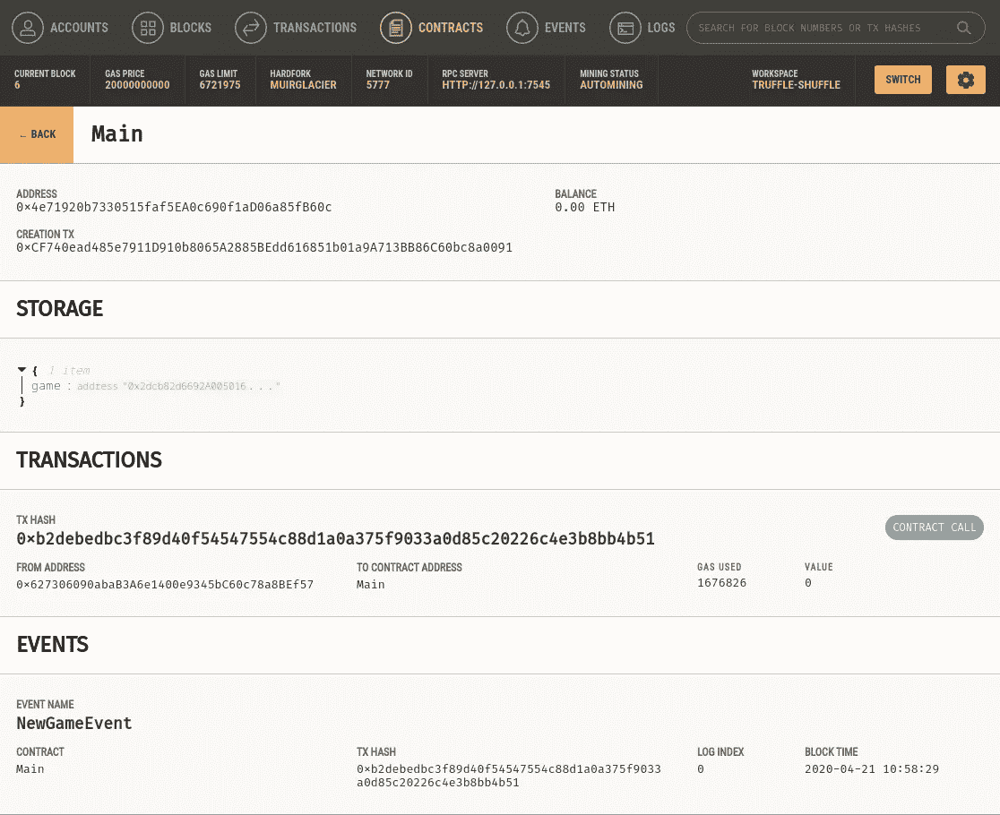
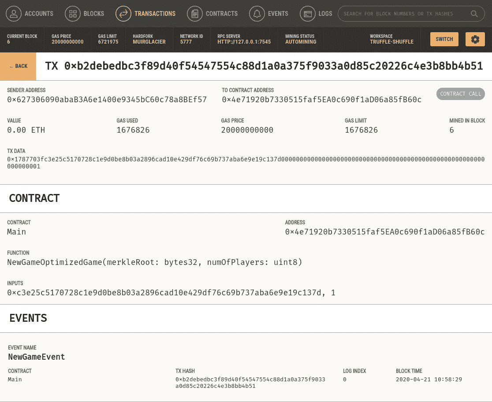

# 使用 Ganache 开发 CSC 智能合同

> 原文：<https://medium.com/coinmonks/csc-smart-contract-development-using-ganache-ae3973b5698f?source=collection_archive---------35----------------------->

您是否尝试过使用基于 GUI 的以太坊开发应用程序来部署您的智能合约？我们过去讨论过安全帽和块菌。在本教程中，我们将回顾 Ganache 并了解更多。我们可以在本地主机中使用 Ganache 在测试网部署之前测试我们的智能契约。

## 加纳切

[Ganache](https://trufflesuite.com/ganache) 是一款快速以太坊和 Corda 分布式应用开发的个人区块链。您可以在整个开发周期中使用 Ganache 使您能够在安全确定的环境中开发、部署和测试 dApps。

Ganache 有两种风格:UI 和 CLI。Ganache UI 是一个桌面应用程序，支持以太坊和 Corda 技术。我们更健壮的命令行工具 [ganache](https://github.com/trufflesuite/ganache) ，可用于以太坊开发。它提供:

*   `console.log`坚固
*   零配置 Mainnet 和 testnet 分叉
*   分叉任何以太坊网络，无需等待同步
*   以太坊 JSON-RPC 支持
*   快照/恢复状态
*   我会根据需要或间隔一段时间立即进行封锁
*   快进时间
*   模拟任何帐户(不需要私钥！)
*   通过 HTTP/WebSockets 监听 JSON-RPC 2.0 请求
*   Node.js 中的编程用法
*   待定交易

## 装置

[下载](https://github.com/trufflesuite/ganache/releases)适合您操作系统的版本:

*   视窗:`Ganache-*.appx`
*   麦克:`Ganache-*.dmg`
*   Linux: `ganache-*.AppImage`

接下来，双击下载的文件，按照提示操作，您就可以开始运行了。

## 工作空间

当你第一次打开 Ganache 时，你会看到主屏幕。在此屏幕上，系统会提示您加载现有工作空间(如果存在)、创建新的自定义工作空间或使用默认选项快速启动一键式区块链。现在，让我们开始快速启动工作空间。从`QUICKSTART`下拉菜单中选择所需的区块链；您可以选择启动以太坊节点或 Corda 网络，然后点击`QUICKSTART`按钮。

## 主接口

一旦你创建了一个工作区，屏幕会显示一些关于服务器的细节，还会列出一些账户。**每个账号赠送 100 乙醚**。在所有帐户中自动拥有 ether 可以让您专注于开发您的应用程序。

有六页可用:

*   **账户**显示生成的账户及其余额。这是默认视图。
*   **区块**显示在区块链开采的每个区块，以及使用的天然气和交易。
*   **事务**列出所有针对区块链运行的事务。
*   **合同**列出了包含在您工作区的块菌项目中的合同。有关 Ganache 如何处理合同的更多信息，请参见我们的合同页面文档。
*   **事件**列出了自该工作区创建以来触发的所有事件。Ganache 将尝试解码由您的松露项目中的合同触发的事件。有关事件的更多信息，请参见我们的事件页面文档。
*   **Logs** 显示服务器的日志，这对调试很有用。

另请注意，您可以从顶部的搜索框中搜索块号或事务散列。

## 合同页面

“新建合同”页面包含按项目列出的智能合同列表。我们一眼就能看到合同的名称、地址、交易数量和部署状态。

单击其中一个合同将显示有关该合同的更多详细信息，包括其创建事务、存储(状态)、事务和事件。

## 解码交易

Ganache 现在将尝试解码契约调用的事务。除了列出事务的事件(编码的或未编码的)，Ganache 还将显示事务的函数签名以及参数值。

**为什么我的交易没有被解码？**检查并确保您已经将相应的 Truffle 项目添加到与交易交互的合同中。

> 交易新手？尝试[加密交易机器人](/coinmonks/crypto-trading-bot-c2ffce8acb2a)或[复制交易](/coinmonks/top-10-crypto-copy-trading-platforms-for-beginners-d0c37c7d698c)