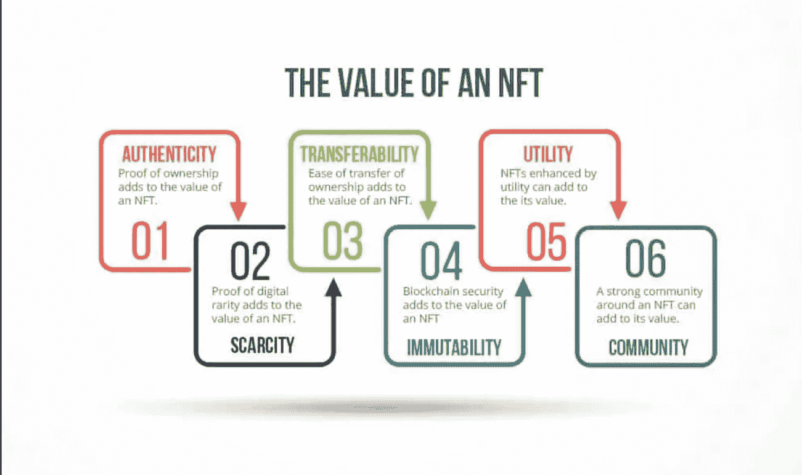

# CSC | NFT 市场

> 原文：<https://medium.com/coinmonks/csc-the-nft-market-68ca48846e8e?source=collection_archive---------31----------------------->

## 与 CSC 交易 NFT

随着区块链技术越来越受欢迎，并扰乱了数百个(如果不是数千个)行业，这项迷人的新技术的新用例每天都在涌现。该行业最广泛采用的功能之一是**不可替代令牌**，也称为 **NFT** 。

## **内容**

*   什么是 NFT？
*   NFTs 是如何工作的？
*   NFT 在 CSC
*   NFT 使用
*   如何购买 NFT 的
*   结果

## 什么是 NFT？

NFT(不可替代的代币)是一种数字资产，以艺术、音乐、游戏中的物品、视频等形式出现。可以通过其元数据中包含的独特品质来识别它。由于它们的设计和制造方式，非功能性测试是独一无二的，不能以任何方式替换、更改或改变。一旦它们被创造出来，它们将永久地铭刻在区块链的公共账本上，让所有人都可以看到。它们经常通过加密货币或另一种 NFT 在网上买卖，因为它们通常使用与许多加密货币相同的底层软件进行编码。

## NFT 是如何工作的？

NFTs 存在于区块链上，这是一种记录交易的分布式公共分类账。你可能最熟悉的是区块链，它是使加密货币成为可能的基础过程。

NFT 由代表有形和无形项目的数字对象创建或“铸造”,包括:

*   涂鸦艺术
*   gif
*   视频和体育集锦
*   收藏品
*   虚拟化身和视频游戏皮肤
*   名牌运动鞋
*   音乐

甚至推特也算。Twitter 联合创始人杰克·多西以 NFT 身份发布的第一条推文售价超过 290 万美元。

本质上，NFT 就像实物收藏家的项目，只是数字。因此，买家得到的不是挂在墙上的真正的油画，而是一个数字文件。

他们还获得独家所有权。NFT 一次只能有一个所有者，并且它们使用区块链技术使得在所有者之间验证所有权和转移令牌变得容易。创建者还可以在 NFT 的元数据中存储特定信息。例如，艺术家可以通过在文件中包含他们的签名来签署他们的作品。

## NFT 在 CSC

[CoinEx 智能链—](https://www.coinex.org/?lang=en_US) CSC 是一款高效的完全去中心化区块链。它为开发者提供了一个高效、低成本的链上环境，以极高的效率和极低的交易费用运行去中心化智能合约应用(DApps)和存储数字资产。

作为一个支持极高的每秒交易量(TPS)并同时将交易费用保持在较低水平的区块链，CSC 可以作为一个优秀的智能链生态系统来铸造、交易和存储 NFT。

***带着一种极度刻板的下属感去探索 ir 的区块链。你会剥夺 DeFi 的所有好处***

## NFT 使用

NFT 是用来做什么的？区块链技术和 NFT 为艺术家和内容创作者提供了一个独特的机会，将他们的商品货币化。例如，艺术家不再需要依赖画廊或拍卖行来出售他们的艺术作品。相反，艺术家可以直接将作品作为 NFT 卖给消费者，这也让他们获得更多的利润。此外，艺术家可以用版税编程，所以每当他们的作品卖给新主人时，他们都会收到一定比例的销售额。这是一个有吸引力的特征，因为艺术家通常在他们的作品首次售出后不会收到未来的收益。

艺术并不是用非艺术电影赚钱的唯一途径。Charmin 和 Taco Bell 等品牌已经拍卖了以 NFT 为主题的艺术品，为慈善事业筹集资金。Charmin 将其产品称为“NFTP”(不可替代的卫生纸)，Taco Bell 的 NFT 艺术在几分钟内就销售一空，最高出价为 3723.83 美元。

**NFT 用例**

*   **音乐**

音乐产业一直以来都在呼唤颠覆，而非功能性音乐技术为这个产业中的许多老问题提供了一个真正的解决方案。例如，由于 NFTs 中的智能合同功能，NFT 版税允许艺术家通过永久收取 1100%的版税来收回对其创意作品的完全控制权。

*   **艺术**

NFTs 最明显的用例是验证加密艺术品。由于其独特的识别能力，NFT 艺术家和投资者可以验证艺术品的真实性，并消除伪造的可能性。

*   **时尚**

高端时装公司正在进军 NFT 市场，销售有数字伴侣的实体商品。在虚拟世界和增强现实中，时尚和服装也有许多用例。

*   **元宇宙**

元宇宙是一个 NFT 兴旺的地方。在这些虚拟世界中，你可以在你自己的虚拟不动产中浏览、购买和存储 NFT。

*   **执照和证书**

NFT 非常适合许可和认证行业，因为它们可以用来验证大学资格和其他许可证。这再次消除了伪造和欺诈的可能性，这对雇主和组织极为有利。

*   **活动和票务**

活动和票务是另一个与伪造和假货作斗争的行业，一系列问题可以通过使用 NFT 来解决。

*   **游戏和数码收藏品**

最后但并非最不重要的一点是，区块链游戏和数字收藏品是 NFTs 被广泛采用的一些用例。随着数十亿游戏玩家在游戏中购买数字商品，NFT 为玩家提供了一种在他们购买商品的游戏的封装环境之外拥有他们的商品的方式，甚至提供了转移 NFT 以在不同的游戏/元宇宙中使用的可能性。

NFT 是区块链上独一无二的数字收藏品。这个特性使它们适合在游戏中作为角色、消耗品和其他可交易物品的代表。

NFT 游戏作为一种赚取收入的方式已经在游戏世界中流行起来。你可以将你的游戏内 NFT 出售给其他收藏者和玩家，甚至可以通过游戏赚取代币。

***NFT 游戏活跃在 CoinEx 智能链— CSC***

[NFT 游戏公司已经发展并开始提供游戏赚取模式。众所周知，Game-Fi 融合了金融和游戏世界，为玩家提供了在游戏中赚取收入的机会。参考我以前的文章了解更多。](/@kryptmystr/csc-p2e-changing-the-game-797ef6b5d790)

## 如何购买 NFT 的

如果你渴望开始自己的 NFT 系列，你需要获得一些关键物品:

首先，你需要一个数字钱包，让你可以存储 NFT 和加密货币。你可能需要购买一些加密货币，比如 CET。你可以在像 [CoinEx 交易所](https://www.coinex.com/)这样的平台上购买 crypto。然后你就可以把它从交易所转移到你选择的钱包里。

当你研究各种选择时，你会想把费用记在心里。当你购买密码时，大多数交易所至少收取你交易的一定比例，这就是为什么 CoinEx 是最好的选择，因为它以相对较低的费用提供快速交易。

## **热门的 NFT 市场**

一旦你有了自己的钱包和资金，NFT 就不缺购物网站。部分最大的 NFT 市场有:

*   **:这个点对点平台自称是“稀有数码产品和收藏品”的供应商要开始，你需要做的就是创建一个帐户来浏览 NFT 收藏。你也可以根据销量对作品进行分类，以发现新的艺术家。**
*   **[**one swap**:](https://www.oneswap.net/cet)one swap 是一种基于智能合约的全分散式交易协议，支持自动做市(AMM)和订单簿模式以及免许可令牌挂牌。通过内置的 OneSwap 钱包，它一站式提供各种服务，将用户交互提升到一个新的水平。**
*   **[**迷你乌托邦:**](https://miniutopia.co/) 迷你乌托邦是一个多连锁店的 NFT 市场，允许用户创建和交易 NFT。**
*   **[**字节块:**](https://byteblock.art/) 字节块艺术(Byteblock Art)是一个 NFT 交易市场，支持 NFT 的创作和交易。**
*   **[**Babylons:**](https://babylons.io/)Babylons 认为版税对于 NFT 生态系统的可持续发展至关重要。Babylons 是一个领先的 NFT 平台，你可以在这里上市、交易和赚钱。**
*   **[**smash cash:**](https://smashcash.io/#home)smash cash 是一个支持多链多币种匿名转账、私人元宇宙、NFT 交易市场的平台。**
*   **[**CSC 青蛙:**](https://cscfrogs.com/mint.html) CSC 青蛙是运行在 CSC 上的 NFT 青蛙铸造平台。NFT 的总供应量是 5000，每个都有对应的属性和稀有度。**

## **结果**

**随着元宇宙看起来正在被大众接受，艺术界正在经历某种程度的数字复兴，看起来 NFTs 在未来几年将在我们的社会中扮演越来越重要的角色。随着一些更大的参与者进入该领域，更多的投资涌入，看到创新以及如何采用 NFT 来克服现实世界的问题将是有趣的。**

> **交易新手？试试[加密交易机器人](/coinmonks/crypto-trading-bot-c2ffce8acb2a)或[复制交易](/coinmonks/top-10-crypto-copy-trading-platforms-for-beginners-d0c37c7d698c)**

****