# 带 Web 的 CSC

> 原文：<https://medium.com/coinmonks/csc-web3-9439ab9716f2?source=collection_archive---------61----------------------->

## WEB3 中的热门话题

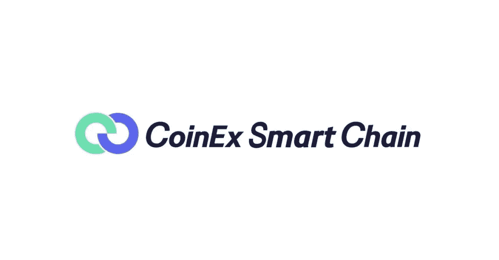

CSC

作为当今互联网的未来，WEB3 一直在创造新的趋势，在世界范围内引起了巨大的轰动。 **Web3 已经并正在重塑市场和各种商业领域，从医疗领域到房地产，DLT 证明了它提供了让生活变得轻松的终极解决方案**。Web3 支持去中心化，并由用户创建、运营和拥有。Web3 使用区块链、加密货币和 NFTs 以所有权的形式将权力还给用户。这是互联网创新的下一个阶段。

## WEB3 热门话题

*   Web3
*   区块链和 CSC
*   德克斯的
*   CET 和代币
*   挑战
*   NFT 的
*   虚拟空间
*   送到医院时已死亡
*   Web3 游戏
*   智能合同
*   投资

## 什么是 Web3

在一个非常基础的层面上，Web3 是互联网发展的第三个阶段。Web1 意味着阅读——web 2 是关于阅读和写作——web 3 是关于所有权。【Web3 背后的基本理念是，它将代表着从控制互联网内容并从中获利的大公司到通过 CSC 这样的分散网络共享内容和互动的个人创作者和消费者的转变。这些网络将依赖于开放协议，允许任何人连接和参与，并将权力从大公司转移到创造者和用户。

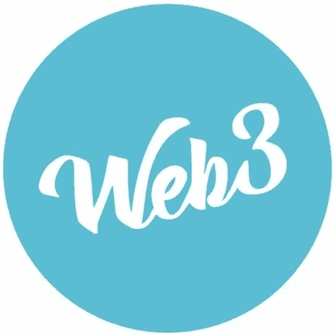

加密网络是开发社区拥有的网络的一种强有力的方式，并为第三方开发者、创造者和企业提供了一个公平的竞争环境。

## 区块链

区块链是一系列“块”或数据的共享账本——每个人都可以看到正在发生的事情和所有实时发生的交易。作为一个数据库，区块链以数字格式存储电子信息。

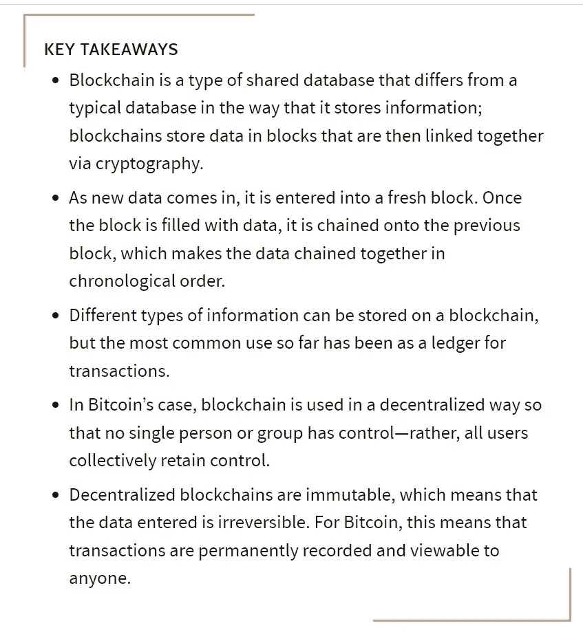

区块链的目标是允许数字信息被记录和分发，但不能被编辑。T4:这样，区块链就是不可变分类账的基础，即不能被修改、删除或销毁的交易记录。这就是为什么区块链也被称为分布式账本技术(DLT)。

从开发人员的角度来看，考虑一个永不宕机的后端，人们可以通过一个地址匿名看到你在做什么。你可以部署你的产品，并使用它来创建一个分散的应用程序，每个人都拥有他们所做的东西。区块链提供:

*   分散
*   无信任系统
*   安全性

## CoinEx 智能链— CSC

CSC 是一个非常坚实的区块链类型。CSC 是一个效率极高、交易费用极低的分散式网络。CoinEx 智能链为开发人员提供了一个高效、低成本的链上环境来运行分散式智能合约应用(DApps)和存储数字资产。该链成本低，这意味着使用该链和其上的平台是负担得起的。用户在使用它的功能之前不需要花很多油费。

CSC 与以太坊生态系统完美兼容。开发者可以方便地将 Dapp 迁移到 CSC，CSC 基于以太坊虚拟机(EVM)，使用成熟的开发工具，用户也可以快速访问 CSC 网络。

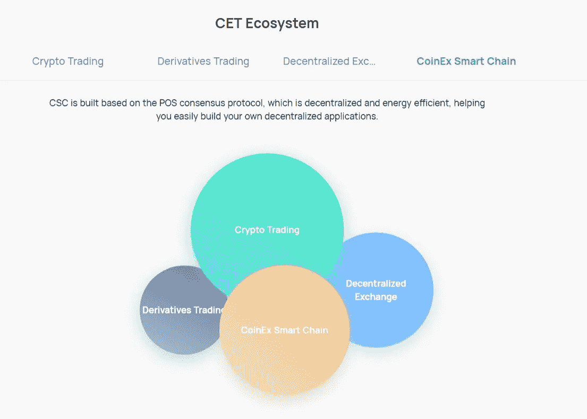

对于区块链的新用户来说，CSC 是完美的开始，因为它的用户朋友有一个交互式界面。随着越来越多的开发者创建去中心化的金融平台、NFT 生态系统、元宇宙功能等等，CoinEx 智能链的用例日益增多。开发人员喜欢这个链，因为它具有可伸缩性、开发工具、授权项目等等。CoinEx 智能链是创新之家。CSC 为开发 dapp 和撰写智能合同提供了一个可靠的环境，不仅提供了构建 dapp 的完美生态系统，CSC 还为开发人员在其网络上部署的项目支付费用，因为它旨在改进 web3 并帮助开发人员发挥他们的最大潜力。

## 分散交易所

分散交换又称 DEX 是允许人们直接相互交换加密令牌的交换。分散交易所使用智能合约(自动执行的协议)来促进个人之间的交易，但不控制他们的硬币。

dex 以三种方式处理这种情况:链上订单簿、链下订单簿或自动做市商方法。

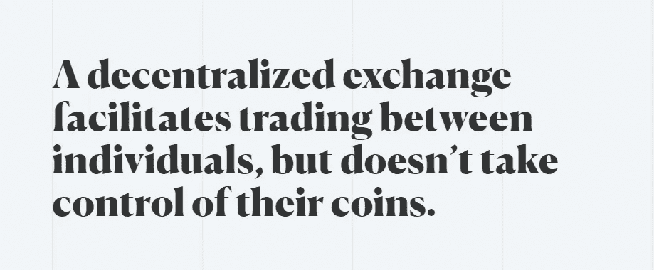

CoinEx 是 DEX 的一个例子。coinex 全球加密货币交易所是一个先进的 dex，因为 CoinEx 核心团队成员来自世界领先的互联网和金融公司，包括加密货币的最早采用者和专业人士，他们在全球运营和行业服务方面拥有丰富的经验。**CoinEx 凭借专有的交易撮合系统和卓越的用户体验，致力于为全球用户构建一个高度安全、稳定、高效的加密货币交易所**。

CoinEx Decentralized Exchange

## 大学英语和代币

**CET —** CoinEx Token (CET)作为基于 CoinEx 生态系统的增值服务和特权方案，是 CoinEx 智能链— CSC 的原生令牌。

CET 的主要功能是:

*   **作为验证者的块奖励**
*   **支付 CSC** 的天然气转让和合同调用费用
*   **支付在 CSC 上部署智能合同的交易费用**
*   **委托给选定的验证人**

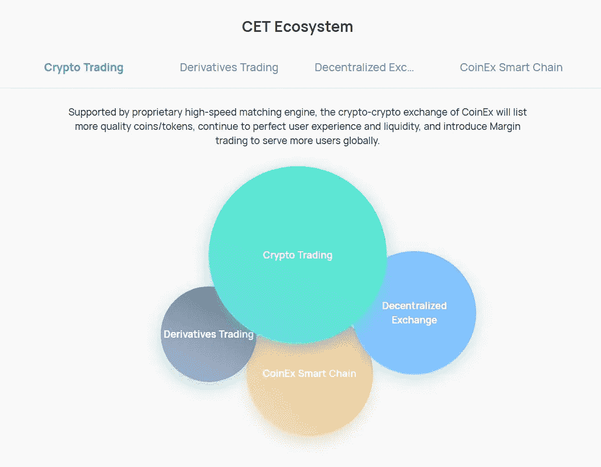

**代币**

从技术上讲，“代币”只是“加密货币”的另一种说法。“但随着语境的不同，它越来越多地呈现出几个更具体的含义

*   一个“代币”通常指除了比特币之外的**任何加密货币*。***(尽管比特币在技术上是代币)。因为比特币是最大的加密货币，所以有一个词来描述其他硬币的宇宙是很有用的。(你可能听到的另一个意思几乎相同的词是“altcoin”。)
*   “token”的另一个越来越常见的含义有一个更具体的内涵，**，它是指运行在另一种加密货币的区块链**之上的加密资产。如果你对分散金融感兴趣，你会遇到这种用法。而像 CET 这样的加密货币有自己专用的区块链。
*   第二类令牌**帮助去中心化的应用程序做任何事情，从自动利率到出售虚拟房地产。但是它们也可以像其他加密货币一样被持有或交易。这正是 CET 在 CSC 上的用例**

## 挑战

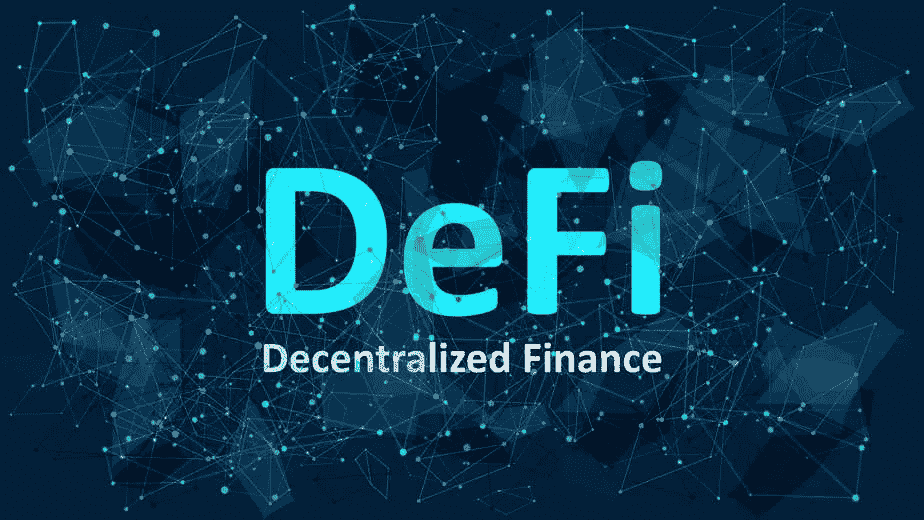

DeFi 或分散金融是一个运动，旨在建立一个新的金融系统，对所有人开放，不需要像银行这样的信任中介。为了实现这一点，defi 非常依赖加密技术、区块链和智能合约。

DeFi，即分散金融，指的是“利用区块链技术建立的金融应用生态系统，无需银行。”

DeFi(或“分散金融”)是公共区块链(CSC)金融服务的总称。有了 DeFi，你可以做银行支持的大部分事情——赚取利息、借款、贷款、购买保险、交易衍生品、交易资产等等——但它更快，不需要文书工作或第三方。与一般的加密一样，DeFi 是全球性的、点对点的(意味着直接在两个人之间进行，而不是通过一个中央系统进行路由)，匿名的，并且对所有人开放。

学习 Defi 的一个很棒的理由是，与传统的银行 0.01%的回报率相比，一些应用程序的 APY 回报率为 10-20%。想一想，你的钱会有 2000 多倍的回报吗？

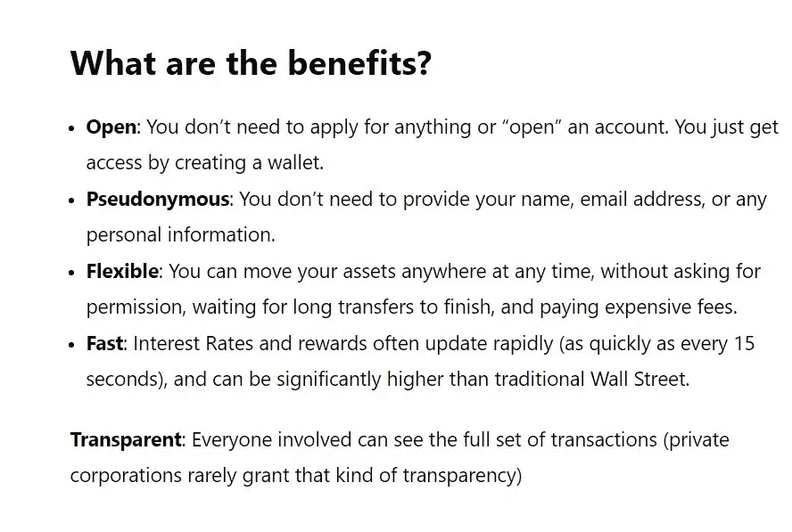

BENEFITS OF DEFI

## **NFT**

NFT 是一种数字资产，代表现实世界中的物体，如艺术、音乐、游戏中的物品和视频。它们经常与加密货币一起在网上买卖，并且它们通常用与许多加密货币相同的底层软件进行编码。

可替换的令牌可以互换(例如，美元、比特币)。不可替换令牌(NFT)是唯一的(例如，艺术、音乐、域名)。

NFT 不仅仅是图像。想想所有权。你拥有你的房子->你想卖掉它->每次你卖掉它->你会得到一些所有权使用费。现在想想拥有一件艺术品什么的。你卖了它，就能得到版税。

多年来，艺术家一直在出售他们制作的东西，但没有所有权。现在他们转向真正的粉丝，从他们的工作中赚更多的钱。

CSC 使得通过促进和支持 NFT 生态系统的各种 DApps 铸造和交易 NFT 成为可能。

## 虚拟空间

今天的一代人整天在手机上滚动，我们大部分时间在网上度过，下一代人将在互联网上花费更多的时间，因此元宇宙赋予互联网一种全新的互动性质。它为创新开辟了一个全新的行业。

元宇宙是一种数字现实，结合了社交媒体、在线游戏、增强现实(AR)、虚拟现实(VR)和加密货币的各个方面，允许用户进行虚拟互动。增强现实将视觉元素、声音和其他感官输入叠加到现实世界的设置中，以增强用户体验。相比之下，虚拟现实完全是虚拟的，增强了虚构的现实。

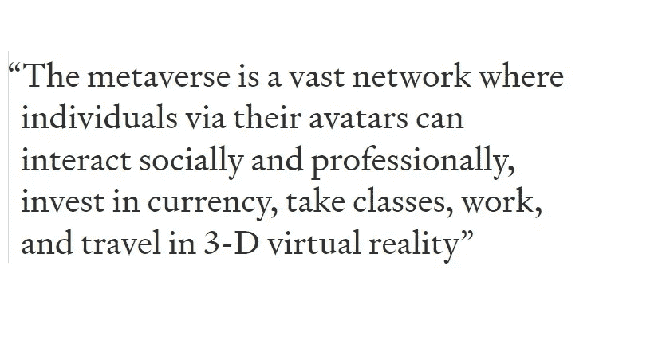

## 送到医院时已死亡

分权自治组织是一种新兴的法律结构形式。由于没有中央管理机构，一个"道"内的每个成员通常都有一个共同的目标，并试图以实体的最大利益行事。通过加密货币爱好者和区块链技术的普及，Dao 被用于以自下而上的管理方式做出决策。

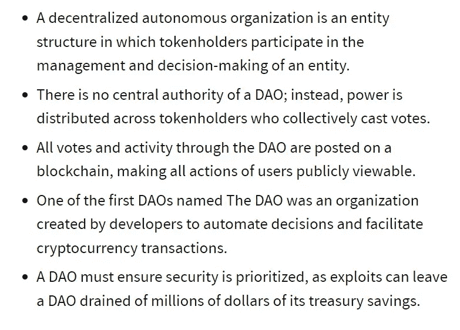

刀的跑路没有队长。这自动降低了腐败和其他不良行为的风险。

例 1:建造分散式稳定币的代币持有者能够管理系统，并对收费等参数进行投票。

我们也看到了迎合更具体投资机会的 Dao 的出现，例如拥有[【NFT】](https://linda.mirror.xyz/df649d61efb92c910464a4e74ae213c4cab150b9cbcc4b7fb6090fc77881a95d)艺术品和虚拟游戏项目。

有许多为创建和协调 DAO 而构建的工具，如 XDAO，在 [CoinEx 智能链-CSC](https://www.coinex.org/?lang=en_US)上推出，以帮助用户轻松创建 DAO。有了 XDAO，用户不再需要理解代码或者能够编写智能契约。相反，他们可以在不到一分钟的时间内通过 CSC 上的 XDAO 创建自己的 DAO，并探索更多的 DAO 函数

## Web3 游戏— P2E

游戏，是另一个拥有大量粉丝的热门领域。这是一个世界中的世界。你可以体验一种全新的环境和氛围。喜欢游戏的人总是寻找新的方法来使他们的游戏体验更加真实。游戏是一个广阔的领域，人们在虚拟世界中互动，相互竞争或一起玩。为了使整个过程安全可靠，必须有一个系统来确保这一点。区块链在这里发挥了作用。

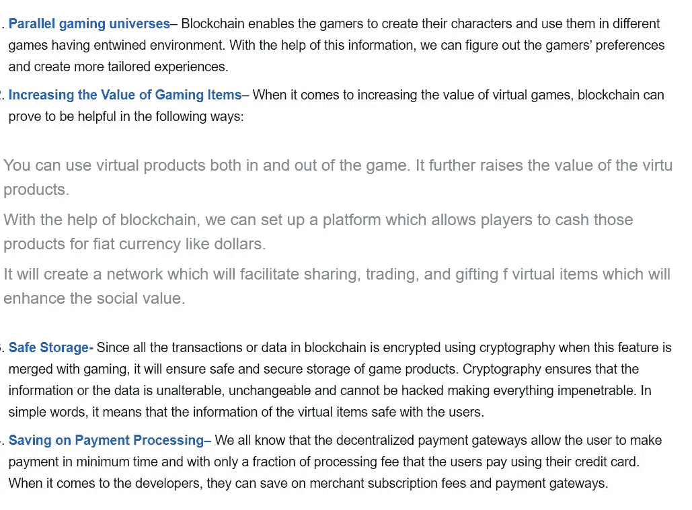

Effects of Blockchain Gaming.

P2E 和元宇宙奥运会的兴起是 2022 年最大的创新之一。游戏经常被描述为给 Web3 带来更多“正常人”的潜在突破案例。

P2E 简单地说就是为了赚钱而玩。欧米茄俱乐部是玩游戏赚钱的典型例子。欧米茄俱乐部是一种风格类似斯诺克的游戏，目标是尽可能将球送入对手的球门。玩家将根据他们的表现获得欧米茄代币奖励。欧米茄俱乐部可以通过 [CSC](https://www.coinex.org/dapp) 进入

## 智能合同

智能合约只是存储在区块链上的程序，在满足预定条件时运行。它们通常用于自动执行协议，以便所有参与者可以立即确定结果，而无需任何中介的参与或时间损失。他们还可以自动化工作流，在满足条件时触发下一个操作。

智能合约是所有分散式应用程序的构建块。就像你在 web2 应用中看到的用户认证、服务器、后端一样，智能合约是你需要添加的基本东西

学习智能合同开发意味着学习可靠性，这是背后的编程语言。

## 投资

加密市场是我们见过的最不稳定的市场，它给人们带来了最多的 FOMO。

没有完美的股票或密码可以购买。做你自己的研究和长期投资，在最受欢迎的项目如 btc，CSC，ETH，CET…

我之前写了一篇关于投资 T2 加密技术的文章。

Defi 通过贷款、赌博和高产农业为被动收入提供了多种选择。请阅读每个交易所和平台的条件——通常有一个授权期，交易所在一定时间内持有该金额

正如上面所证明的，技术正在飞速发展。幸运的是，作为 CSC，我们的工作就是紧跟每一个趋势，以及它对您的利益意味着什么。这意味着我们将使用最有意义的技术——即使我们必须自己创造它们，就像我们已经做的那样。如果你对 Web3 的可能性感兴趣，现在是最好的时机[加入 CS](https://www.coinex.org/?lang=en_US) C，成为革命的一部分。

> 交易新手？尝试[加密交易机器人](/coinmonks/crypto-trading-bot-c2ffce8acb2a)或[复制交易](/coinmonks/top-10-crypto-copy-trading-platforms-for-beginners-d0c37c7d698c)