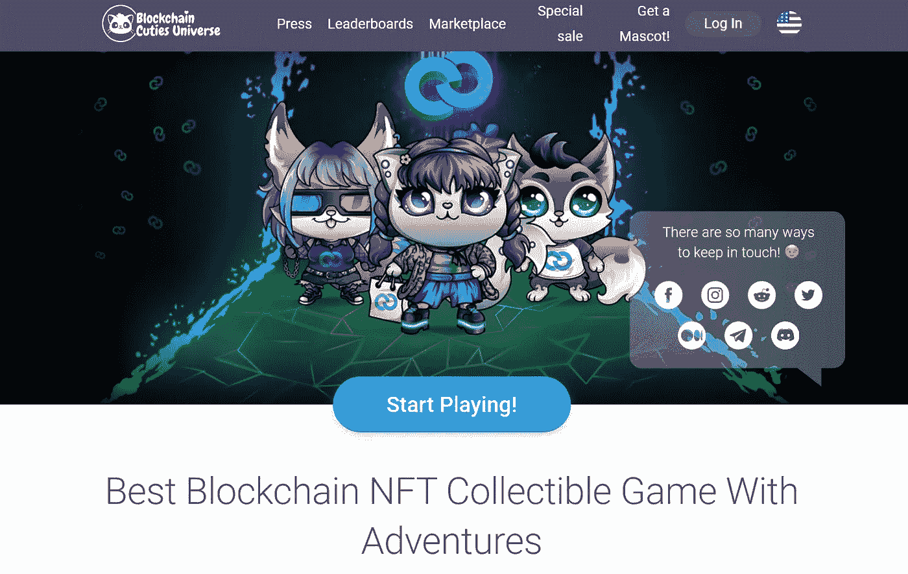
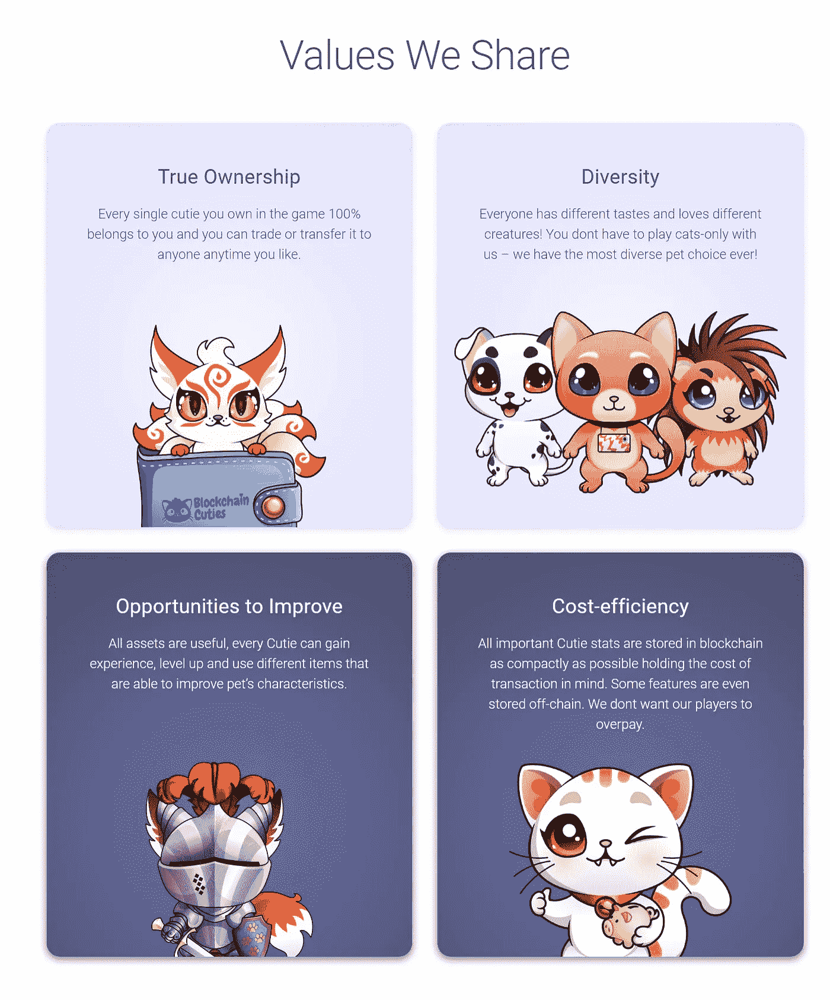

# CSC Web3 游戏

> 原文：<https://medium.com/coinmonks/csc-web3-gaming-503566660f09?source=collection_archive---------21----------------------->

## 区块链 Cuties 宇宙

# 什么是 Web3 游戏？

新技术趋势的到来总是会引发不同行业的新一轮变革。当互联网到来时，没有人会想到硅谷的顶级企业是如何为每个人改变商业和技术的。互联网商业革命几年后，世界已经为 web3 革命做好了准备，web3 游戏是这个漫长旅程中的第一步。

基于 web3 的游戏概念明显不同于传统游戏平台。事实上，基于 web3 的游戏提供了一种创新的视角，通过分散的方式参与游戏。那么，什么是 web3 游戏呢？下面的讨论通过深入探究 web3 游戏的基本原理来帮助你找到答案。

> 交易新手？在[最佳密码交易所](/coinmonks/crypto-exchange-dd2f9d6f3769)上尝试[密码交易机器人](/coinmonks/crypto-trading-bot-c2ffce8acb2a)或[复制交易](/coinmonks/top-10-crypto-copy-trading-platforms-for-beginners-d0c37c7d698c)

## Web3 游戏的定义

在任何关于“什么是 Web3 游戏”的讨论中，一个显而易见的方面是从基于 web3 的游戏的定义开始。你可以把这个术语理解为一种新的分散式游戏方法。web3 游戏或游戏生态系统中的所有活动，以及游戏内资产和体验的所有权，都超出了任何中央机构的范围。在分散的 web3 游戏生态系统中，玩家对他们的资产和体验拥有完全的所有权。web3 游戏的主要亮点之一是区块链在游戏世界的整合。怎么可能，为什么相关？

当你看一看传统游戏行业的问题和 web3 游戏的特点时，你会发现一种富有成效的联系。例如，顶级 web3 游戏的分散化优势有助于玩家对游戏的未来发表意见。此外，web3 游戏提供了玩即赚游戏的创新优势，而不是传统游戏中的付费游戏模式。web3 游戏中一些值得注意的亮点支持“玩即赚”功能，包括资产交易或可交易游戏代币的功能。

在提供公平的虚拟市场的基础上，web3 游戏在加密中的重要性也显著增加。Web3 游戏可以向玩家提供对游戏中数字资产的完全访问和完全所有权。这些游戏能够以 NFTs 的形式存储游戏中的数字资产，同时支持互操作性。CoinEx Smart Chain-CSC 等现代区块链网络通过利用跨链通信桥提供了互操作性优势。

## Web3 游戏的主要特征

在本次讨论中，web3 游戏列表之前的下一个重要亮点是与 web3 游戏相关的一些关键功能。有了 web3 游戏中的新游戏模式，玩家可以在所有权、控制权和交易游戏内资产和收藏品的灵活性方面拥有更好的特权。这里有一些你可以在现代网络游戏中找到的基本特征。

*   **所有权控制和资产的无缝移动**

区块链游戏的最大特点是对所有权的控制，因为游戏提供了自我主权。玩家可以通过 NFTs 对游戏中的资产和收藏品行使完全的所有权。Web3 确保了用户对他们的游戏内资产拥有真正的所有权，同时也确保了竞争资产互操作性的优势。例如，玩家在一个游戏中拥有游戏内资产的所有权，然后在他们选择的另一个平台上使用它们。

*   **以玩家为中心的体验**

web3 游戏中的顶级玩家展示了新的游戏生态系统如何根据玩家的偏好定制体验而蓬勃发展。你可以发现许多值得注意的方面，通过这些方面，web3 游戏一直致力于为玩家提供最好的奖励。例如,“玩赚”游戏展示了玩家如何充分利用游戏来赚取金钱奖励。此外，web3 游戏中的自我主权方面也强调他们如何为玩家考虑利益。

*   **透明度和可用性**

“什么是 web3 游戏”最引人注目的亮点之一是这个过程的分布式本质。你不会像传统游戏的集中式服务器那样有单点故障。最重要的是，区块链的游戏使用投票共识来改变游戏过程。

因此，web3 游戏可以提供更好的透明度。此外，web3 游戏生态系统的自主运行，中央政府的干预最少，确保了高可用性。您还拥有高弹性数据存储设施和块铸造的优势，以减少停机时间和更好的可扩展性。

## [区块链 Cuties Universe](https://blockchaincuties.com/)

区块链可爱是一个新的可收集的加密冒险游戏，你可以和小狗，蜥蜴，小熊，猫和其他真实和幻想的生物一起玩。

**关于区块链 Cuties Universe**

区块链可爱是一个新的可收集的加密冒险游戏，你可以和小狗，蜥蜴，小熊，猫和其他真实和幻想的生物一起玩。每个小可爱都是独一无二的，100%属于你。你可以收集它们，繁殖它们，在战斗中测试它们的技能，武装它们，甚至升级它们！游戏内经济让你在以太坊、EOS、TRON 和新区块链上使用智能合约进行交易。每个小可爱都是不可替代的，可以像普通加密货币一样转让或出售给其他玩家。

区块链 Cuties Universe 运行在 CSC 上

## 关于 CSC

CoinEx 智能链——CSC 是一个智能合同链，生成大宗交易的时间更短，交易费用更低。

CSC 是一个去中心化、高效率的公链，效率极高，交易费用低。通过 PoS consensus 协议，CSC 在几秒钟内生成一个块，支持极高的 TPS，同时将交易费用保持在较低的水平。

CSC 是一个优秀的区块链生态系统，为开发者提供了一个高效、低成本的链上环境来运行分散式智能合约应用(DApps)和存储数字资产。

## 与 CSC 联系

[电报](https://t.me/CoinEx_Announcement) | [推特](https://twitter.com/coinexcom) | [脸书](https://www.facebook.com/TheCoinEx) | [网站](https://www.coinex.org/) | [GITHUB](https://github.com/coinexcom/coinex_exchange_api/wiki) | [下载 APP](https://www.coinex.com/#toapp) | [YOUTUBE](https://www.youtube.com/channel/UCMAuqO8ZqfBwgL51-fY5n4g/)