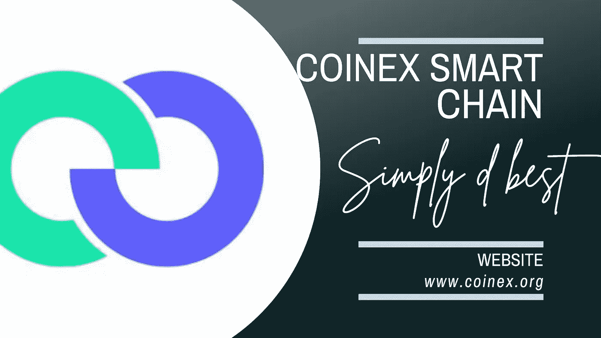

# CSC |什么是 SAFT 协议，它们是如何工作的

> 原文：<https://medium.com/coinmonks/csc-what-are-saft-agreements-and-how-do-they-work-14c8b750beca?source=collection_archive---------42----------------------->

加密货币和区块链经济多年来一直在发展，相当多的初创公司通过首次发行硬币(ico)筹集资金。然而，在 2018 年利用加密项目的热潮进行了一系列骗局和可疑项目之后，监管机构开始调查这些筹资流程以及如何保护投资者。这就是 SAFT(未来代币的简单协议)的由来。

推出《未来证券简单协议》( SAFT)框架背后的想法之所以存在，是因为没有明确的决定因素来确定哪些投资类型被视为“证券”。考虑到法规最终将 ICO 令牌标记为证券，SAFTs 被引入以确保项目符合所有适用的法规。

秘密筹款不仅仅是建立一个区块链。投资者需要确定他们将投资什么。有必要知道该项目从长远来看是否有价值，以及它们是否会受到法律保护。

《SAFT 框架协议》的出台是对市场上 ICO 激增的回应，旨在为投资的税务管理提供更大的灵活性，并在一定程度上保护投资者。在这篇文章中，我们将着眼于所有你需要知道的关于未来令牌的简单协议(SAFT)。

# 什么是 SAFT？

SAFT 是一种筹资合同或协议的形式，旨在用于加密初创公司的开发者和合格投资者之间，承诺当项目投入运营时提供代币。这些协议旨在帮助新的加密货币项目筹集资金，作为回报，在不违反金融法规的情况下，在设定的日期发行折扣代币。

尽管 SAFT 看起来类似于立即发行代币的标准 ICO，但 SAFT 允许投资者在代币在区块链上发行之前购买代币，并承诺在项目开始运营时交付代币。这些合同条款是由项目团队制定的，在任何款项转手之前，双方都必须同意。一旦项目投入运营，投资者就会收到他们的代币，他们可以在平台上使用代币，也可以将代币兑换成其他加密货币

值得注意的是，SAFT 协定仅适用于美国法律。希望遵守美国安全法规的投资者在打算投资任何新的加密项目时，可以出示 SAFT 协议。但是，由于纽约州的法规，该协议在纽约州不被接受。

# SAFT 简史

2017 年 10 月，Protocol Labs 和库利 LLP 设计了一个合规框架，以帮助促进加密货币领域的融资，该领域被称为未来令牌简单协议(SAFT)。在此之前，每当一个加密项目进入市场，并且对投资者来说似乎很有前途，他们就会大量模仿 ICO，购买这些项目令牌，就好像它们是公司股权的一部分一样。这极大地影响了加密行业，因为初创公司能够在数小时/数天内筹集数百万美元的资金。它引起 SEC(美国证券交易委员会)的注意只是时间问题。

可以说，转折点是一个大型加密项目“Bitconnect”诈骗了许多美国投资者超过 24 亿美元。随着美国证券交易委员会(Securities and Exchange Commission)出台法律将加密代币归类为“证券”，因此要求加密筹款活动遵守现有法规。SAFT 和其他实体对此做出了回应，目的是通过美国证券法律法规，最终提供更大的税务管理灵活性，并为美国加密投资者提供保护。自那以后，许多加密公司，如 Filecoin，利用 SAFTs 筹集了数百万美元的资金。

此外，Ripple Labs 被 SEC 指控进行了 13 亿美元的未注册证券发行，这一消息在加密市场引起了很大的反应。SEC 主席已经表明，比特币(BTC)等加密货币不能被视为证券，因为它们足够分散。然而，主席补充说，任何不遵守证券法规并继续在美国筹集资金的新加密项目都将被追究责任。

# SAFT 是如何工作的？

就 SAFT 而言，投资者为一个新的加密项目提供资金，以换取未来的代币。这为项目提供了空间来筹集资金，同时它们仍然符合安全法规。在这种情况下，直到项目达到特定的里程碑或运营阶段，才会向投资者发放代币。一旦项目进行到这个阶段，投资者现在可以将他们的 SAFT 换成代币。

引进 SAFT 的另一个重要目的是解决项目业主和投资者之间的不确定性问题。在筹款活动期间，投资者投入资金，期望在规定的日期收到代币，拍卖合同将被用作参与活动的合格投资者的担保。这将向投资者保证，一旦他们的网络运行正常，该项目将立即交付令牌，并且 SEC 将确保他们不会受到欺诈。

# 具体来说，就是这样做的:

*   一个新加密项目的开发者同意与投资者签署一份书面的 SAFT 协议，反过来，一旦网络完全投入运营，投资者就投入资金，以换取令牌权(以一定的折扣)。这些项目必须向美国证券交易委员会提交此协议。
*   从投资者那里获得的资金将用于开发这个可能需要几个月或几年的项目。在此期间，还没有颁发任何令牌。
*   在项目完成并且平台或项目现在运行之后，创建的代币将被发送给投资者，投资者可以自由地在公开市场上向公众出售代币以获利。

# 期货代币简单协议(SAFT)和初始硬币发行(ICO)之间的区别

*   SAFT 只对合格投资者开放，受美国证券交易委员会的监管，并且必须遵守某些披露要求。另一方面，任何人都可以使用 ICO，他们不受 SEC 监管，也不必遵守任何披露要求。
*   与普通投资者相比，SAFT 认可投资者对投资创业公司所涉及的风险有更深刻的理解，而在 ico 中，投资者可能几乎不了解他们所承担的责任范围。
*   在 SAFT，美国证券交易委员会向合格投资者提供披露要求，有更多关于公司和发行的信息，因为这将有助于他们做出更明智的投资决定。而投资 ico 的投资者只需依赖基于自己研究的信息。

# SAFTs 的优点

*   SAFT 通过减少 ICO 骗局的机会增加了合格投资者对密码行业的信心。由于美国证券交易委员会(SEC)的彻底审查过程，安全性得到了提高，并有助于初创项目遵守证券法规。
*   SAFTs 为投资者和项目团队都提供了清晰性，因为协议以清晰的条款提供，有助于避免误解。
*   它给了项目空间和时间在他们的项目开发之前获得足够的资金。只有当项目投入运营后，投资者才能收到他们的代币。
*   SAFTs 可以被用作锁定早期投资者投资的一种手段，同时他们可以建立并确保社区完全支持他们的项目。

# SAFTs 的缺点

*   SAFTs 不适合希望立即提供代币的项目。
*   SAFTs 可能是复杂和耗时的，因为协议的条款需要仔细推敲，以符合适用的安全法规。
*   SAFT 框架仅适用于在美国联邦法律下运营的加密初创公司，因此不适用于其他国家，没有给国际贡献空间。
*   根据 SAFT 协议，在代币销售的第一阶段，参与仅限于获得资格认证的投资者

# 结论

SAFT 框架显然在加密货币和区块链空间的发展中发挥了至关重要的作用。然而，在将它完全纳入代币销售之前，仍有一些缺点需要解决。拥有投资代币的法律框架有助于加密项目筹集资金，同时保护投资者。然而，如果你投资于任何项目，确保进行自己的研究，并了解所涉及的风险。我们只能拭目以待，看看 SAFT 框架会随着时间的推移发展到什么程度。

如果您需要支持或想要向我们发送反馈，请加入 Coinex 智能链社区。

[网站](http://www.coinex.org/) | [推特](https://twitter.com/CoinEx_CSC) | [电报](https://t.me/CoinExChain) | [不和](https://discord.gg/5uBGRW9qSp)

> 交易新手？尝试[加密交易机器人](/coinmonks/crypto-trading-bot-c2ffce8acb2a)或[复制交易](/coinmonks/top-10-crypto-copy-trading-platforms-for-beginners-d0c37c7d698c)