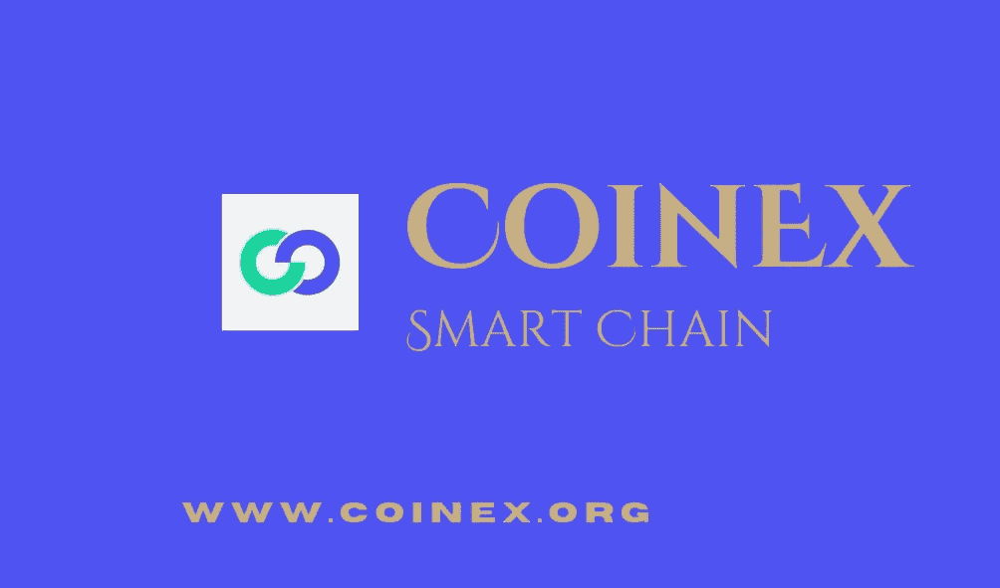

# CSC|什么是产量农业，它是如何工作的？

> 原文：<https://medium.com/coinmonks/csc-what-is-yield-farming-and-how-does-it-work-e459443a7deb?source=collection_archive---------45----------------------->

加密货币领域是最具活力的行业之一，不断引领新趋势和流行词汇。在其众多趋势中，分散金融(DeFi)是一种不断发展的金融技术，旨在消除金融交易中的中介，为投资者创造了多种渠道来赚取被动收入。其中一个途径是 Yield farming，这是 DeFi 的一种投资策略，投资者必须通过入股或出借他们的加密资产来换取回报或利益。

产量农业繁荣的主要贡献者之一可以归功于 COMP token，这是复合金融生态系统的一个治理令牌。随着越来越多的平台不断提出解决方案，使投资者能够赚取利息，产量农业背后的想法继续传播，给潜在的产量农民提供各种池流动性的激励。

根据 coincodex.com 的数据，收益农业行业的市值目前为 83.3 亿美元，占加密货币总市值的 0.87%。在本文中，我们将探讨高产农业、收益和风险，以及您可以利用的高产农业平台。

# 什么是产量农业？

收益种植是指加密持有者锁定其加密资产以赚取更多被动收入或奖励的过程。简而言之，收益农业是一个允许投资者通过在 DeFi 市场投资密码来赚取固定或可变利息的过程。通过这样做，你本质上是在给一个平台增加流动性，并以利息的形式获得回报。与传统金融类似，传统金融发放贷款的预期是带利息的，高产农业遵循同样的过程。这里的区别在于，它是通过 DeFi 协议完成的，并被锁定到智能合约中，以便获得回报。

此外，经常实施高产农业还有各种原因:

*   它经常被用作激励投资者存款和向 DeFi 协议提供流动性的手段，目的是增加平台的 TVL。例如，随着分散化交易所的流动性增加，用户的滑点减少，某些代币的波动性也降低。,
*   将 DeFi 应用程序的本机/治理令牌分发给协议用户，这些用户利用将资金存入平台的机会。这鼓励人们更多地参与权力下放的治理过程。

# 产量农业是如何运作的？

Yield farming 让投资者有机会通过智能合约支持的分散式应用程序(dApp)出借代币，持有所有资金，不涉及中间人或中间人。在收益农业领域，提供其加密资产以支持 DeFi 协议功能的投资者被称为流动性提供者(LPs)。

这些有限合伙人将其加密资产锁定在 DeFi 平台的流动性池中，以赚取费用或产生利息。。这种分布取决于协议的独特实现。这里的主要问题是，流动性提供者将根据他们向资金池提供的流动性获得回报。

值得注意的是，随着越来越多的人将他们的加密硬币或代币投入该流动性池，该百分比可能会因平台而异。此外，流动性供应受到平台所在网络的限制。例如，如果你在以太坊网络上建立的 DeFi 平台上提供流动性，奖励只能作为基于 ERC 20 的代币发行，其他各种网络也是如此。

# 高产农业的好处

*   随着产量农业，你可以很容易地赚取被动收入的密码
*   它为投资者提供了广泛的机会，从保守的低产农场到进取的高产农场
*   用户通过治理令牌奖励获得参与 DeFi 协议决策的机会
*   向用户开放 DeFi 教育，并建立一个基础技能层，这将有助于许多投资者了解 DeFi 创新的未来。

# 高产农业的风险

价格波动性:加密货币市场波动性很大，你放入流动性池的代币或硬币的市值可能会上升或下降(除非是稳定的硬币)。如果发给你的奖励令牌失去了它的价值，你可能已经浪费了大量的时间和资金，而这些时间和资金本可以用在更有价值的农场或游泳池中。

智能合同风险:在 DeFi 的世界中，智能合同代表了项目的关键部分。智能合同主要依赖于代码质量和开发团队的技能和经验。如果智能合同没有被仔细编程以避免错误，或者没有被一个良好和有信誉的审计公司适当审计，DeFi 协议的黑客攻击将不可避免，从而使储户容易遭受资金损失。

非永久性损失:在高波动时期，流动性提供者多数时候会经历非永久性损失。当流动性池中的代币价格发生变化，随后转换池中代币的比率以稳定其总价值时，就会发生这种情况。

Rugpull 风险:当恶意行为者决定推出一个令牌，只是为了在放弃项目之前骗取不知情的投资者的资金时，就会发生这种情况。拉扯以不同的方式发生。这些恶意行为者可能会从 AMM 中移除相当大一部分流动性，阻止投资者出售代币合同，或者他们继续铸造大量新代币，从而造成过度供应等等。

# 如何开展高产农业

产量农业平台相对容易导航，尤其是特别关注为非技术投资者建立更友好的用户体验。然而，有一些在使用之前需要进一步的指导。以 UniSwap V3 为例。要开始从您的加密资产中获得收益，您可以:

需要下载软件钱包，如 Metamask 或 Trust wallet。

需要购买以太坊或 BNB 或 CET(取决于主机网络)来支付交易费用

设置完成后，进入你选择的高产农业网站，点击“连接钱包”。

一旦解决了这个问题，找到你想要存放的池子或农场，然后按照平台提供的指示去做

及时了解任何重大的价格波动，以防遭受非永久性的损失。

# CoinEx 智能链

CoinEx 智能链(CSC)是由 CoinEx 团队为分散式金融创建的分散式高效公共链。公共链与以太坊生态系统完全兼容，具有高效率、低费用以及无许可验证器的特点。所有开发人员都可以基于 CSC 轻松构建他们自己的分布式应用程序，或者在 CSC 上快速部署他们的 EVM 应用程序。

# 总结想法

收益农业是加密货币领域最有趣的想法之一，投资者可以从闲置的加密货币资产中获得被动收入，而无需提供 KYC 要求。不可否认，好处是有吸引力的，所以注意其中的风险也很重要。获得 100%、200%或更高的年利息是非常诱人的。但是，进行尽职调查很重要，除非您完全了解 yield farming 的工作方式、所涉及的风险以及 yield farming 平台背后的团队，否则您不应参与。DYOR。

加入我们的社区

[网站](http://www.coinex.org/) | [电报](https://t.me/CoinExChain) | [推特](https://twitter.com/CoinEx_CSC) | [不和](https://discord.gg/5uBGRW9qSp)

> 交易新手？尝试[加密交易机器人](/coinmonks/crypto-trading-bot-c2ffce8acb2a)或[复制交易](/coinmonks/top-10-crypto-copy-trading-platforms-for-beginners-d0c37c7d698c)
> 
> 加入 Coinmonks [电报频道](https://t.me/coincodecap)和 [Youtube 频道](https://www.youtube.com/c/coinmonks/videos)获取每日[加密新闻](http://coincodecap.com/)

## 另外，阅读

*   [复制交易](/coinmonks/top-10-crypto-copy-trading-platforms-for-beginners-d0c37c7d698c) | [加密税务软件](/coinmonks/crypto-tax-software-ed4b4810e338)
*   [网格交易](https://coincodecap.com/grid-trading) | [加密硬件钱包](/coinmonks/the-best-cryptocurrency-hardware-wallets-of-2020-e28b1c124069)
*   [密码电报信号](/coinmonks/top-3-telegram-channels-for-crypto-traders-in-2021-8385f4411ff4) | [密码交易机器人](/coinmonks/crypto-trading-bot-c2ffce8acb2a)
*   [最佳加密交易所](/coinmonks/crypto-exchange-dd2f9d6f3769) | [印度最佳加密交易所](/coinmonks/bitcoin-exchange-in-india-7f1fe79715c9)
*   [开发人员的最佳加密 API](/coinmonks/best-crypto-apis-for-developers-5efe3a597a9f)
*   最佳[密码借贷平台](/coinmonks/top-5-crypto-lending-platforms-in-2020-that-you-need-to-know-a1b675cec3fa)
*   [免费加密信号](/coinmonks/free-crypto-signals-48b25e61a8da) | [加密交易机器人](/coinmonks/crypto-trading-bot-c2ffce8acb2a)
*   杠杆代币的终极指南