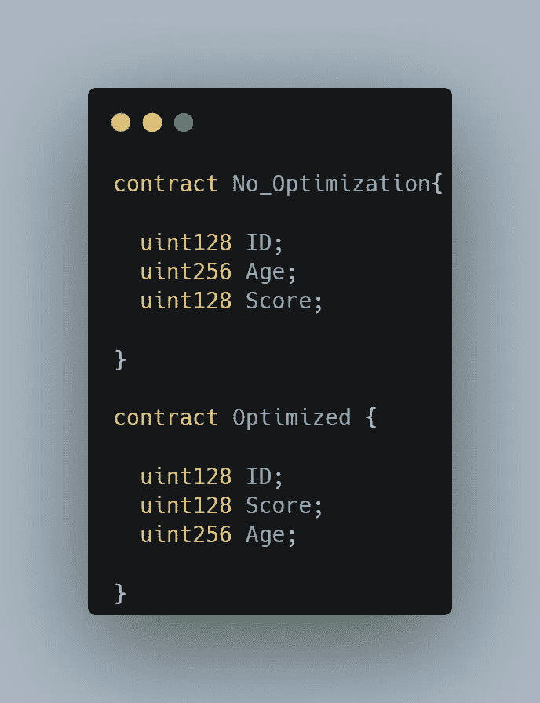
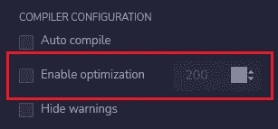

# CSC 101-气体优化第 1 部分

> 原文：<https://medium.com/coinmonks/csc101-gas-optimization-part1-bd3b635dbcc8?source=collection_archive---------33----------------------->

智能合同天然气优化是智能合同开发的最重要部分之一。这对我们减少能源消耗很有帮助。

为了成功，我们需要学习稳健如何处理我们的变量和功能。在本教程中，我们想谈谈坚固性优化方法。

这篇文章将为你提供一些在智能合同中减少汽油消耗的技巧。


## 最佳化

在计算机编程中，程序优化、代码优化或软件优化是修改软件系统以使其某方面工作更有效或使用更少资源的过程。

在本教程中，我们想学习一些技巧和方法来优化我们的 solidity 智能合同。

## 打包您的变量

Solidity 将数据存储在 256 位内存插槽中。少于 256 位的变量将存储在单个槽中，不适合单个槽的数据分布在几个槽中。
每个储气槽都消耗天然气，打包变量有助于通过减少我们合同要求的储气槽数量来优化您的天然气使用。

**示例:**Solidity 编译器只能将两个`uint128`放在相同的 256 位内存槽中，当它们被声明为彼此相邻时。否则，`uint128`个变量各自只为自己占用一个单独的`uint256`，每个槽浪费 128 位



## 坚固性优化器

当您编译 Solidity smart contracts 时，您可以指定一个优化标志来告诉 Solidity 编译器生成高度优化的字节码。与不使用优化标志相比，这个字节码将消耗更少的资源。

您可以在 Remix 中启用实度优化器:



你也可以在 hardhat 中启用优化器。把这个放进`hardhat.config.js`:

```
module.exports = {
  solidity: {
    version: "0.8.10",
    settings: {
      optimizer: {
        **enabled: true,**
        runs: 1000,
      },
    },
  },
};
```

在 Truffle 中启用优化器可以按如下方式进行:

```
module.exports = {
  compilers: {
    solc: {
      version: <string>, // A version or constraint - Ex. "^0.5.0"
                         // Can be set to "native" to use a native solc or
                         // "pragma" which attempts to autodetect compiler versions
      docker: <boolean>, // Use a version obtained through docker
      parser: "solcjs",  // Leverages solc-js purely for speedy parsing
      settings: {
       ** optimizer: {
          enabled: <boolean>,**
          runs: <number>   // Optimize for how many times you intend to run the code
        }
```

## 删除未使用的变量

在 CSC，你可以获得释放存储空间的气体退款。
删除可变退款 15，000 燃气，最高可达交易燃气费用的一半。用`delete`关键字删除相当于给数据类型赋值初始值，比如`0`给整数。

## 离链计算

如果你知道要散列什么数据，就没有必要消耗更多的计算能力来使用`keccak256.`散列它

> 加入 Coinmonks [电报频道](https://t.me/coincodecap)和 [Youtube 频道](https://www.youtube.com/c/coinmonks/videos)了解加密交易和投资

# 另外，阅读

*   [加密交易机器人](/coinmonks/crypto-trading-bot-c2ffce8acb2a) | [OKEx vs 币安](https://coincodecap.com/okex-vs-binance)
*   [币安 vs FTX](https://coincodecap.com/binance-vs-ftx) | [最佳(SOL)索拉纳钱包](https://coincodecap.com/solana-wallets)
*   [如何在 Uniswap 上交换加密？](https://coincodecap.com/swap-crypto-on-uniswap) | [A-Ads 评论](https://coincodecap.com/a-ads-review)
*   [加密货币储蓄账户](/coinmonks/cryptocurrency-savings-accounts-be3bc0feffbf) | [YoBit 审核](/coinmonks/yobit-review-175464162c62)
*   [Botsfolio vs nap bots vs Mudrex](/coinmonks/botsfolio-vs-napbots-vs-mudrex-c81344970c02)|[gate . io 交流回顾](/coinmonks/gate-io-exchange-review-61bf87b7078f)