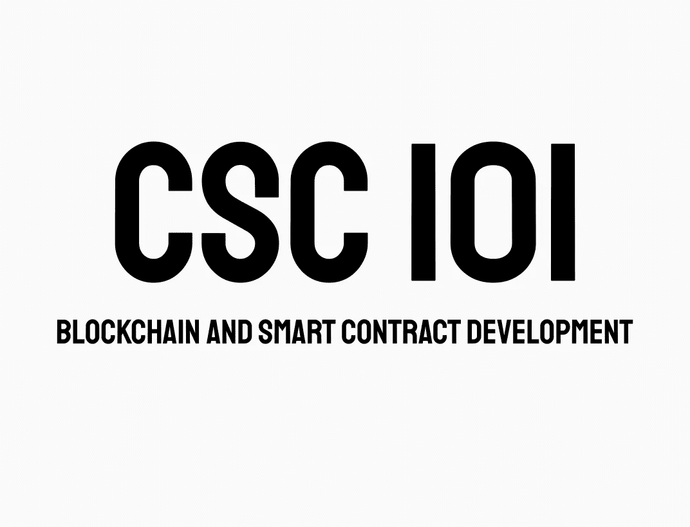

# CSC 101-继承

> 原文：<https://medium.com/coinmonks/csc101-inheritance-f9f1de705cb6?source=collection_archive---------47----------------------->

继承是扩展契约功能的一种方式。可靠性既支持单一继承也支持多重继承。



# 遗产

继承是面向对象编程语言最重要的特征之一，它是受 Python 启发而来的。

可靠性继承让我们将多个契约合并成一个契约。基础契约是其他人继承的契约。那些继承数据的协定是派生的。这是一个在合同之间产生父子关系的过程。有两种类型的继承:单级和多级。继承标记了几个具有父子关系的链接契约。

它的规则与 Python 非常相似，但也有一些不同。继承创建一个合同，并将其放入区块链。继承使用的关键字**是**。

以下是继承特性:

*   派生协定可以访问所有非私有成员，包括内部方法和状态变量。但是不允许使用这个。
*   如果函数签名保持不变，则允许函数重写。如果输出参数不同，编译将失败。
*   我们可以使用 super 关键字或 super 契约名来调用 super 契约的函数。
*   在多重继承的情况下，使用 super 的函数调用优先考虑大多数派生契约。

**语法:**

```
pragma solidity ^0.8.10;

contract A{
    //statement
}contract B is A {
    //statement
}
```

**举例**:

```
contract A {
    event Event(string name);

    constructor() public {
        emit Event("A");
    }
}

contract B is A {
    constructor() public {
        emit Event("B");
    }
}

contract C is A {    
    constructor() public {
        emit Event("C");
    }
}

contract D is C, B {
    constructor() public {
        emit Event("D");
    }
}
```

# 继承类型

在坚固性中我们有 4 种类型的继承。以下是继承类型:

## 单一遗传

在单级或单级继承中，一个基础协定的函数和变量只被一个派生协定继承。

## 多层次继承

它与单一继承非常相似，但不同之处在于它具有父代和子代之间的关系层次。从父合同派生的子合同也充当从其派生的合同的父合同。

## 分层继承

在分层继承中，一个父协定有多个子协定。当一个共同的功能要在不同的地方使用时，通常会用到它。

## 多重遗传

在多重继承中，一个契约可以从多个契约中继承。父合同可以有多个子合同，而子合同可以有多个父合同。

> 交易新手？尝试[加密交易机器人](/coinmonks/crypto-trading-bot-c2ffce8acb2a)或[复制交易](/coinmonks/top-10-crypto-copy-trading-platforms-for-beginners-d0c37c7d698c)