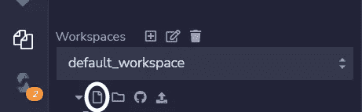

# CSC 101-图书馆

> 原文：<https://medium.com/coinmonks/csc101-libraries-63f03021da16?source=collection_archive---------33----------------------->

库类似于契约，包含可重用的代码以减少编码时间，它们主要是为了重用。


## 图书馆

和其他编程语言一样，solidity 有库。Solidity 中的库的概念和其他编程语言没有什么不同。基本思想是，同一个库是一组可重用的实用程序，你可以在主程序中调用它们来帮助你保持代码的整洁、可重用和易于理解。一个库包含其他契约可以调用的函数。

以下是 Solidity 库的主要特征:

*   当不修改状态变量时，可以直接调用库函数
*   不能销毁库，因为它被认为是无状态的。
*   库不能有状态变量。
*   库不能继承任何元素。
*   库不能被继承。

**注**:通过创建库来部署通用代码，降低了 gas 成本。

## 创建库

库协定是通过使用 library 关键字而不是一般协定来定义的。库没有任何存储，因此它不能保存状态变量，fallback 或 payable 函数也不能在库中创建，因为它不能存储以太(在 EVM 兼容的网络中，以太意味着网络原生硬币)，但它可以实现一些数据类型，如用户定义的 struct 和 enums，以及存储在以太坊堆栈中而不是存储中的常量变量。

首先，我们需要创建实体文件。在这个例子中，我们称之为 **mylib.sol** 。在终端类型中:

```
touch mylib.sol
```

如果使用 CSC IDE，可以在工作区中创建文件:



**语法:**

```
library <libraryName> {
    // block of code
}
```

**举例:**

```
pragma solidity ^0.8.0;library Adder{
    function add(uint a, uint b) public pure returns(uint) {
        return a + b;
    }
}
```

## 纯修饰词

内存修饰符告诉编译器，我们的变量将要访问区块链的内存，pure 是一个修饰符，本质上意味着这个函数不读，也不写任何状态变量。

## 返回类型

最后一个关键字 **returns** 描述了这个函数返回的值的类型，在我们的例子中，我们返回一个数组中所有整数的和，所以我们返回一个 uint 类型的变量。

耶！我们成功地做到了。！

现在是时候导入和使用我们的库了

## 导入库

导入库非常简单。它只需要使用 **import** 关键字在 solidity 中导入一个库。可以按如下方式导入库:

```
import "./MyLib.sol";
```

## 访问同一文件中的库

访问存在于同一文件中的契约中的库需要任何种类的 so import 语句。

为了访问这个库，我们创建了一个简单的智能契约，其中包含一个调用我们的库的 add 函数的函数。因为库和契约存在于同一个文件中，所以不需要任何 import 语句。

## 在其他智能合同中使用库函数

现在我们想从其他契约中访问一个库函数。

```
import "./example.sol";

contract MyContract{                                 

function give_sum(uint[] memory data)external view returns(uint)                                 
{                                    
uint sum;                                   
sum = adder.add(data);                                    
return sum;                                 
}}
```

> 交易新手？试试[加密交易机器人](/coinmonks/crypto-trading-bot-c2ffce8acb2a)或者[复制交易](/coinmonks/top-10-crypto-copy-trading-platforms-for-beginners-d0c37c7d698c)
> 
> 加入 Coinmonks [电报频道](https://t.me/coincodecap)和 [Youtube 频道](https://www.youtube.com/c/coinmonks/videos)获取每日[加密新闻](http://coincodecap.com/)

## 另外，阅读

*   [复制交易](/coinmonks/top-10-crypto-copy-trading-platforms-for-beginners-d0c37c7d698c) | [加密税务软件](/coinmonks/crypto-tax-software-ed4b4810e338)
*   [网格交易](https://coincodecap.com/grid-trading) | [加密硬件钱包](/coinmonks/the-best-cryptocurrency-hardware-wallets-of-2020-e28b1c124069)
*   [密码电报信号](/coinmonks/top-3-telegram-channels-for-crypto-traders-in-2021-8385f4411ff4) | [密码交易机器人](/coinmonks/crypto-trading-bot-c2ffce8acb2a)
*   [最佳加密交易所](/coinmonks/crypto-exchange-dd2f9d6f3769) | [印度最佳加密交易所](/coinmonks/bitcoin-exchange-in-india-7f1fe79715c9)
*   开发人员的最佳加密 API
*   最佳[密码借贷平台](/coinmonks/top-5-crypto-lending-platforms-in-2020-that-you-need-to-know-a1b675cec3fa)
*   [免费加密信号](/coinmonks/free-crypto-signals-48b25e61a8da) | [加密交易机器人](/coinmonks/crypto-trading-bot-c2ffce8acb2a)
*   [杠杆代币的终极指南](/coinmonks/leveraged-token-3f5257808b22)