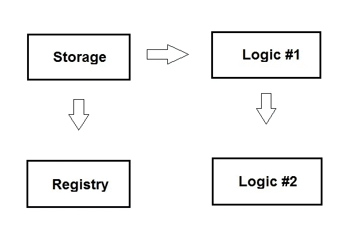

# CSC 101-可升级和代理智能合同第 1 部分

> 原文：<https://medium.com/coinmonks/csc101-upgradable-and-proxy-smart-contracts-part1-79415b9447f7?source=collection_archive---------25----------------------->

区块链最大的特点之一就是数据是不可变的。这意味着没有人能在不使整个区块链失效的情况下改变任何交易的内容。部署智能合约后，您不能更改代码，因此也不能升级智能合约。

在本教程中，我们将介绍可升级和代理智能合同。


## 代理合同

通过将代码重新构建到不同的契约中，可以在保持存储相同的同时允许逻辑升级。事实上，可升级的 smarts 合同越来越受欢迎，杰克·唐纳有一篇很好的文章解释了所有使用的技术。

想法是有一个存储契约，一个注册契约和一个逻辑契约。每当需要在逻辑契约中添加新功能或升级现有功能时，只需创建一个新的逻辑契约，继承当前的逻辑契约。



存储契约只是保存状态，让我们尽可能地简化它:

```
pragma solidity ^0.8.13;contract Storage {
    uint public val;
}
```

注册表协定为逻辑协定提供代理，以修改它所继承的存储协定的状态。

```
pragma solidity ^0.4.21;import './Ownable.sol';
import './Storage.sol';contract Registry is Storage, Ownable { address public logic_contract; function setLogicContract(address _c) public onlyOwner returns (bool success){
        logic_contract = _c;
        return true;
    } function () payable public {
        address target = logic_contract;
        assembly {
            let ptr := mload(0x40)
            calldatacopy(ptr, 0, calldatasize)
            let result := delegatecall(gas, target, ptr, calldatasize, 0, 0)
            let size := returndatasize
            returndatacopy(ptr, 0, size)
            switch result
            case 0 { revert(ptr, size) }
            case 1 { return(ptr, size) }
        }
    }
}
```

注册中心契约需要知道与哪个逻辑契约对话。我们可以使用 setLogicContract 函数进行设置。我们使用了一个简单的 Ownable.sol 来确保只有 admin 可以调用 setLogicContract 函数。对于一些人来说，[程序集](http://solidity.readthedocs.io/en/v0.4.24/assembly.html)中的回退功能可能看起来很陌生，但是这个特殊的代码实际上对于代理契约来说是相当标准的。基本上，它允许外部契约改变其内部存储。请注意，在拥有合同之前初始化存储也非常重要。

delegatecall 汇编代码很方便，但也很危险。因此，在开始使用它之前，请确保您知道正在发生什么。

接下来，我们来谈谈逻辑部分。

```
pragma solidity ^0.8.13;import './Storage.sol';contract LogicOne is Storage {
    function setVal(uint _val) public returns (bool success) {
        val = 2 * _val;
        return true;
    }
}
```

**注**:LogicOne 合同意在修改“val”存储。

**实现**

1.  我们部署 Registry.sol 和 LogicOne.sol
2.  我们在 Registry.sol 中注册 LogicOne 部署的地址，即

```
Registry.at(Registry.address).setLogicContract(LogicOne.address)
```

3.我们使用 LogicOne [ABI](https://github.com/ethereum/wiki/wiki/Ethereum-Contract-ABI) 来修改注册中心契约中的“val”存储。

```
LogicOne.at(Registry.address).setVal(2)
```

4.例如，当我们准备将 LogicOne 升级到 LogicTwo 时，我们部署 LogicTwo 契约并更新注册中心契约以指向它。

```
Registry.at(Registry.address).setLogicContract(LogicTwo.address)
```

5.我们现在可以用 LogicTwo 控制注册表的存储。

```
LogicTwo.at(Registry.address).setVal(2)
```

重要的是花一点时间来消化我们在这里做的事情，而不是马上投入代码。LogicOne 和 LogicTwo 的存储与注册表协定中的存储不同。它们只通过存储设计相关(这一点非常重要)。

**鸣谢:**特别感谢**伯纳德·佩**精彩的代码和文章

> 交易新手？试试[密码交易机器人](/coinmonks/crypto-trading-bot-c2ffce8acb2a)或[复制交易](/coinmonks/top-10-crypto-copy-trading-platforms-for-beginners-d0c37c7d698c)