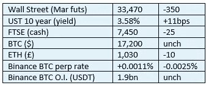
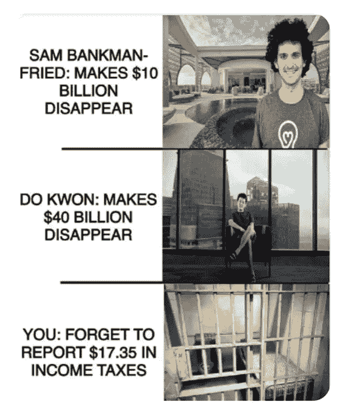

# 《好奇的密码》2022 年 12 月 10 日评论——欧盟和税收

> 原文：<https://medium.com/coinmonks/curious-cryptos-commentary-10th-december-2022-the-eu-and-tax-34d45b4bb937?source=collection_archive---------26----------------------->

**TL；博士**

税务人员茫然不知所措，但还不知道。

**市场抢购**

**市场包装**

本周美国国债波动很大，这对风险资产来说从来都不是一个积极的背景。随着欧盟和英国面临能源限电的威胁，投资者情绪在 2022 年的最后几周不太可能改善。

**偶然系列——来自牛奶之路的另一个伟大的迷因**

[https://themilkroad.beehiiv.com/subscribe?ref=o5CmCFhBAK](https://themilkroad.beehiiv.com/subscribe?ref=o5CmCFhBAK)

**好奇的 Cryptos 评论——欧盟和税收**

伟大的迷因只有在它们是真实的时候才是有趣的。为了证明这一点，欧盟及其最新的税收提案如下:

[https://EC . Europa . eu/info/law/better-regulation/have-your-say/initiatives/12632-Tax-fraud-逃税-加强行政合作规则-扩大信息交流 _en](https://ec.europa.eu/info/law/better-regulation/have-your-say/initiatives/12632-Tax-fraud-evasion-strengthening-rules-on-administrative-cooperation-and-expanding-the-exchange-of-information_en)

如果你只读到摘要，没人会责怪你。为了使它更简单，这里是:

“税务欺诈和逃税意味着金钱的损失，这些钱可以用来支付医疗和教育等费用。尽管近年来采取了行动，但新的替代支付和投资手段有可能破坏在税收透明度方面取得的进展，并给逃税带来巨大风险。

该倡议将修订行政合作指令(DAC)，以确保欧盟规则与不断发展的经济保持一致，并包括加密资产和电子货币等其他领域。"

世界上每一个政府的官僚机构都感觉受到了加密革命的威胁，可能最大的威胁莫过于税务员和他的亲信。

过度依赖《金融时报》和《华尔街日报》等新闻媒体加剧了他们的担忧，在他们看来，加密技术的一个主要用途是逃税。不可否认，在人类努力的所有领域，都有人寻求将自己的税收支出降至最低，尤其是在税收总额因历届政府的财政失控而处于数十年高位的时候。但是那些试图这样做的人是不道德的和犯罪的，因为这是他们的本性。这不是密码使他们如此。

但是，正如上面的迷因所示，过度关注我们这些小人物，显然有过度触及的危险。

…

这一新的“指令提案”让公司有责任报告欧盟客户进行的所有加密交易。这将适用于欧盟以外的公司。

所需信息包括个人信息，如姓名、地址、出生地和出生日期。每个密码交易必须包括任何法定操作，以及密码之间的任何交换。

这是必须提供的非常多的信息，坦率地说，是不可能处理的。

举个例子，可能有几个月，我在多达十个不同的平台上执行几十笔交易，有些是集中的，有些是分散的。这是一项艰巨的管理任务，让我能够掌控自己的交易活动。鉴于约 17%的欧盟人口拥有 cryptos(即 7500 万个人),并且其中一部分人在数百个平台上积极买卖，因此不可能跟踪和追踪每个菲亚特输入和每个菲亚特输出。

欧洲加密倡议主席 Simon Polrot 明确指出:

“……产生和发送的信息量将是巨大的。[成员国]税务当局有办法处理这些信息吗？”

我不这么认为，西蒙。

…

这个考虑极其不周全的计划的另一个漏洞是，让 DeFi(去中心化金融)应用程序遵守规则是不可能的。

随着密码嵌入商品和服务的支付系统，如果政府继续走这条对公司和个人过度监管的严厉道路，政府将失去对大部分税基的控制。

这将是一件好事，因为税收模式将从目前复杂的代码转变为对所有集中化组织的销售收入征税的简单模式。税务顾问、税务调查员、税务律师以及他们的同类人最好开始接受新职业的培训。

**合规材料**

触发警报警告。

如果任何读者在读完我的评论后觉得他们“真的在颤抖”(这是一名达勒姆大学的学生提出的说法，他无法在情感上——当然也无法在智力上——应对罗德·利德尔表达的不同观点)，那么我只能建议你不要读，或者不要颤抖。这取决于你。

Cryptos——我的任何评论都不应该被视为参与 cryptos 的建议。我可能在不知道的情况下胡说八道。任何加密投资都必须被视为极高的风险，并被视为在出售前价值为零。

股票——只是为了说明这不是股票咨询服务。CCC 团队不提供任何形式的财务建议。本注释中对资产价格的任何引用都是为了简单地给出注释的上下文，并为与密码相关的某些股票的表现增添色彩。

为避免疑问，本通讯不是煽动购买密码，购买股票，甚至出售家庭成员希望购买密码或股票。

请注意，所有版权归好奇密码有限公司所有。

礼貌地要求偶尔分享和复制，你的愿望就会实现。

这封信或我们网站的新订户总是最受欢迎的。

[www.curiouscryptos.com](http://www.curiouscryptos.com)

medium.com/@mark_curiouscryptos

> 交易新手？试试[密码交易机器人](/coinmonks/crypto-trading-bot-c2ffce8acb2a)或[复制交易](/coinmonks/top-10-crypto-copy-trading-platforms-for-beginners-d0c37c7d698c)