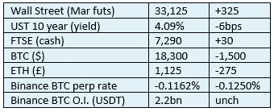

# 《好奇的密码》2022 年 11 月 10 日评论——FTX。又

> 原文：<https://medium.com/coinmonks/curious-cryptos-commentary-10th-november-2022-ftx-3fe64f2b17e5?source=collection_archive---------17----------------------->

**TL；博士**

听到我说 FTX 的崩溃实际上可能对我们所有人都是一件好事，你可能会感到惊讶。

**市场抢购**

**市场包装**

一年前的 ATH，一夜之间我们看到了 24 个月以来的最低点，15.6 万美元

这是对币安退出对 FTX 的潜在收购的消息的反应，伴随着永续期货融资利率有史以来最大的变动。如果你很矮，那么这是一个非常拥挤的位置，出口很小。

**好奇的 Cryptos 评论——FTX 的崩溃**

在中央加密货币交易所 FTX 的崩溃以及随后币安提出的收购所带来的所有厄运和黑暗中，有一些好消息，我想与你分享。

参议员辛西娅·卢米斯是《卢米斯-吉利布兰德责任金融创新法案》的共同发起人，她很快就阐明了这一立法提案的价值，这一提案的推动力现在有了新的支柱:

“FTX 和币安之间最近发生的事件是迄今为止最清楚的例子，说明了我们为什么需要美国数字资产交易所的明确规则。”

她继续说道:

“市场操纵、贷款活动以及客户资金和资产是否得到适当保护，只是我和我的同事们未来几天需要考虑的众多问题中的几个。”

对像比特币基地和币安这样的公司加强监管是必然的，这是一件非常好的事情。

…

市场参与者似乎已经吸取了导致 Celsius 和 Voyager 倒闭的 Terra 惨败的惨痛教训，特别是在相关性风险方面，每当涉及杠杆时，这是我内心深处的恐惧之一。

首先，Tether 的首席执行官 Paolo Ardoino 在推特上写道:

“需要澄清的是: [#Tether](https://twitter.com/hashtag/Tether?src=hashtag_click) 与 FTX 或阿拉米达没有任何关联。0.Null。”

由于其财务披露报告的不透明性以及其储备中相关资产的存在，泰瑟和其稳定的 USDT 货币经常受到 CCC 的批评。这两个问题在很大程度上得到了解决，随着短期美国政府债券的收益率不断上升，Tether 似乎正在积极地恢复秩序。

…

Circle 首席执行官 Jeremy Allaire 对其位于 USDC 的 stablecoin 做出了同样的声明:

“Circle 从未向 FTX 或阿拉米达贷款，从未接受 FTT 作为抵押品，也从未在 FTT 持有头寸或进行交易。无论如何，Circle 不会自行交易。”

…

比特币基地首席执行官 Brian Armstrong:

"比特币基地在 FTX 或 FTT 没有任何实质性的风险敞口(在阿拉米达也没有)."

他还借此机会狠狠踢了山姆·班克曼-弗里德一脚，他是 FTX 的创始人、首席执行官和大股东，现在肯定是一位前亿万富翁:

“我认为在这样的时刻，强调比特币基地的与众不同是很重要的。这一事件似乎是高风险商业行为的结果，包括深度交织的实体之间的利益冲突，以及客户资金的不当使用(出借用户资产)。”

…

就连态度和行为通常受到 CCC 严厉指责的币安首席执行官赵昌鹏，也第一次开始表现得像个成年人了:

“两大教训:
1:永远不要使用你创造的代币作为抵押品。
2:经营密码业务就不要借。不要“高效”地使用资本。有大量储备。

币安从未将 BNB 用作抵押品，我们也从未举债。"

他的第一点直接提到了相关性风险，以及它可能带来的危险。

…

我的观点很简单。

这类事件总是会导致短期的信心丧失，引发对传染风险的担忧。这就是为什么我们看到 BTC 从近 22k 美元抛售到今天的价格。

市场将会复苏，上面的这些例子表明，负面事件使加密世界的恢复力变得更强。

从中期来看，我们都将从 FTX 的崩溃中受益。

**合规玩意儿**

触发警惕警告——如果任何读者在读完我的评论后，觉得自己“真的在颤抖”(正如一名达勒姆学生所声称的，他无法在情绪上应对不同的观点)，那么我只能建议你不要读，或者不要颤抖。这取决于你。

Cryptos——我的任何评论都不应该被视为参与 cryptos 的建议。我可能在不知道的情况下胡说八道。任何加密投资都必须被视为极高的风险，并被视为在出售前价值为零。

股票——只是为了说明这不是股票咨询服务。CCC 团队不提供任何形式的财务建议。本注释中对资产价格的任何引用都是为了简单地给出注释的上下文，并为与密码相关的某些股票的表现增添色彩。

为避免疑问，本通讯不是煽动购买密码，购买股票，甚至出售家庭成员希望购买密码或股票。

请注意，所有版权归好奇密码有限公司所有。

礼貌地要求偶尔分享和复制，你的愿望就会实现。

这封信或我们网站的新订户总是最受欢迎的。

【www.curiouscryptos.com 

[medium.com/@mark_curiouscryptos](mailto:medium.com/@mark_curiouscryptos)

> 交易新手？尝试[加密交易机器人](/coinmonks/crypto-trading-bot-c2ffce8acb2a)或[复制交易](/coinmonks/top-10-crypto-copy-trading-platforms-for-beginners-d0c37c7d698c)