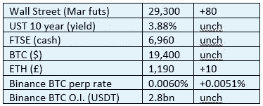
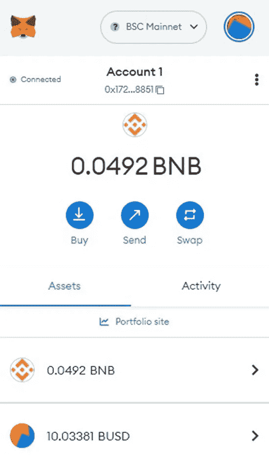
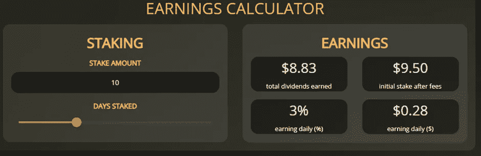
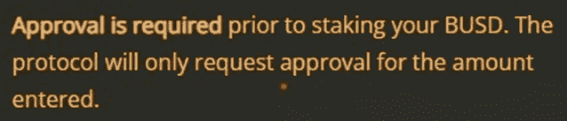
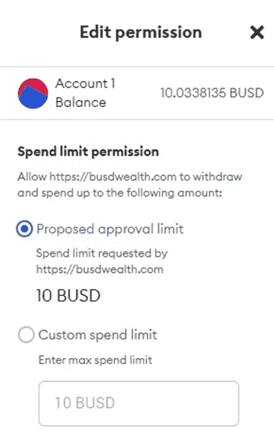
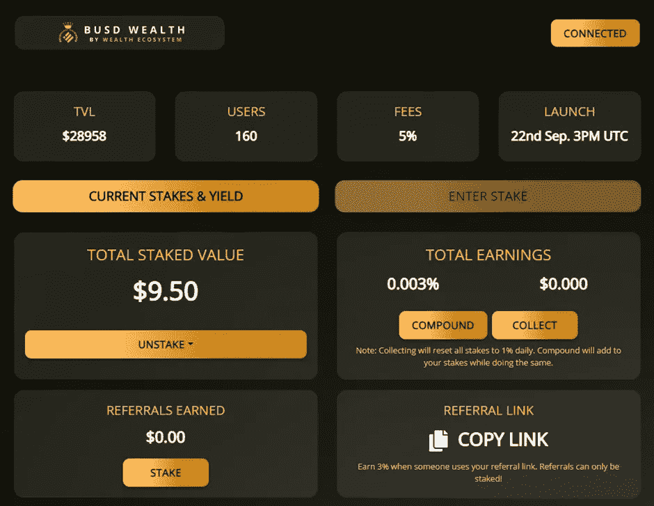

# 《好奇的密码》评论 2022 年 10 月 10 日

> 原文：<https://medium.com/coinmonks/curious-cryptos-commentary-10th-october-2022-7f7fec41507d?source=collection_archive---------49----------------------->

**TL；博士**

一个小实验证明，如果某样东西看起来好得不像真的，那么它就是好得不像真的。

**市场抢购**

**市场包装**

尽管火箭落在基辅，以报复从俄罗斯大陆通往克里米亚的桥梁被部分摧毁，但今天上午市场看起来非常平淡。

**好奇密码的评论——基于网络的矿工和赌注者**

有许多网站声称，如果你存入一些密码，这些密码将被添加到一个采矿池或赌注池，从中你将获得奖励。

其中许多都是合法的——我是 Stake fish([https://stake.fish/](https://stake.fish/))的用户，可以购买我拥有的任何 PoS(赌注凭证)硬币。还有许多其他声誉好的公司参与那项业务。

我之前也在一些高风险但希望合法的 DeFi(去中心化融资)协议中押过 alts。

长期读者清楚地记得 CCC 的 RTP(储备资金协议)经验(为了我们所有人的利益公开分享)，其中大多数是骗局，但一些(特别是仙境)继续试图建立一个有价值的操作。

…

我被问了许多关于这些主题的变化的问题，所有这些问题都无一例外地宣传了荒谬的潜在收益。

这一趋势始于 CEX(中央交易所)，纯粹作为营销成本，为稳定存款提供高达 40%或更多的年利率。不，谢谢 stablecoins 的风险意味着我甚至不会考虑这样做，除非 APR 远高于 100%(见 CCC 2021 年 11 月 1 日和 2 日等，过期副本可免费索取或在我们的网站[https://www.curiouscryptos.com/](https://www.curiouscryptos.com/))。

RTPs 将这一点发挥到了极致，以令人难以置信的通货膨胀率提供数十亿 APY。

作为一个天生的怀疑论者，我相信你可以假设，如果某样东西看起来像免费的午餐，那么你就是免费的午餐。这总是正确的，除了在非常特殊的情况下，我们的 CTO Nick 发出邀请。

但是我注意到了其中一个标桩协议，所以我想我应该仔细看看。

顺便说一句，这并不是建议参与，而是为了我们的共同利益而进行的试验。

在我看来，这个操作肯定要么是一个彻头彻尾的骗局，要么是一个注定失败的庞氏骗局。

但作为证明这种网站是假的真实实验，CCC 财政部将投资总计价值 10 美元的 BUSD，以证明任何提供 1%日回报率的人都是在骗你。

请击鼓。

…

我给你们带来了今天的骗子，以及幸运的得到我辛苦赚来的 10 美元的人:

[https://busdwealth.com/](https://busdwealth.com/)

在这一点上，我将假设你熟悉 BUSD(一个稳定的硬币),并知道如何与 DeFi 互动。如果没有，仍然会有重要的教训需要学习，所以请坚持下去。

首先，也是最重要的，我已经用 Brave Browser 建立了一个新的档案。这允许我用新的私钥建立一个全新的元掩码钱包，然后将它与我通常的元掩码钱包完全隔离。

这听起来很复杂，我同意你的观点，但是正如你将会看到的，这个实验注定只有 30 天的寿命。在那之后，这个新的勇敢的浏览器配置文件和新的 MetaMask 钱包将永远被抛弃。

(顺便说一句，这个小技巧是在合并之后检索两个硬分叉(ETHW 和 ETF)的有效方法)。

如果你想了解我在区块链 BUSD 财富大厦的经历的细节，这是一个全新的公钥:

0x 172946 e 88725 FDD 6 FD 4 de 4d 6 EC 6 ab 1d 717 e 58851

接下来，我在我全新的 MetaMask 钱包中设置了智能链(如果你不确定如何操作，请参见我们免费在线培训课程的模块 1.11 meta mask【https://www.curiouscryptos.com/course-modules】)，并存入了 10 BUSD。

当然，首先必须导入 BUSD 作为一个令牌，契约地址为 0x e 9 e 7 ce a3 dedca 5984780 bafc 599 BD 69 add 087d 56:

现在我们到了有趣的部分，如果你喜欢吹 10。

该网站告诉我，如果我在 30 天内押注 10 BUSD，我将获得 8.33 BUSD:

这几乎是一个月内稳定硬币的两倍。我不能否认这一点，嗯？

…

这里的另一个小问题是，我需要 BNB(币安智能链的硬币)支付汽油费，以批准智能合约可以与我的钱包进行交互，并向智能合约中存入 10 BUSD。批准合同的费用是 0.00022 BNB 和 0.0012 BNB，总共 36 便士。

这里是一个不错的接触。读者会记得日期为 2022 年 10 月 7 日的 CCC，大多数智能合约都被设置为可以访问您钱包中的无限资金，但在权限设置中，可以设置自定义支出限制。在这种情况下，自定义限制会自动设置为您的赌注金额，诱使粗心的人产生一种虚假的安全感:

在元蒙版中:

…

扣除 5%的交易费后，我有 9.50 美元的赌注。让我们看看 30 天后我们在哪里。

**合规玩意儿**

触发警惕警告——如果任何读者在读完我的评论后，觉得自己“真的在颤抖”(正如一名达勒姆学生所声称的，他无法在情绪上应对不同的观点)，那么我只能建议你不要读，或者不要颤抖。这取决于你。

Cryptos——我的任何评论都不应该被视为参与 cryptos 的建议。我可能在不知道的情况下胡说八道。任何加密投资都必须被视为极高的风险，并被视为在出售前价值为零。

股票——只是为了说明这不是股票咨询服务。CCC 团队不提供任何形式的财务建议。本注释中对资产价格的任何引用都是为了简单地给出注释的上下文，并为与密码相关的某些股票的表现增添色彩。

为避免疑问，本通讯不是煽动购买密码，购买股票，甚至出售家庭成员希望购买密码或股票。

请注意，所有版权归好奇密码有限公司所有。

礼貌地要求偶尔分享和复制，你的愿望就会实现。

这封信或我们网站的新订户总是最受欢迎的。

[www.curiouscryptos.com](http://www.curiouscryptos.com)

medium.com/@mark_curiouscryptos

> 交易新手？试试[密码交易机器人](/coinmonks/crypto-trading-bot-c2ffce8acb2a)或[复制交易](/coinmonks/top-10-crypto-copy-trading-platforms-for-beginners-d0c37c7d698c)