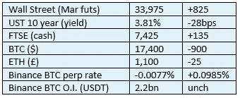

# 《好奇的密码》2022 年 11 月 11 日评论

> 原文：<https://medium.com/coinmonks/curious-cryptos-commentary-11th-november-2022-ledger-nano-x-ab6363418a5d?source=collection_archive---------35----------------------->

**TL；博士**

在这个不确定的时代，你的 Ledger Nano X 是一个无价的工具。

**市场抢购**

**市场包装**

由于显而易见的原因，Cryptos 未能加入美国上个月“仅”7.7%的通胀数据后的更广泛的风险市场反弹。有传言称，陷入困境的 FTX 中央加密货币交易所的创始人兼首席执行官萨姆·班克曼-弗里德(Sam Bankman-Fried)在试图离开巴哈马时被捕。

这应该有助于将一些人的注意力集中在处理客户资金的正当程序上。

**好奇的 Cryptos 评论——FTX 和莱杰**

(对于外行人来说，莱杰生产了一种用于自我保管的硬件钱包，看起来更像一个 u 盘。它本身并不存储密码——它允许通过离线用你的私钥签署交易来访问你的密码。对于您的加密产品组合而言，它是当今最安全的存储选择)。

这可能是 FTX 惨败后最令人惊讶的故事。

Ledger 首席技术官 Charles Guillemet 在推特上写道:

“FTX 地震后，大量资金从交易所流向总账安全和自我主权(sic)解决方案。”

这并不令人惊讶。

令人惊讶的是，Ledger Nano 附带的在线应用 Ledger Live 遭遇了“可扩展性挑战”，并且“设备管理器服务上有不寻常的负载”。

这些问题的原因似乎是通过使用 Ledger Nano 将加密资产从 FTX 交易所转移到自行保管。

这里要强调的关键点是，通过 Ledger Nano 将资产转移到自我托管并不需要使用 Ledger Live。它所需要的只是公钥的知识。如果用户不知道他们的公钥，我很怀疑他们知道如何找到他们的私钥。

同样，设备管理器服务的问题也归因于最新固件的大量上传。同样，如果用户不保持软件更新，那么软件本身就不会更新。

…

这两个问题的出现是因为一些人继续在中央交易所存储他们的大部分密码，并且对自我保管的概念不够熟悉。

我有两个提醒给你。

我认为，你的加密投资组合的 5-10%——一分也不能多——是存储在交易所的合适数量。

其余的应该由 Ledger Nano X 自行保管。

两条简单的规则，有一天可能会帮你省下一大笔钱。

**合规的东西**

触发警惕警告——如果任何读者在读完我的评论后，觉得自己“真的在颤抖”(正如一名达勒姆学生所声称的，他无法在情绪上应对不同的观点)，那么我只能建议你不要读，或者不要颤抖。这取决于你。

Cryptos——我的任何评论都不应该被视为参与 cryptos 的建议。我可能在不知道的情况下胡说八道。任何加密投资都必须被视为极高的风险，并被视为在出售前价值为零。

股票——只是为了说明这不是股票咨询服务。CCC 团队不提供任何形式的财务建议。本注释中对资产价格的任何引用都是为了简单地给出注释的上下文，并为与密码相关的某些股票的表现增添色彩。

为避免疑问，本通讯不是煽动购买密码，购买股票，甚至出售家庭成员希望购买密码或股票。

请注意，所有版权归好奇密码有限公司所有。

礼貌地要求偶尔分享和复制，你的愿望就会实现。

这封信或我们网站的新订户总是最受欢迎的。

[www.curiouscryptos.com](http://www.curiouscryptos.com)

medium.com/@mark_curiouscryptos

> 交易新手？试试[密码交易机器人](/coinmonks/crypto-trading-bot-c2ffce8acb2a)或[复制交易](/coinmonks/top-10-crypto-copy-trading-platforms-for-beginners-d0c37c7d698c)