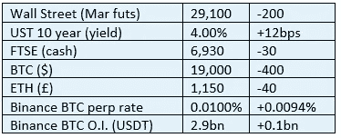

# 好奇的密码评论 2022 年 10 月 11 日

> 原文：<https://medium.com/coinmonks/curious-cryptos-commentary-11th-october-2022-e18e8a78fb17?source=collection_archive---------39----------------------->

**TL；博士**

加密的采用和小 XRP(波纹)更新。

**市场抢购**

**市场包装**

这是董事会的 4%。今年年初，10 年期利率仅为 150 个基点左右，这意味着仅今年一年，长期债券组合名义价值就下降了 25%。这就是你所谓的市场动荡。由于全球央行行长的狂妄自大，所谓安全投资的价值遭到大规模破坏。

**好奇密码的评论——密码的采用**

在熊市期间，有时很难对密码感到兴奋。或者至少我听说其他人也会这样。

不管怎样？

在幕后有大量的事情正在进行，这些事情将很快证明，密码和去中心化的概念，对于像国际货币基金组织(IMF)和其他一些我可以提到的组织来说是如此陌生，将在为人类创造繁荣、幸福和满足感方面发挥如此重要的作用。

…

Visa 长期以来一直是加密革命的坚定支持者，它正与加密货币中央交易所 FTX 合作，在 40 个国家发行借记卡。我从来没有发现有必要使用 FTX，我不能评论它，但足以说，我相信它是一个大男孩。

Visa 的发言人得到了我的投票:

“在 Visa，我们相信数字货币将对金融服务和资金流动的未来产生持久影响。”

用行动支持他们的话，借记卡可以用来使用密码而不是法定货币进行支付。虽然现在的重点是亚洲和拉丁美洲，发言人解释了这一倡议的短期目标:

“FTX 品牌的 Visa 借记卡的下一阶段推广预计将于今年年底前在欧洲进行，计划于 2023 年在其他地区推出。”

鉴于欧盟令人惊讶且最受欢迎地转向对加密技术进行适当且有针对性的监管，正如之前在这些每日通讯中详细讨论的资本资产立法市场所证明的那样，这一雄心肯定会实现。

Visa 首席财务官 Vasant Prabhu 说:

"尽管价格已经下降，但人们对加密技术仍有稳定的兴趣."

他应该知道。

**好奇 Cryptos 的评论——小 XRP (Ripple)更新**

长期以来，我一直认为，XRP 的支持者声称，美国证交会前企业融资主管威廉希曼(William Hinman)在证交会任职期间犯有以太坊基金会(Ethereum Foundation)的公然腐败行为，这并没有给他们自己带来好处。

你应该还记得，Hinman 宣称 BTC 和瑞士联邦理工学院都是商品而不是证券，SEC 指控 Ripple Labs 及其高管违反了证券法。

如果 XRP 的支持者成功地证明了希曼犯有腐败罪，这就增加了 ETH 被宣布为安全的可能性，从而毫无疑问地保证了 XRP 是一个安全的地方。这与 XRP 爱好者希望看到的结果正好相反。

最后，我得到了 Cardano 创始人 Charles Hoskinson 的支持，他对 XRP 律师 John Deaton 的评论如下:

“约翰，你是一名律师，很清楚腐败问题的讨论对当前 XRP 的安全对话没有任何影响。这是完全不同的事情，应该如此对待。它所做的只是碎片化空间，减少获胜的机会。”

…

为了充分披露，我相信我们正在接近这个传奇的最后阶段，Ripple Labs 似乎越来越有可能获胜。因此，我在 XRP 做了一笔小投资，但这不是投资建议，而是披露。

**合规材料**

触发警惕警告——如果任何读者在读完我的评论后，觉得自己“真的在颤抖”(正如一名达勒姆学生所声称的，他无法在情绪上应对不同的观点)，那么我只能建议你不要读，或者不要颤抖。这取决于你。

Cryptos——我的任何评论都不应该被视为参与 cryptos 的建议。我可能在不知道的情况下胡说八道。任何加密投资都必须被视为极高的风险，并被视为在出售前价值为零。

股票——只是为了说明这不是股票咨询服务。CCC 团队不提供任何形式的财务建议。本注释中对资产价格的任何引用都是为了简单地给出注释的上下文，并为与密码相关的某些股票的表现增添色彩。

为避免疑问，本通讯不是煽动购买密码，购买股票，甚至出售家庭成员希望购买密码或股票。

请注意，所有版权归好奇密码有限公司所有。

礼貌地要求偶尔分享和复制，你的愿望就会实现。

这封信或我们网站的新订户总是最受欢迎的。

www.curiouscryptos.com

【medium.com/@mark_curiouscryptos 

> 交易新手？尝试[加密交易机器人](/coinmonks/crypto-trading-bot-c2ffce8acb2a)或[复制交易](/coinmonks/top-10-crypto-copy-trading-platforms-for-beginners-d0c37c7d698c)