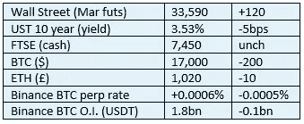

# 《好奇的密码》2022 年 12 月 12 日评论——美国政客

> 原文：<https://medium.com/coinmonks/curious-cryptos-commentary-12th-december-2022-us-politicians-f9996f2f1c4c?source=collection_archive---------42----------------------->

**TL；博士**

可悲的是，你不能让政治远离密码。

**市场抢购**

**市场包装**

BTC 的区间限制非常严格，尽管杠杆空头确信，欺诈性的 FTX 惨败将带来进一步的影响。他们可能是对的。

**好奇的 Cryptos 评论——美国政客**

尽管 CCC 在前景上仍然保持着恬不知耻和坚定的非政治性，但 cryptos 不可能脱离政治舞台。cryptos 的支持者和反对者之间的哲学分歧沿着政治路线坚定地分裂，特别是在美国。

首先是参议员雷蒙德·乔恩·特斯，他昨天发表了声明:

"我看不出这种东西存在的理由。"

在这个简单明了的句子中，Tester 明确表示他没有做任何功课，他对 cryptos 的敌意源于对失去控制的根深蒂固的恐惧。

他的理由是密码“……无法通过嗅觉测试”，这是一个被滥用的借口，当有人基于情绪而不是事实采取立场时。

他支持监管或禁止加密，但第一个选择对他没有吸引力:

“问题是，如果我们对它进行监管——一两周前我向这里的一些监管者指出了这一点——如果我们对它进行监管，它可能会让人们认为它是真实的。”

这是一个错位的句子，但我想我们知道他的意思。

这就剩下了禁止 cryptos 的选项，这根本不可能以任何有意义的方式实现，这充分表明了他的无知程度。

为了防止有人有任何疑问，我引用他的另一句有意义的话:

“都是牛****”。

在谈论密码时使用脏话完全是英国《金融时报》的套路。也许他正在考虑从事另一种职业。

…

在分歧的另一边，参议员汤姆·艾默(Tom Emmer)将美国证券交易委员会(SEC)主席加里·詹斯勒(Gary Gensler)牢牢地锁定在他的视线之内。在 2022 年 11 月 27 日的 CCC 中首次报道，Tom 加倍努力让 Gensler 承担责任:

“(詹斯勒)必须在国会作证，并回答有关其监管失误成本的问题。”

汤姆继续说道:

“他拒绝向国会提供信中要求的信息，这些信息可以告知国会 Gensler 方法中的明显不一致，导致他错过了 Terra/Luna，Celsius，Voyager 和 FTX。”

要求提供的信息与 SEC 在处理加密行业时采用的方法和流程有关。由于未能回答这些问题，汤姆再次公开指责 Gensler:

“国会不应该通过进步出版物中捏造的故事来了解证交会监管议程的细节。”

我想我们知道他指的是哪些期刊。

以防有人有任何疑问:

“FTX 的崩溃不是加密失败。和 CeFi， [@GaryGensler](https://twitter.com/GaryGensler) ，还有 Sam Bankman-Fried 都很失败。去中心化才是重点。”

…

不用猜哪个参议员支持哪个政党。

**合规玩意儿**

触发警报警告。

如果任何读者在读完我的评论后觉得他们“真的在颤抖”(这是一名达勒姆大学的学生提出的说法，他无法在情感上——当然也无法在智力上——应对罗德·利德尔表达的不同观点)，那么我只能建议你不要读，或者不要颤抖。这取决于你。

Cryptos——我的任何评论都不应该被视为参与 cryptos 的建议。我可能在不知道的情况下胡说八道。任何加密投资都必须被视为极高的风险，并被视为在出售前价值为零。

股票——只是为了说明这不是股票咨询服务。CCC 团队不提供任何形式的财务建议。本注释中对资产价格的任何引用都是为了简单地给出注释的上下文，并为与密码相关的某些股票的表现增添色彩。

为避免疑问，本通讯不是煽动购买密码，购买股票，甚至出售家庭成员希望购买密码或股票。

请注意，所有版权归好奇密码有限公司所有。

礼貌地要求偶尔分享和复制，你的愿望就会实现。

这封信或我们网站的新订户总是最受欢迎的。

【www.curiouscryptos.com 

[medium.com/@mark_curiouscryptos](mailto:medium.com/@mark_curiouscryptos)

> 交易新手？尝试[加密交易机器人](/coinmonks/crypto-trading-bot-c2ffce8acb2a)或[复制交易](/coinmonks/top-10-crypto-copy-trading-platforms-for-beginners-d0c37c7d698c)