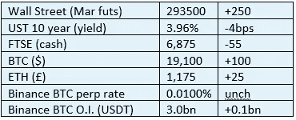

# 好奇的密码 2022 年 10 月 12 日评论

> 原文：<https://medium.com/coinmonks/curious-cryptos-commentary-12th-october-2022-f831a0c0b9b0?source=collection_archive---------28----------------------->

**TL；博士**

金融稳定委员会(FSB)正试图介入监管法案。

**市场抢购**

**市场包装**

我看到国际货币基金组织(IMF)执行了一个受桁架启发的尖锐的 180 度大转弯，现在说英国的微型预算不仅有利于增长，而且将使英国成为今年 G7 中表现最好的经济体。

鸡蛋正面朝上。

但是嘲笑这些恐龙时代遗留下来的集权实体太容易了，而且可能有点不公平。

但是我控制不了自己。这里还有一个。

**好奇的 Cryptos 评论——金融稳定委员会**

我不会为 CCC 正在进行的监管评论道歉。围绕加密的监管和立法框架是决定加密采用速度的最重要因素。

最近，我们看到了一些非常受欢迎的发展，尤其是在美国和欧盟。

如今，金融稳定委员会正试图参与进来。

…

金融稳定委员会是另一个由职业官僚组成的国际机构，他们不会被解雇，并且有非常丰厚的有保障的养老金。这类组织关注的是过程，而非结果，我不明白为什么会有人愿意在那里工作。

从他们自己的网站:

“金融稳定委员会在国际一级协调各国金融当局和国际标准制定机构的工作，并制定和促进实施有效的监管、监督和其他金融部门政策。”

值得一提的是，金融稳定委员会没有实权——它更像是一个游说组织，但我必须承认一个重要的权力，原因我无法理解。在一个理想的世界里，它的沉思可以被安全地忽略，但不幸的是，我们不能这样做。

让我们看看他们有什么要说的。

…

在昨天发布的一份报告中，金融稳定委员会提出了一个监管密码的框架。该框架旨在减轻潜在风险，同时鼓励潜在收益:

“一个有效的监管框架必须确保加密资产活动受到全面的监管，与它们带来的风险相称，同时利用其背后技术的潜在优势。”

你可以在这里阅读这份长达 11 页的报告介绍，但如果你们中有人这样做，我会感到非常惊讶:

[https://www . FSB . org/2022/10/international-regulation-of-crypto-asset-activities-a-proposed-framework-for-consulting/](https://www.fsb.org/2022/10/international-regulation-of-crypto-asset-activities-a-proposed-framework-for-consultation/)

没有人会对稳定资本的监管成为这份报告的重点感到惊讶。事实上，这份报告的主要内容——几乎没有——是区分加密和稳定加密。对于后者，金融稳定委员会侧重于“有效的稳定机制”，并得出结论:

“修订后的建议阐明，依赖算法和套利活动不是有效的稳定机制。事实上，正如报告所描述的，许多现有的 stablecoins，包括 Terra/Luna，都不符合金融稳定委员会的高级别建议。

因为 Terra 的惨败发生在几个月前，这是人类历史上最极端的马逃跑后关门的例子。

…

呃，就这样。

我的意思是，有一大堆单词根本什么也没说。如果你今天没有事情要做，你可以在这里阅读 cryptos 上包含 77 页的完整报告:

[https://www.fsb.org/wp-content/uploads/P111022-3.pdf](https://www.fsb.org/wp-content/uploads/P111022-3.pdf)

哦，别忘了附带的关于稳定的报告，这份报告长达 44 页，更易于管理:

【https://www.fsb.org/wp-content/uploads/P111022-4.pdf 号

公众被邀请就关于有效监管的必要性的陈词滥调发表评论，并承诺在 2023 年年中之前提供最终细节。

如果在任何时候有任何更实质性的建议，我将向你汇报。

**合规玩意儿**

触发警惕警告——如果任何读者在读完我的评论后，觉得自己“真的在颤抖”(正如一名达勒姆学生所声称的，他无法在情绪上应对不同的观点)，那么我只能建议你不要读，或者不要颤抖。这取决于你。

Cryptos——我的任何评论都不应该被视为参与 cryptos 的建议。我可能在不知道的情况下胡说八道。任何加密投资都必须被视为极高的风险，并被视为在出售前价值为零。

股票——只是为了说明这不是股票咨询服务。CCC 团队不提供任何形式的财务建议。本注释中对资产价格的任何引用都是为了简单地给出注释的上下文，并为与密码相关的某些股票的表现增添色彩。

为避免疑问，本通讯不是煽动购买密码，购买股票，甚至出售家庭成员希望购买密码或股票。

请注意，所有版权归好奇密码有限公司所有。

礼貌地要求偶尔分享和复制，你的愿望就会实现。

这封信或我们网站的新订户总是最受欢迎的。

[www.curiouscryptos.com](http://www.curiouscryptos.com)

medium.com/@mark_curiouscryptos

> 交易新手？试试[密码交易机器人](/coinmonks/crypto-trading-bot-c2ffce8acb2a)或[复制交易](/coinmonks/top-10-crypto-copy-trading-platforms-for-beginners-d0c37c7d698c)