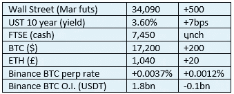
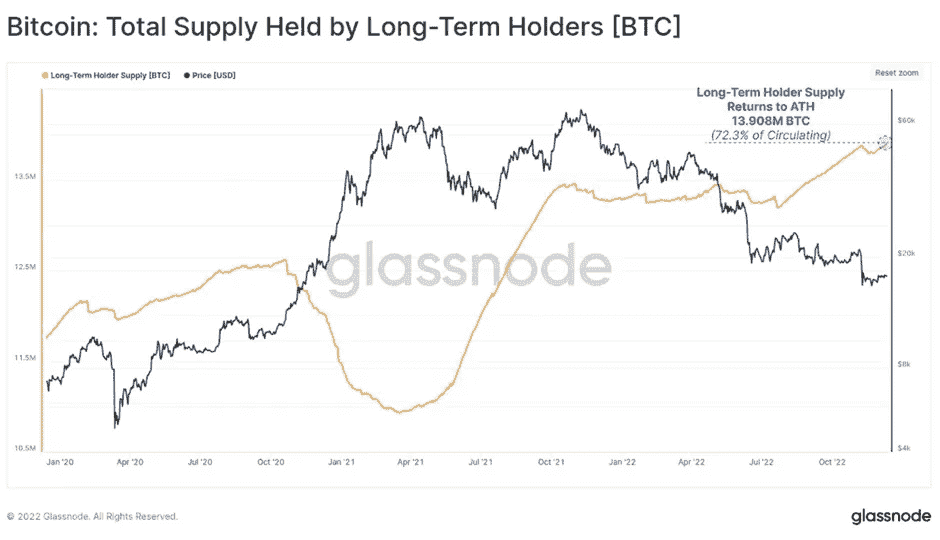
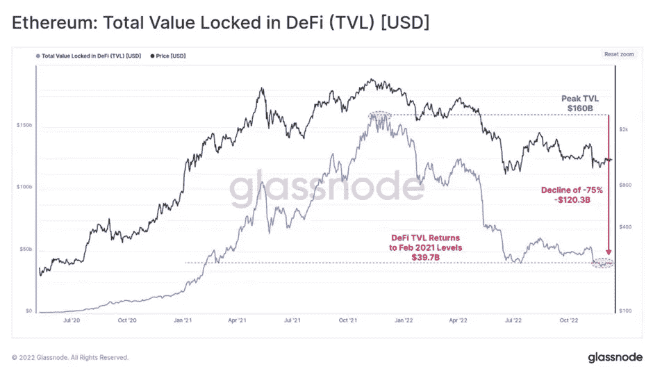

# 《好奇的密码》2022 年 12 月 13 日评论— Glassnode Analytics

> 原文：<https://medium.com/coinmonks/curious-cryptos-commentary-13th-december-2022-1dcbd7297205?source=collection_archive---------60----------------------->

**TL；博士**

Glassnode Analytics 的年终报告摘要。

**市场抢购**

**市场包装**

美国股市昨天表现不错，但 cryptos 仍保持窄幅震荡。要了解更多信息，请参见下面的评论。

**偶遇系列——FTX 前首席执行官山姆·班克曼·弗里德被捕**

“巴哈马皇家警察部队关于逮捕 Samual(原文如此)Benjamin Bankman Fried 的声明。警方宣布，美国加利福尼亚州 30 岁的塞缪尔·本杰明·班克曼-弗里德已被逮捕。

这是个好消息。

FTX 的崩溃是由于班克曼-弗里德及其亲信的欺诈行为，而不是因为 cryptos。他们都有可能永远呆在监狱里，或者至少那些没有认罪协议放弃其他人的人。

班克曼-弗里德非常公开他对某些人慷慨的政治捐款。人们会希望这些捐款现在被返还给申请破产的人。(*)

**好奇的 Cryptos 评论— Glassnode**

Glassnode 是一家链上分析公司，对各种各样的链上指标进行每周审查和评论，他们已经制作了 2022 年的最终报告:

[https://insights . glass node . com/the-week-on chain-week-50-2022/](https://insights.glassnode.com/the-week-onchain-week-50-2022/)

根据我的计算，即将有两周的假期。如果你能得到的话，干得不错，但是 CCC 绝不会考虑像那样抛弃你。与此同时，在我们一头冲进圣诞节流动性不足之际，这里有一份他们对加密市场看法的总结。

…

BTC 1 周和 2 周的实际波动性处于多年来的低点，这对于经常阅读 CCC 的读者来说并不奇怪，BTC 价格区间似乎在略低于 17k 美元的非常狭窄的区间内波动。

与此同时,(杠杆)期货交易量大幅减少，这对我们所有人来说都是好消息。目前，现货市场和期货市场的交易量相当于每天 100 亿美元左右。Glassnode 解释道:

“这表明了流动性收紧、普遍去杠杆化以及该领域许多贷款和交易部门受损的巨大影响。”

我们喜欢这个结论作为 2023 年的基础。

…

坚持期货主题，日历期货(即有到期日的期货)和永久掉期都处于现货溢价状态。由于近几个月来，永久期货融资利率一直低于 1 个基点，这并不令人意外，但它再次表明，下行风险受到抑制，许多市场参与者都以这种方式进行了对冲。

…

这可能是整份报告中最有趣也最容易理解的图表——长期持有人持有的供应量:

在我看来，有两种方法可以解释这个图表。

第一个也是最明显的是，不管 BTC 价格的市场走势如何，加密支持者仍然坚定不移地坚持他们的信念。这一群人没有在弱势时抛售，而是相反——他们将价格下跌视为买入机会。我当然认为自己属于那一类。

另一种解释是，有相当多的弱手在 2022 年的牛市中参与，现在他们后悔这个决定。尽管这些人中的许多人已经卖出(让我们其余的人以他们为代价积累)，但我相信有些人只是在等待以他们的进场价格退出。虽然他们在等待，但他们给人的印象是长期持有，但显然他们不是。

事实很可能是这两个原因的混合。在没有杠杆化子女的情况下，他们的相对实力可能是 2023 年秘密市场复苏与否的一个重要决定因素。

…

就数量而言，DeFi(去中心化金融)受到了巨大冲击:

DeFi 绝对是加密世界的西部前沿，尽管我个人对它的无数机会充满热情，但必须承认存在问题。

骗局比比皆是，形式是拉地毯和老式的庞氏骗局。大多数 dApps(去中心化应用)都很复杂，很难完全理解。一些内在的风险，特别是非永久性的损失——几乎总是永久性的——对许多参与者来说仍然笼罩在神秘和困惑之中。

毫无疑问，DeFi 将成为人类发展的一个极好的工具，但这是一个多年，甚至几十年的项目。

…

(*)机会渺茫。

**合规材料**

触发警报警告。

如果任何读者在读完我的评论后觉得他们“真的在颤抖”(这是一名达勒姆大学的学生提出的说法，他无法在情感上——当然也无法在智力上——应对罗德·利德尔表达的不同观点)，那么我只能建议你不要读，或者不要颤抖。这取决于你。

Cryptos——我的任何评论都不应该被视为参与 cryptos 的建议。我可能在不知道的情况下胡说八道。任何加密投资都必须被视为极高的风险，并被视为在出售前价值为零。

股票——只是为了说明这不是股票咨询服务。CCC 团队不提供任何形式的财务建议。本注释中对资产价格的任何引用都是为了简单地给出注释的上下文，并为与密码相关的某些股票的表现增添色彩。

为避免疑问，本通讯不是煽动购买密码，购买股票，甚至出售家庭成员希望购买密码或股票。

请注意，所有版权归好奇密码有限公司所有。

礼貌地要求偶尔分享和复制，你的愿望就会实现。

这封信或我们网站的新订户总是最受欢迎的。

[www.curiouscryptos.com](http://www.curiouscryptos.com)

medium.com/@mark_curiouscryptos

> 交易新手？试试[密码交易机器人](/coinmonks/crypto-trading-bot-c2ffce8acb2a)或[复制交易](/coinmonks/top-10-crypto-copy-trading-platforms-for-beginners-d0c37c7d698c)