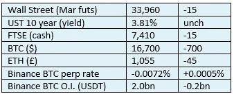
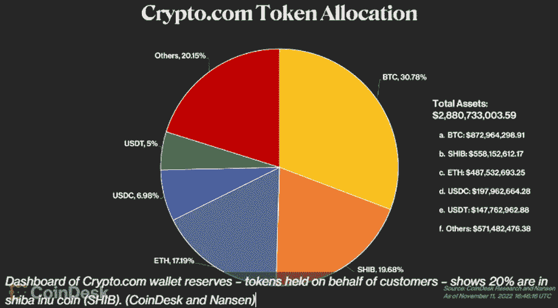

# 《好奇的密码》2022 年 11 月 13 日评论——来自 FTX 的辐射

> 原文：<https://medium.com/coinmonks/curious-cryptos-commentary-13th-november-2022-fallout-from-ftx-37dd63490135?source=collection_archive---------14----------------------->

**TL；博士**

当心 FTX 惨败的余波。

**市场抢购**

**市场包装**

随着坏消息不断传来，永久期货融资利率仍被推高至短期水平，这一次，据称 FTX 储备被“黑”了 6 亿美元。在巴哈马，大多数高级管理人员都在监控之下——他们与美国有一个铁定的引渡条约，直接导致几十年的监禁——只有卡罗琳·埃里森(见下文)似乎暂时逃脱了。

**好奇的 Cryptos 评论——Crypto.com**

中央加密货币交易所 FTX 及其姊妹公司阿尔梅达研究公司的倒闭，对加密市场来说是痛苦的，阿尔梅达研究公司是一家对冲基金，其资产非法来源于 FTX 的零售客户。

然而，我认为保持正确的观点是很重要的。

FTX 惨败的核心问题是杠杆、相关性风险和赤裸裸的盗窃，再加上高级管理团队严重缺乏经验。(*)

这些都不是密码本身造成的问题。这些问题一直困扰着商业和金融。对像 FTX 这样的集中操作进行监管审查是我们目前需要的最简单的缓解措施，美国和欧盟在这方面起带头作用。

…

历史告诉我们，以前信任的公司的崩溃会导致多米诺骨牌效应。TradFi 中的例子举不胜举，但正如我们今年早些时候看到的那样，Terra 和 LUNA 的倒闭导致 Voyager 和 Celsius 破产，我怀疑当时其他一些杠杆参与者也有点担心自己的偿付能力。

Crypto.com 有可能成为最近这场惨败的附带损害。

…

郑重声明，我对 Crypto.com 并无恶意。

也许我把重点放在这个中央加密货币交易所有点不公平。但是我希望在我解释了我的担心之后，它会帮助你关注一些可能影响你的风险。

…

Crypto.com 已经主动公布了其加密资产的分配情况。

这是值得称赞的。

但我怀疑这可能会适得其反:

他们拥有近 30 亿美元的资产，其中 20%在 SHIB (Shiba Inu)，这是去年刚刚推出的众多 meme 币中的一种。SHIB 是一个没有真正价值主张的密码，除了它有一只可爱的狗作为其个人资料图片。

那是一面红旗。

尽管大众媒体对 Crypto.com 表现出的透明度印象深刻，但我这个反向投资者忍不住从完全不同的角度看待这件事。

Crypto.com 没有公布任何有关其负债的信息。

至少这些负债是客户存款，如果将 20%的资产配置给 SHIB 能准确反映这些存款的构成，我会感到非常惊讶。

关于其借款安排以及针对这些协议的抵押品的信息为零。

关于杠杆率的信息为零。

没有对资产负债表的重要部分的洞察力——公司欠了什么，债务的持有成本是多少，以及在什么时候，什么情况下，债务需要偿还。这些都是需要回答的问题，以试图理解 Crypto.com 的偿付能力或其他。

…

我们再一次看到杠杆和相关性的双重风险抬起了丑陋的头，通过一致行动变得更加丑陋。

Crypto.com 关于其资产透明度的公关活动显然未能解决这些问题，这让我担心这一表面上无害的披露的真正原因是 Crypto.com 也处于崩溃的边缘。

也许事实并非如此，但是你想等着发现什么时候可能太晚了吗？

如果你是 Crypto.com 或任何其他集中交易所的用户，最好使用账本 Nano X，将至少 90%的加密资产转移到自我保管中。现在就行动吧。

套用一句名言，这真的是投资建议，第一次也是唯一一次出现在 CCC 的页面上。

…

(*)如果你不同意这种说法，你应该先看看对阿尔梅达研究公司首席执行官 Caroline Ellison 的采访，据称他与 FTX 首席执行官 Sam Bankman-Fried 有关系:

[https://twitter.com/i/status/1591137605613408256](https://twitter.com/i/status/1591137605613408256)

她在采访中说的话吓得我魂不附体。

这还没有考虑到她的眼镜只有一只手在左手边。

**合规玩意儿**

触发警惕警告——如果任何读者在读完我的评论后，觉得自己“真的在颤抖”(正如一名达勒姆学生所声称的，他无法在情绪上应对不同的观点)，那么我只能建议你不要读，或者不要颤抖。这取决于你。

Cryptos——我的任何评论都不应该被视为参与 cryptos 的建议。我可能在不知道的情况下胡说八道。任何加密投资都必须被视为极高的风险，并被视为在出售前价值为零。

股票——只是为了说明这不是股票咨询服务。CCC 团队不提供任何形式的财务建议。本注释中对资产价格的任何引用都是为了简单地给出注释的上下文，并为与密码相关的某些股票的表现增添色彩。

为避免疑问，本通讯不是煽动购买密码，购买股票，甚至出售家庭成员希望购买密码或股票。

请注意，所有版权归好奇密码有限公司所有。

礼貌地要求偶尔分享和复制，你的愿望就会实现。

这封信或我们网站的新订户总是最受欢迎的。

[www.curiouscryptos.com](http://www.curiouscryptos.com)

medium.com/@mark_curiouscryptos

> 交易新手？试试[密码交易机器人](/coinmonks/crypto-trading-bot-c2ffce8acb2a)或[复制交易](/coinmonks/top-10-crypto-copy-trading-platforms-for-beginners-d0c37c7d698c)