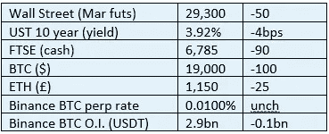

# 好奇的密码 2022 年 10 月 13 日评论

> 原文：<https://medium.com/coinmonks/curious-cryptos-commentary-13th-october-2022-fa225c5cfad1?source=collection_archive---------38----------------------->

**TL；博士**

谷歌采用加密支付。

**市场抢购**

**市场包装**

CryptoQuant 报告称，鲸鱼——被定义为拥有 100 至 1000 BTC(我希望如此)的钱包——一直在以越来越快的速度在中央交易所存放硬币。

这通常被解读为预示着潜在的抛售，因为持有人准备好按下卖出按钮。这并不意味着出售的决定已经做出，但随着普京在乌克兰的凶残行径愈演愈烈，或许快速执行的能力看起来对一些人有利。

**好奇密码的评论——密码的采用**

这是公司和企业对使用密码的想法越来越感兴趣的又一个例子。

这次是谷歌。

谷歌将与比特币基地合作，从 2023 年初开始接受数量有限的客户为其部分服务付款，这实际上消除了加密货币的市场风险。

我知道这是一小步，但是如果这个计划成功了(毫无疑问会成功),我们应该期待服务的范围和能够使用这个功能的客户群的范围会扩大。

我一直在重复下面的观点，但它很重要，因此值得重复。

这种稳定且不断增长的组织流愿意投入高级管理层的时间、资源和现金，将加密支付和服务纳入其商业模式，这不仅仅是因为对所有加密事物的热爱，尽管我愿意认为这是一个原因。

这是因为客户对该功能的需求。

…

可以说，零售相关加密应用的圣杯是亚马逊将加密支付纳入其无处不在的在线市场。

我们知道这总有一天会发生，只是时间问题。

比特币基地长期以来一直是亚马逊云业务的企业客户。

这项新交易的一个要素是，比特币基地将把这项业务从亚马逊转移到谷歌自己的云业务。

这应该会让亚马逊的反对者——他们今天在该组织中显然处于优势地位——挠头，为什么他们会犯这样的错误。

**合规的东西**

触发警惕警告——如果任何读者在读完我的评论后，觉得自己“真的在颤抖”(正如一名达勒姆学生所声称的，他无法在情绪上应对不同的观点)，那么我只能建议你不要读，或者不要颤抖。这取决于你。

Cryptos——我的任何评论都不应该被视为参与 cryptos 的建议。我可能在不知道的情况下胡说八道。任何加密投资都必须被视为极高的风险，并被视为在出售前价值为零。

股票——只是为了说明这不是股票咨询服务。CCC 团队不提供任何形式的财务建议。本注释中对资产价格的任何引用都是为了简单地给出注释的上下文，并为与密码相关的某些股票的表现增添色彩。

为避免疑问，本通讯不是煽动购买密码，购买股票，甚至出售家庭成员希望购买密码或股票。

请注意，所有版权归好奇密码有限公司所有。

礼貌地要求偶尔分享和复制，你的愿望就会实现。

这封信或我们网站的新订户总是最受欢迎的。

[www.curiouscryptos.com](http://www.curiouscryptos.com)

medium.com/@mark_curiouscryptos

> 交易新手？试试[密码交易机器人](/coinmonks/crypto-trading-bot-c2ffce8acb2a)或[复制交易](/coinmonks/top-10-crypto-copy-trading-platforms-for-beginners-d0c37c7d698c)