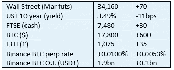

# 《好奇的密码》2022 年 12 月 14 日评论——币安

> 原文：<https://medium.com/coinmonks/curious-cryptos-commentary-14th-december-2022-binance-77adf9191224?source=collection_archive---------37----------------------->

**TL；博士**

币安可能有麻烦，也可能没有，但还是小心为好。

**市场抢购**

**市场包装**

杠杆空头被取出，刺激了 BTC 价格，导致一夜之间创下月度新高。与此同时，ARG(阿根廷队标志)在过去几天里翻了一番，尽管所有的队标志在本届世界杯期间都严重低于我的希望。

**偶遇系列——银行家弗里德，诈骗犯，FTX 前 CEO**

这名罪犯骗走了数百万人价值数十亿美元的储蓄——严格遵循在数千年的遗留金融欺诈中编写和完善的剧本——在被捕后申请保释，因为他需要维持素食饮食。

**好奇的 Cryptos 评论——币安**

似乎班克曼-弗里德的被捕引发了一些投资者对币安偿付能力或其他方面的担忧，该交易所是目前世界上最大的中央加密货币交易所。

就在昨天，30 亿美元的资产被取走，想必大部分进入了 Ledger Nano X 等自我保管的钱包。这类新闻故事当然是自我强化的。长期以来，我一直认为，集中交易所持有的加密资产不应超过 5-10 %,这是防范任何一个交易所崩溃风险的关键手段。在我集中交易的那些基金中，绝大部分是在币安和比特币基地持有的。但 FUD 也打动了我，我持有的大部分币安股票现在都被冷藏了。

…

毫无疑问，币安的崩溃将是加密市场有史以来最大的灾难。

Twitter 上的一些评论者比我更好地解释了这一点(所有拼写和语法错误都忠实地转载自原文):

“我不明白为什么人们在为币安的崩溃欢呼。你意识到如果币安垮台，其他一切都会崩溃吗？是的#比特币将会存活，但包括 stablecoins 在内的整个加密生态系统将会消亡。”

“币安破产肯定会让这个行业倒退几年，我同意这一点。但是密码产业会消失吗..不，我不同意。早在币安出现之前，加密技术就已经存在了&此后它还会存在”

“媒体试图在币安引起银行挤兑。在过去的几个星期里，他们已经尝试了几个关于这方面的说法，最新的说法是[@币安](https://twitter.com/binance)没有通过审核。事实是，时间是第一审计，[@币安](https://twitter.com/binance)已经证明了时间的考验。”

“如果币安倒下，对这个领域不会有任何好处。回到石器时代。币安是我最想去的地方。我相信币安很好，这是一场由希望 crypto 失败的实体运作的协调一致的 FUD 战役。”

“币安破产意味着密码消失。为什么人们会把这个放在那里？”

“加密不会消失。那艘船已经起航了。Crypto 会一直存在。然而，从长期来看，这对市场来说将是一场灾难。政府将把它作为更多秘密监管的另一个例子。成千上万的人和家庭将失去他们一生的积蓄”

诸如此类。

…

在这些版面上，币安经常受到批评，因为它以前在遵守监管规范方面表现平平。

在过去一年左右的时间里，高级管理层对这个问题的态度发生了巨大的变化。然而，我们目前有一家私人公司，拥有几个不同的运营实体，其中一些实体遵循当地监管标准，但没有代表整个组织的中央总部。对于这样一个大玩家来说，这不是一个理想的情况。

最近的一项审计表明，币安的客户存款是储备资产的 1.01 倍，但这并没有解决资产负债表内外其他负债的潜在问题。币安是这样说的:

"币安的用户资产都得到 1:1 的支持，币安的资本结构是无负债的."

让我们希望这是真的。

路透社认为，否则声称美国检察官接近“……对包括创始人赵昌鹏在内的个别高管提出刑事指控。”

…

金融灾难总是会在表面下隐藏很长一段时间，然后突然爆发，几乎没有任何预警。

通常情况下，金融灾难要么源于欺诈，要么源于可能与相关性相关的杠杆，或者通常是这三种因素的结合。

不可能肯定地说币安是否处于一个好的位置，尽管这似乎与我们在 FTX 看到的情况和集结不同(见 2022 年 11 月 8 日 CCC 警告，在撤军停止前几个小时将你的资产撤离 FTX)。

但谨慎有时是更好的选择。

**合规的东西**

触发警报警告。

如果任何读者在读完我的评论后觉得他们“真的在颤抖”(这是一名达勒姆大学的学生提出的说法，他无法在情感上——当然也无法在智力上——应对罗德·利德尔表达的不同观点)，那么我只能建议你不要读，或者不要颤抖。这取决于你。

Cryptos——我的任何评论都不应该被视为参与 cryptos 的建议。我可能在不知道的情况下胡说八道。任何加密投资都必须被视为极高的风险，并被视为在出售前价值为零。

股票——只是为了说明这不是股票咨询服务。CCC 团队不提供任何形式的财务建议。本注释中对资产价格的任何引用都是为了简单地给出注释的上下文，并为与密码相关的某些股票的表现增添色彩。

为避免疑问，本通讯不是煽动购买密码，购买股票，甚至出售家庭成员希望购买密码或股票。

请注意，所有版权归好奇密码有限公司所有。

礼貌地要求偶尔分享和复制，你的愿望就会实现。

这封信或我们网站的新订户总是最受欢迎的。

[www.curiouscryptos.com](http://www.curiouscryptos.com)

medium.com/@mark_curiouscryptos

> *交易新手？试试* [*密码交易机器人*](/coinmonks/crypto-trading-bot-c2ffce8acb2a) *或* [*复制交易*](/coinmonks/top-10-crypto-copy-trading-platforms-for-beginners-d0c37c7d698c)
> 
> *分散加密持股，了解* [*币安的替代方案*](https://coincodecap.com/binance-alternatives)
> 
> *加入 Coinmonks* [*电报频道*](https://t.me/coincodecap) *和* [*Youtube 频道*](https://www.youtube.com/c/coinmonks/videos) *获取每日* [*加密新闻*](http://coincodecap.com/)

# 另外，阅读

*   [复制交易](/coinmonks/top-10-crypto-copy-trading-platforms-for-beginners-d0c37c7d698c) | [加密税务软件](/coinmonks/crypto-tax-software-ed4b4810e338)
*   [电网交易](https://coincodecap.com/grid-trading) | [加密硬件钱包](/coinmonks/the-best-cryptocurrency-hardware-wallets-of-2020-e28b1c124069)
*   [密码电报信号](/coinmonks/top-3-telegram-channels-for-crypto-traders-in-2021-8385f4411ff4) | [密码交易机器人](/coinmonks/crypto-trading-bot-c2ffce8acb2a)
*   [最佳加密交易所](/coinmonks/crypto-exchange-dd2f9d6f3769) | [印度最佳加密交易所](/coinmonks/bitcoin-exchange-in-india-7f1fe79715c9)
*   [面向开发人员的最佳加密 API](/coinmonks/best-crypto-apis-for-developers-5efe3a597a9f)
*   最佳[密码借贷平台](/coinmonks/top-5-crypto-lending-platforms-in-2020-that-you-need-to-know-a1b675cec3fa)
*   [免费加密信号](/coinmonks/free-crypto-signals-48b25e61a8da) | [加密交易机器人](/coinmonks/crypto-trading-bot-c2ffce8acb2a)
*   杠杆代币的终极指南