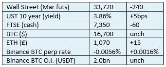
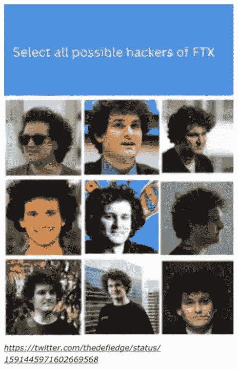

# 好奇 Cryptos 评论 2022 年 11 月 14 日—自我监护

> 原文：<https://medium.com/coinmonks/curious-cryptos-commentary-14th-november-2022-self-custody-1cbd287cdf19?source=collection_archive---------43----------------------->

**TL；博士**

加密资产的自我保管不仅仅是一件事。

**市场抢购**

**市场包装**

币安的一项声明稳定了隔夜的抛售:

“为了进一步减少 FTX 带来的负面影响，币安正在组建一个行业复苏基金，以帮助那些实力雄厚但陷入流动性危机的项目。更多细节即将公布。同时，如果您认为自己合格，请联系币安实验室。”

**偶遇系列——笑一笑，感谢牛奶之路**

[https://www.milkroad.com/subscribe?ref=o5CmCFhBAK](https://www.milkroad.com/subscribe?ref=o5CmCFhBAK)

**好奇的加密人评论——中央加密货币交易所**

本周，我们目睹了中央加密货币交易所 FTX 及其姊妹对冲基金阿尔梅达研究(Almeda Research)的崩溃，FTX 曾向其非法秘密出借客户存款。

FTX 不是第一个死去的同类。

众所周知，Mt. Gox 在 2014 年因其储备基础遭到大规模攻击而破产。在我看来，Mt. Gox 失败的核心原因是无能，这比 FTX 个人自大造成的欺诈更为严重，但这只是我的一种观点，与那些将信任和资金投入这些组织的人无关。

昨天，CCC 对 Crypto.com 的资产负债表提出了一些合理的质疑。

从那以后，事情变得更糟了。

…

为了更好地理解，我们需要回到几天前。

币安是世界上最大的中央加密货币交易所。它的产品范围很广，它的用户界面我个人很喜欢，但我知道，对于那些对交易屏幕的知识和使用有限的人来说，它可能会让人望而生畏。就其监管行为而言，其首席执行官赵昌鹏最近的态度发生了巨大变化。我认为公平的说法是，这部分是由于 CCC 对币安企业文化的一些尖锐但合理的批评。

作为对 FTX 惨败的回应，币安提出了一个被称为“储量证明”的机制。

抛开秘密共识机制的术语，储量证明是一个中央化的概念，借用去中心化的世界来获得可信度。

但这并不是坏事。这又一次证明了去中心化和集中化的世界将如何找到空间相互包容，造福全人类。

…

储量证明背后的想法是，像币安这样的交易所将定期公布其资产和负债的细节。

这显然是一件好事，不容置疑。这一倡议不需要监管或立法。我认为，未来考虑使用集中式加密货币交易所进行交易，将要求在提交资产前了解这些细节。

至关重要的是，储量证明需要由声誉良好的审计机构进行审计，然后才能出具。

…

但是有一件事。

即使没有审计员，如果一个集中的组织试图对其分散的资产和负债撒谎，它也会被发现。

并且很快发现，这在中央集权的世界里是不可能发生的。

这是一个大胆的主张，所以我来解释一下。

…

据报道，在 Crypto.com 公布其资产(但不是其负债——见昨天的 CCC)后不久，320，000 ETH 被转移到 Gate.io，并包括在后者的公开声明储备证明中。

在 OKex 公开发表储量证明声明后不久，Huobi.com 以类似的方式向其转让了 10，000 ETH。

这些转移可能有合法的原因，公平地说，它们的美元价值有限。但是当 Crypto.com 公司的首席执行官克里斯·马斯扎克承认这笔资金——占 crypto . com 所持 ETH 股份的 82%——被意外转移到 Gate.io 时，我对这种转移的怀疑达到了顶点:

本应是移动到新的冷存储地址，但却被发送到白名单中的外部 exchange 地址

是的没错。我们都相信一个配偶。

…

我们还剩下什么？

我必须再一次重申，一个人在中央加密货币交易所持有的加密资产不应超过 5-10%。

其余部分应自行保管，最好使用 Ledger Nano X。如果您有任何疑问，请注册我们的免费在线培训课程:

https://www.curiouscryptos.com/cccourses[。](https://www.curiouscryptos.com/cccourses)

我还要补充一点，比特币基地和币安可能是唯一可以放心持有资产的交易所。例如，总部位于香港的 AAX 交易所(exchange Hong Kong)已停止所有提款，尽管它声称没有 FTX 敞口。

我刚刚浏览了我的加密电子表格和我的个人账户包。除了我最喜欢的两家交易所之外，各种小型交易所持有的密码价值只有几百美元左右。

不会太久了。

**合规玩意儿**

触发警惕警告——如果任何读者在读完我的评论后，觉得自己“真的在颤抖”(正如一名达勒姆学生所声称的，他无法在情绪上应对不同的观点)，那么我只能建议你不要读，或者不要颤抖。这取决于你。

Cryptos——我的任何评论都不应该被视为参与 cryptos 的建议。我可能在不知道的情况下胡说八道。任何加密投资都必须被视为极高的风险，并被视为在出售前价值为零。

股票——只是为了说明这不是股票咨询服务。CCC 团队不提供任何形式的财务建议。本注释中对资产价格的任何引用都是为了简单地给出注释的上下文，并为与密码相关的某些股票的表现增添色彩。

为避免疑问，本通讯不是煽动购买密码，购买股票，甚至出售家庭成员希望购买密码或股票。

请注意，所有版权归好奇密码有限公司所有。

礼貌地要求偶尔分享和复制，你的愿望就会实现。

这封信或我们网站的新订户总是最受欢迎的。

[www.curiouscryptos.com](http://www.curiouscryptos.com)

medium.com/@mark_curiouscryptos

> 交易新手？试试[密码交易机器人](/coinmonks/crypto-trading-bot-c2ffce8acb2a)或[复制交易](/coinmonks/top-10-crypto-copy-trading-platforms-for-beginners-d0c37c7d698c)