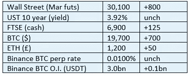
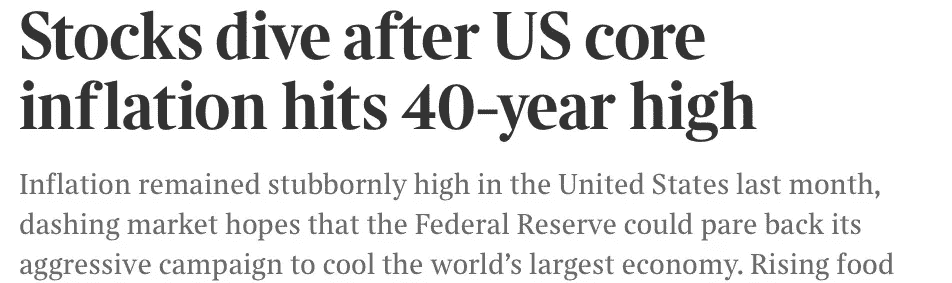

# 好奇的密码 2022 年 10 月 14 日评论

> 原文：<https://medium.com/coinmonks/curious-cryptos-commentary-14th-october-2022-74161d8c39b1?source=collection_archive---------50----------------------->

**TL；博士**

会计规则刚刚变得令人兴奋！

**市场抢购**

**市场包装**

随着彭博继续声称今天上午市场动荡，我只能看到一个非常令人印象深刻的风险资产反弹。我错过了什么？

**好奇的 Cryptos 评论——财务误报**

我知道我一直在唠叨这件事，但它真的让我心烦。

只是提醒一下，我没有政治目的 CCC 仍然保持着强烈的非政治性。

如你所知，英国媒体在迷你预算后连续几天刊登了关于市场动荡的头条新闻，没有事实证据来支持耸人听闻、刺耳的头条新闻，似乎是为了设计报道的结果，尽管——对所有人来说都是幸运的——绝对没有效果。

现在他们又在这么做了。昨天下午，我在我们最权威的出版物之一的网络版上看到了这一点:

有人想猜猜在那个特定的时间点股票在哪里吗？

是的，你是对的。

华尔街上涨了 600 点，大约 2%，现在甚至更高。记者的正直到底怎么了？

**好奇密码的评论——会计准则**

我知道，我已经失去了你们中的大部分，但如果你能坚持到底，这是一个有趣而有教育意义的 CCC。

2021 年 6 月 16 日，CCC 报告称，MSTR (MicroStrategy)为公司资产负债表上的密码会计处理提供了一个方便的小指南:

“然而，我们认为加密货币通常符合无限期无形资产的定义，因为它们不会像金融工具一样传递特定的权利。不确定寿命的无形资产不摊销，但要求按其历史成本确认和计量；当账面金额超过公允价值时，确认减值。禁止随后转回先前确认的减值损失”。

这些都只是文字，坦率地说，对于那些具有会计工作知识的人来说，这些文字令人担忧，但 CCC 提出了一个问题——这在实践中意味着什么？

当时我不想给你留下一个扣人心弦的问题，我也回答了这个问题:

“如果在任何季度报告日，资产负债表上持有的 BTC 的市值低于购买价格，该公司必须将这一损失视为亏损，并在 PnL 宣布。

如果在任何季度报告日，市值增加，该收益不能在 PnL 中确认，直到 BTC 被出售。"

…

这个问题对每个人来说都是显而易见的。

这个问题一直是企业财务部门考虑将一小部分投资组合分散到 BTC 的主要绊脚石。

财政部有一个非常明确的职能——他们需要在日常运营现金需求和长期融资计划之间取得平衡。

这些计划主要由债务组成，这与股权(股票和股份)是公司融资的关键驱动力的流行观点相反，但我们可以再次将公众的无知归因于所有主要新闻媒体，无论是印刷还是数字媒体，大多数财务报告的低质量。

我告诉过你这让我很烦。

继续前进。

老读者会记得，我在 2021 年 2 月 5 日对每 BTC 120 万美元的荒谬价格预测包含了一个假设，即有朝一日多达 5%的公司国债资产将被分配给 BTC。

对这一投资总额的估计很难获得，也不太可能准确。我看到一些人说这大约是 10 万亿美元([http://www.pagetutor.com/trillion/index.html](http://www.pagetutor.com/trillion/index.html))，对我来说这似乎是一个非常低的数字，但我们将继续下去。

如果这些资产中有 5%被配置到 BTC，那么 BTC 的市值将增加一倍以上，价格至少会上涨一倍，尽管有这么大的买家，卖方流动性的缺乏将放大价格的上行。

也许你想说这一比例只有 1%，但我认为 10 万亿美元是对公司国债资产的严重低估。

不管这些细节和潜在的分歧，关键是这个。推动每 BTC 120 万美元的因素之一是企业财务部门的采用。

现在这一天已经越来越近了。

….

美国财务会计准则委员会(FASB)已经宣布，加密资产在资产负债表上以“公允价值”呈现。

公允价值在理论上是一个简单的概念，但在现实生活中有点困难，但这是审计人员的讨论，而不是我们。

我们将假设 BTC 在比特币基地和币安等散户驱动的集中交易所的市场价格就是 BTC 的公允价值(*)。这无疑是最普遍接受的公允价值衡量标准。

让我再问一次同样的问题——这在实践中意味着什么？

答案是这样的:

如果在任何季度报告日，资产负债表上持有的 BTC 的市值低于购买价格，该公司必须将这一损失视为亏损，并在 PnL 宣布。

如果在任何季度报告日，市值增加，该收益必须在 PnL 中确认。

…

毕马威另类投资税务业务负责人 Anthony Tuths 理解这一新会计法令的重要性:

“FASB 刚刚为新的会计准则扫清了道路，该准则将允许大多数加密货币以公允价值入账。当该指南生效时(可能在 2023 年)，它将极大地有助于为更广泛的主流采用铺平道路。”

干得好，托尼。

…

(*)剧透警报——没有，原因我们之前已经讨论过。

**合规材料**

触发警惕警告——如果任何读者在读完我的评论后，觉得自己“真的在颤抖”(正如一名达勒姆学生所声称的，他无法在情绪上应对不同的观点)，那么我只能建议你不要读，或者不要颤抖。这取决于你。

Cryptos——我的任何评论都不应该被视为参与 cryptos 的建议。我可能在不知道的情况下胡说八道。任何加密投资都必须被视为极高的风险，并被视为在出售前价值为零。

股票——只是为了说明这不是股票咨询服务。CCC 团队不提供任何形式的财务建议。本注释中对资产价格的任何引用都是为了简单地给出注释的上下文，并为与密码相关的某些股票的表现增添色彩。

为避免疑问，本通讯不是煽动购买密码，购买股票，甚至出售家庭成员希望购买密码或股票。

请注意，所有版权归好奇密码有限公司所有。

礼貌地要求偶尔分享和复制，你的愿望就会实现。

这封信或我们网站的新订户总是最受欢迎的。

www.curiouscryptos.com

【medium.com/@mark_curiouscryptos 

> 交易新手？尝试[加密交易机器人](/coinmonks/crypto-trading-bot-c2ffce8acb2a)或[复制交易](/coinmonks/top-10-crypto-copy-trading-platforms-for-beginners-d0c37c7d698c)