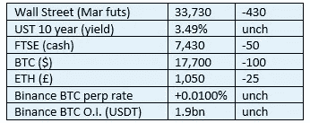

# 2022 年 12 月 15 日——加拿大

> 原文：<https://medium.com/coinmonks/curious-cryptos-commentary-15th-december-2022-canada-91fb49ce1e3b?source=collection_archive---------32----------------------->

**TL；博士**

加拿大正在打造一条新的密码监管路径。

**市场抢购**

**市场包装**

我昨晚睡觉时确信我今天早上会报告一个 18 句柄(我知道，我知道，痴迷甚至不能开始解释它)。

风险资产自己也不相信美联储关于到 2023 年底只会再增加 75 个基点的预测是正确的。2s-10s 保持反相 95bps。财政部官员喜欢通胀，因为他们对债务预测持悲观态度，但衰退将对政府财政造成严重破坏。财富税背后的动力开始看起来不可阻挡。

**偶然系列——神秘的金融事物**

安德鲁·贝利是英格兰银行行长。

他肩负着将通胀率保持在 2%左右的目标，却在这方面酿成了一场灾难。

当然有他无法控制的因素。

但人们可能会希望，像他这种政治能力的技术官僚应该知道，通过增加 QE(也就是让富人更富，穷人更穷)来刺激供应，同时支持通过封锁(也就是西方自由民主国家中最恶劣的剥夺公民自由的行为)来大幅削减需求，这是一种将对经济理论 1.0 进行嘲讽的组合。

现在我们了解到，在“金融危机”期间——迷你预算后所有主要报纸都是这样报道的(尽管没有实际证据证明这一点，除了所有反向投资者都利用的英镑/美元汇率的非常短暂的异常)——英国央行考虑采取 LDIs(流动性驱动工具)，养老基金因其资产负债表上的 QE 而被迫投资 LDIs。

你在开玩笑吗？即使你忽略了这种决定所固有的相关性风险所引起的道德风险，无能也是他最小的罪过。

这个人退休时将会有一大笔养老金，一个爵士头衔，也许还有一个每天 350 英镑的免税职位。

与此同时，我们其他人要为他在任上的失败买单。

**偶然系列——关于 FTX/阿拉米达研究的一些新的可怕事实**

会计记录使用 QuickBooks 维护，这对于小企业来说是一个非常合理的选择，但其管理会计功能非常有限，金融资产的零风险管理信息。

当从投资者那里筹集新资金时，班克曼-弗里德使用一个人工维护的电子表格来吹嘘他的个人财富——没有人认为这很奇怪。

阿拉米达 80 亿美元的交易损失被转移到另一个账户，内部称之为“那个奇怪的韩国账户”。

阿拉米达获得了无限的信用额度，在高杠杆交易中没有保证金要求。

Alameda 在速度和审批流程方面获得了交易执行优势，实际上相当于一个前置操作。

**好奇的 Cryptos 评论——加拿大又开始禁止东西了**

众所周知，加拿大对其自由主义和民主的声誉的破坏程度超过了任何其他西方自由民主国家，不仅是对 Covid 的过度反应，尤其是对其对 Covid 的过度反应所引起的反应的过度反应。

现在，它又开始着手禁止某些东西了。政客们就是控制不住自己。

奇怪的是，尽管我讨厌“禁止”这个词，尤其是它的实际用法，但我发现自己站在他们一边。

我知道这是令人担忧的时期。

让我解释一下。

…

加拿大证券管理局(CSA)发布了一份新闻稿，您可以在此阅读全文:

[https://www . OSC . ca/en/news-events/news/CsA-provides-update-crypto-trading-platforms-operating-Canada](https://www.osc.ca/en/news-events/news/csa-provides-update-crypto-trading-platforms-operating-canada)

假设你有自己的生活，并且你已经把这样的任务委托给我，那么这里有一个简短的摘要。

今年早些时候，CSA 要求所有在加拿大运营的加密交易平台都必须在 CSA 注册。这是一个完全合理的要求，尽管如果我是书生气的话，我会指出这种方法有一个重大缺陷。CSA 不仅忽视了去中心化的世界，也没有承认去中心化的世界的存在。

但该表扬的地方就应该表扬。

CSA 的职权范围必须集中在菲亚特进入加密世界的集中入口，他们正在积极地追求这一职权范围。

新闻稿包含三个关键条款:

“出于证券监管的目的，加拿大人可以访问的位于加拿大境外的平台被视为在加拿大运营。”

“……要求通过适当的托管人持有加拿大客户的资产，并将这些资产与平台的自营业务隔离……”

“……禁止向任何加拿大客户提供保证金或杠杆。”

…

CCC 一直是监管和立法的支持者，这是机构大规模采用密码的唯一可行途径。

上述三个条款中的第一个描述了加拿大立法范围的参数。这种延伸可能不像美国的立法延伸那样可怕，但考虑到这两个国家在金融和经济上对生活的看法非常接近，这当然应该引起思考。

这三个条款中的第二个应该是所有任何类型的集中式加密/平台的最低要求。如果这一点在 FTX 得到了实施，我们现在会有一个平静得多的几个月。

因此，在这两点上，我与 CSA 没有争议，尽管我认为这两点都不是特别创新，也不是突破性的。

最后一点是真正引起我注意的一点。

任何金融资产的杠杆交易都不适合散户投资者，或许最老练的投资者除外。

对散户投资者来说，在任何密码上进行杠杆交易都是自杀，不管他们是谁。

在我的生活中，我很少支持禁止一些十诫和其他一些明显例子之外的东西，但这是其中之一。

…

这份文件最搞笑的部分是这个评论:

“此外，正如其商业计划中概述的那样，加拿大证券管理局将继续监测和评估稳定资本在加拿大资本市场中的存在和作用。”

没有一个技术专家或官僚会认可一个商业计划，即使你用它挠他们的腋窝，然后把它塞进他们的内裤里，但他们不这样想是很甜蜜和天真的。

**合规材料**

触发警报警告。

如果任何读者在读完我的评论后觉得他们“真的在颤抖”(这是一名达勒姆大学的学生提出的说法，他无法在情感上——当然也无法在智力上——应对罗德·利德尔表达的不同观点)，那么我只能建议你不要读，或者不要颤抖。这取决于你。

Cryptos——我的任何评论都不应该被视为参与 cryptos 的建议。我可能在不知道的情况下胡说八道。任何加密投资都必须被视为极高的风险，并被视为在出售前价值为零。

股票——只是为了说明这不是股票咨询服务。CCC 团队不提供任何形式的财务建议。本注释中对资产价格的任何引用都是为了简单地给出注释的上下文，并为与密码相关的某些股票的表现增添色彩。

为避免疑问，本通讯不是煽动购买密码，购买股票，甚至出售家庭成员希望购买密码或股票。

请注意，所有版权归好奇密码有限公司所有。

礼貌地要求偶尔分享和复制，你的愿望就会实现。

这封信或我们网站的新订户总是最受欢迎的。

【www.curiouscryptos.com 号

【medium.com/@mark_curiouscryptos 

> *交易新手？试试* [*密码交易机器人*](/coinmonks/crypto-trading-bot-c2ffce8acb2a) *或* [*复制交易*](/coinmonks/top-10-crypto-copy-trading-platforms-for-beginners-d0c37c7d698c)
> 
> *分散加密持股，了解* [*币安的替代方案*](https://coincodecap.com/binance-alternatives)
> 
> *加入 Coinmonks* [*电报频道*](https://t.me/coincodecap) *和* [*Youtube 频道*](https://www.youtube.com/c/coinmonks/videos) *获取每日* [*加密新闻*](http://coincodecap.com/)

# 另外，阅读

*   [复制交易](/coinmonks/top-10-crypto-copy-trading-platforms-for-beginners-d0c37c7d698c) | [加密税务软件](/coinmonks/crypto-tax-software-ed4b4810e338)
*   [网格交易](https://coincodecap.com/grid-trading) | [加密硬件钱包](/coinmonks/the-best-cryptocurrency-hardware-wallets-of-2020-e28b1c124069)
*   [密码电报信号](/coinmonks/top-3-telegram-channels-for-crypto-traders-in-2021-8385f4411ff4) | [密码交易机器人](/coinmonks/crypto-trading-bot-c2ffce8acb2a)
*   [最佳加密交易所](/coinmonks/crypto-exchange-dd2f9d6f3769) | [印度最佳加密交易所](/coinmonks/bitcoin-exchange-in-india-7f1fe79715c9)
*   [面向开发人员的最佳加密 API](/coinmonks/best-crypto-apis-for-developers-5efe3a597a9f)
*   最佳[密码借贷平台](/coinmonks/top-5-crypto-lending-platforms-in-2020-that-you-need-to-know-a1b675cec3fa)
*   [免费加密信号](/coinmonks/free-crypto-signals-48b25e61a8da) | [加密交易机器人](/coinmonks/crypto-trading-bot-c2ffce8acb2a)
*   [杠杆代币终极指南](/coinmonks/leveraged-token-3f5257808b22)