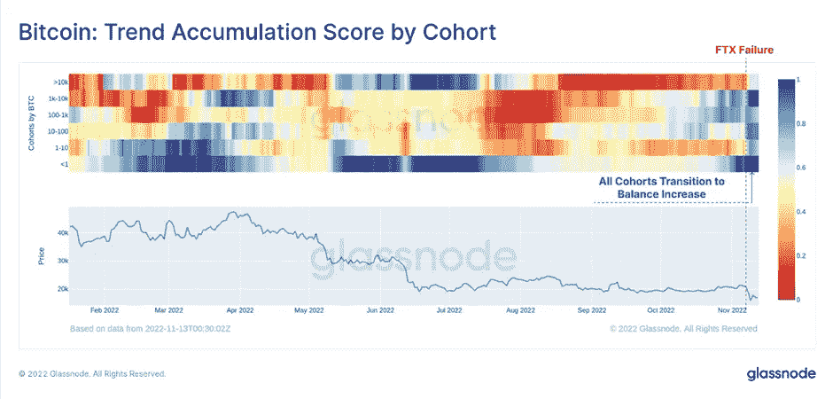

# 好奇密码评论 2022 年 11 月 15 日 LBRY 公司。

> 原文：<https://medium.com/coinmonks/curious-cryptos-commentary-15th-november-2022-lbry-inc-28f74cf0ec68?source=collection_archive---------27----------------------->

**TL；博士**

LBRY Inc .输给了 SEC，这对密码行业毫无益处。

**市场抢购**

**市场包装**

币安昨日宣布成立一只行业复苏基金，继续对市场产生安抚作用，这不是坏事。据我所知，FTX 事件的影响仅限于一家对冲基金，该基金将约 90%现已冻结的客户资产存放在 FTX。如果他们在停止从 FTX 撤军前几个小时读到中央司令部发出的逃离 FTX 的警告，他们可能会更早采取行动。

**偶然系列——自我保管**

我很高兴你们都认真考虑了 CCC 的建议，将加密货币从中央加密货币交易所转移到自我保管，最好使用 Ledger Nano X。

我怎么知道这个？Glassnode 是这么说的:

“作为对 FTX 失败的直接回应，在所有钱包投资者中，有#名比特币投资者的行为明显转向了自我保管。

从虾到鲸鱼，#比特币 onchain 余额正在上升🔵

阅读更多尽在本周外链👇
[https://glassno.de/3UvSNb0](https://t.co/cVUE7QHbtQ)

伴随着这张图表:

**好奇的 Cryptos 评论— LBRY 公司**

上周，美国证券交易委员会(SEC)赢得了对 LBRY Inc .的诉讼，该公司出售本国硬币 LBRY 违反了证券法。具体来说，LBRY Inc .未能将 LBRY 的出售登记为证券发行。

完整的裁决可以在这里看到:

[https://fingfx . Thomson Reuters . com/gfx/legal docs/mopakmakkpa/SECURITIES % 20 lbry % 20 ruing . pdf](https://fingfx.thomsonreuters.com/gfx/legaldocs/mopakmakkpa/SECURITIES%20LBRY%20ruling.pdf)

路透社简明扼要地总结如下:

新罕布什尔州康科德的美国地区法官保罗·巴尔巴多罗裁定，任何合理的陪审团都不能驳回证券交易委员会的指控，即 LBRY 提供信用作为对其内容分发网络的投资

对于证交会主席加里·詹斯勒(Gary Gensler)来说，这显然是一个令人振奋的消息，他因积极扩大证交会的职权范围和责任而受到越来越大的压力。

另一方面，这对密码行业来说不是好消息。CCC 完全支持促进创新和发展的有针对性的监管。我越来越相信，这不会是那些被指定为证券而非商品的密码的结果。

杰里米·考夫曼。LBRY CED 同意我的观点，称该决定“威胁到整个美国加密货币行业”，因为它可能会将我们引向一条道路，即除 BTC 外的所有加密货币都是证券。

这一事态发展加剧了美国证券交易委员会诉 XRP (Ripple)案的热度，该案的数据收集过程已接近完成，法官将很快离开，考虑他的回应，预计在几个月后。

**合规材料**

触发警惕警告——如果任何读者在读完我的评论后，觉得自己“真的在颤抖”(正如一名达勒姆学生所声称的，他无法在情绪上应对不同的观点)，那么我只能建议你不要读，或者不要颤抖。这取决于你。

Cryptos——我的任何评论都不应该被视为参与 cryptos 的建议。我可能在不知道的情况下胡说八道。任何加密投资都必须被视为极高的风险，并被视为在出售前价值为零。

股票——只是为了说明这不是股票咨询服务。CCC 团队不提供任何形式的财务建议。本注释中对资产价格的任何引用都是为了简单地给出注释的上下文，并为与密码相关的某些股票的表现增添色彩。

为避免疑问，本通讯不是煽动购买密码，购买股票，甚至出售家庭成员希望购买密码或股票。

请注意，所有版权归好奇密码有限公司所有。

礼貌地要求偶尔分享和复制，你的愿望就会实现。

这封信或我们网站的新订户总是最受欢迎的。

【www.curiouscryptos.com 号

【medium.com/@mark_curiouscryptos 

> 交易新手？尝试[加密交易机器人](/coinmonks/crypto-trading-bot-c2ffce8acb2a)或[复制交易](/coinmonks/top-10-crypto-copy-trading-platforms-for-beginners-d0c37c7d698c)