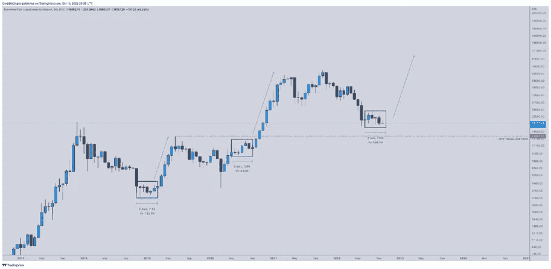

# 好奇的密码评论 2022 年 10 月 15 日

> 原文：<https://medium.com/coinmonks/curious-cryptos-commentary-15th-october-2022-6c10f3e2ef90?source=collection_archive---------32----------------------->

**TL；博士**

加入对抗 CDBCs(央行数字货币)的战斗。

**市场抢购**

**市场包装**

收益率再次上升。随着利息支出在政府支出中所占的份额越来越大，税收无情地增加，削减了消费者和企业支出，有人能解释一下继续为公共服务提供资金的计划吗？

**偶遇系列——今晚的桑丘·潘萨船会**

明天肯定不会有 CCC。

**好奇 Cryptos 解说— h/t 牛奶之路再来**

**好奇 Cryptos 评论—技术分析(TA)**

不管我对在图表上画曲线和线条有多怀疑，当它符合我的世界观时，我喜欢一点 TA。以此为例:

注意右边是对数刻度。

很好。今天技术人员很受欢迎:

“在每一个更高的时间框架上都有看涨背离，DXY 也有看跌背离。USDT。d 也拒绝抵抗。头脑简单的投资者再次做空底部。”

**好奇密码评论—中央银行数字货币(cbdc)**

与 CBDCs 的斗争尚未结束(见 CCC 2022 年 10 月 9 日等)。

美联储州长克里斯多佛·沃勒公开表示坚决反对一元 CBDC。

我们担心的是，CBD 可能会严重侵犯我们的隐私，而且它们会促使政府对个人的合法行为(在他们看来)是否合适做出自己的判断。很容易看出这是如何迅速退化为一种强制和控制体系的。

这解释了为什么中国和俄罗斯是 CBD 的最大支持者，尽管公平地说，英国和欧盟也紧随其后。

克里斯托弗的立场和我们不同。他在几个不同的方面采取了实际行动。首先，他否认美元霸权可以受到另一个主权国家 CBDC 的挑战，他的论点只能被描述为具有说服力:

“支撑美元首要地位的因素不是技术性的，而是包括美国国债和其他债务的充足供应和流动性市场，以及美国经济和政治制度的长期稳定性。在这些方面，没有哪个国家能与美国完全媲美，CBDC 不会改变这一点。”

他还认为，在解决银行系统内的欺诈和洗钱问题上，CBD 没有带来任何好处:

“国际层面正在进行有意义的努力，以多种方式改善跨境支付，其中绝大多数改进不是来自 CBDCs，而是对现有支付系统的改进。”

…

克里斯托弗在高层有支持者。

当被问及引入美元 CBDC 的可能性时，美联储主席杰罗姆·鲍威尔也反对这一想法，至少目前是这样:

“我们认为自己在一段时间内不会做出那个决定。”

显然，“一段时间”已经将 flex 内置于其中，但我们现在需要所有我们可以获得的盟友来对抗 CBDCs。

**合规材料**

触发警惕警告——如果任何读者在读完我的评论后，觉得自己“真的在颤抖”(正如一名达勒姆学生所声称的，他无法在情绪上应对不同的观点)，那么我只能建议你不要读，或者不要颤抖。这取决于你。

Cryptos——我的任何评论都不应该被视为参与 cryptos 的建议。我可能在不知道的情况下胡说八道。任何加密投资都必须被视为极高的风险，并被视为在出售前价值为零。

股票——只是为了说明这不是股票咨询服务。CCC 团队不提供任何形式的财务建议。本注释中对资产价格的任何引用都是为了简单地给出注释的上下文，并为与密码相关的某些股票的表现增添色彩。

为避免疑问，本通讯不是煽动购买密码，购买股票，甚至出售家庭成员希望购买密码或股票。

请注意，所有版权归好奇密码有限公司所有。

礼貌地要求偶尔分享和复制，你的愿望就会实现。

这封信或我们网站的新订户总是最受欢迎的。

www.curiouscryptos.com

【medium.com/@mark_curiouscryptos 

> 交易新手？尝试[加密交易机器人](/coinmonks/crypto-trading-bot-c2ffce8acb2a)或[复制交易](/coinmonks/top-10-crypto-copy-trading-platforms-for-beginners-d0c37c7d698c)