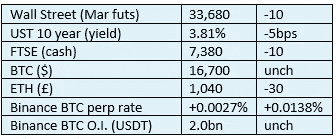

# 好奇的 Cryptos 评论 2022 年 11 月 16 日— BIS

> 原文：<https://medium.com/coinmonks/curious-cryptos-commentary-16th-november-2022-bis-3805373547e0?source=collection_archive---------31----------------------->

**TL；博士**

BIS 和加密偏差。

**市场抢购**

**市场包装**

加密市场再次陷入一个非常狭窄的区间，尽管随着 FTX 欺诈案惨败后日子一天天过去，人们不禁希望不会再有蔓延。有一天，最后一批因近期价格波动而遭受损失的杠杆潜鸟将会破产，这可能会触发市场的复苏。

**好奇的 Cryptos 评论— BIS(国际清算银行)**

国际清算银行在很大程度上是一个传统的贸易机构。它由 63 家中央银行所有，提供讨论政策的论坛，提供“独立”的金融分析，并向这些中央银行提供银行服务。

这是一个官僚驱动的组织，很像国际货币基金组织(IMF ),对创新的概念并不热衷。人们可以有把握地认为，这是对密码革命的制度性批评。

但知道敌人在想什么总是好的，而国际清算银行恰恰允许我们这么做。

…

在一份题为“加密交易和比特币价格:来自零售采纳新数据库的证据”的新报告中，国际清算银行试图将人们对 BTC 的兴趣描述为主要受价格上涨时期的驱动:

[https://www.bis.org/publ/work1049.htm](https://www.bis.org/publ/work1049.htm)

这份报告在很多方面都有缺陷。

这一结论的基础是，加密相关应用的下载随着 BTC 价格的上涨而增加，并声称此类活动的高峰是在 2021 年 11 月之前的几个月，当时 BTC 达到了 69k 美元的 ATH(历史最高水平)。

这个评论让我想建议作者们走开，试着去理解因果关系，因为他们已经把它们混在自己的脑子里了。

该报告称，40%的加密用户是 35 岁以下的男性，并由此得出结论，“用户被比特币不断上涨的价格所吸引。”一个人必须对 cryptos 有极大的偏见，才能想出这样的废话。

最后，该报告惊人地宣称，如果用户购买了超过 2 万美元的比特币，高达“81%的用户会赔钱”。

我仍然很有信心，购买 BTC 超过 20000 美元的 100%都是亏损的。

就像阿拉米达研究公司的审计员一样(见 CCC 2022 年 11 月 8 日),我建议 BIS 的高级管理层深入挖掘，拿出资金购买一台全新的计算器，以帮助他们的研究人员进行简单的减法练习。

**合规的东西**

触发警惕警告——如果任何读者在读完我的评论后，觉得自己“真的在颤抖”(正如一名达勒姆学生所声称的，他无法在情绪上应对不同的观点)，那么我只能建议你不要读，或者不要颤抖。这取决于你。

Cryptos——我的任何评论都不应该被视为参与 cryptos 的建议。我可能在不知道的情况下胡说八道。任何加密投资都必须被视为极高的风险，并被视为在出售前价值为零。

股票——只是为了说明这不是股票咨询服务。CCC 团队不提供任何形式的财务建议。本注释中对资产价格的任何引用都是为了简单地给出注释的上下文，并为与密码相关的某些股票的表现增添色彩。

为避免疑问，本通讯不是煽动购买密码，购买股票，甚至出售家庭成员希望购买密码或股票。

请注意，所有版权归好奇密码有限公司所有。

礼貌地要求偶尔分享和复制，你的愿望就会实现。

这封信或我们网站的新订户总是最受欢迎的。

[www.curiouscryptos.com](http://www.curiouscryptos.com)

medium.com/@mark_curiouscryptos

> 交易新手？试试[密码交易机器人](/coinmonks/crypto-trading-bot-c2ffce8acb2a)或[复制交易](/coinmonks/top-10-crypto-copy-trading-platforms-for-beginners-d0c37c7d698c)