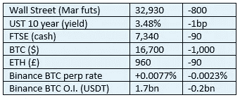

# 《好奇的密码》2022 年 12 月 17 日评论——币安

> 原文：<https://medium.com/coinmonks/curious-cryptos-commentary-17th-december-2022-binance-19098bdc65b1?source=collection_archive---------35----------------------->

**TL；博士**

币安仍然是焦点，损害了投资者的信心，并突然停止了最近加密价格的小反弹。

**市场抢购**

**市场抢购**

价格行为完全与币安有关，尽管卖蛇油的技术人员会告诉你不同的说法。

**好奇的 Cryptos 评论——Trump 的 NFT 收藏**

不，你是对的，我们不会去那里。

**好奇的 Cryptos 评论——币安(再次)**

CCC 在 2022 年 12 月 14 日对币安的情况做了一个快速的回顾。

我所知道的唯一重大变化是，为币安 PoR(储量证明)出具审计报告的会计师事务所 Mazars，已停止向加密客户提供所有服务。

CCC 在过去对此类报告持批评态度(参见 CCC 13th、14 和 17 月),同时认识到它们可以重新配置，对恢复投资者的信心极其有用。马扎尔斯说:

“由于担心公众对这些报告的理解方式，Mazars 暂停了与为加密货币行业实体提供储备证明报告相关的活动。”

这个解释有些不太正确。我不知道 Mazars 的任何人怎么可能误解 PoR 报告的目的。截至发稿时，Mazars 尚未对澄清请求做出回应。

…

直言不讳的加密反对者的下意识反应是显而易见的 Mazars 现在不再相信自己的报告，币安声称对客户存款提供 100%支持是胡扯。

在这种情况下，相当于币安的银行挤兑将使其破产，这一事件可能会使 BTC 在短期内走向 1 万美元。

币安是一家私人公司，有几个经营实体。其整个公司结构和公众形象由首席执行官兼创始人赵昌鹏掌控。他本周告诉美国消费者新闻与商业频道:

“……运行良好的加密交易所应该一对一地持有用户的资产。"

我们目前掌握的证据表明，币安确实遵循了这一良好做法。币安的一份声明谈到了这个问题:

“……在过去的一周里，币安通过了压力测试，这应该会给社区带来极大的安慰，他们的资金是安全的。尽管 12 月 12 日至 14 日有大量提款，三天内净提款 60 亿美元，但我们能够在不中断步伐的情况下完成提款。”

就目前而言，这是一个公平的观点。

渴望加强这一安全网，币安已经接触了其他公司来审计其 PoR，但收效甚微。毫无疑问，币安可能会像 FTX 那样戏剧性地崩溃，这带来了没有人愿意接受的声誉风险。据币安的一位发言人说，四大会计师事务所——德勤、安永、毕马威和普华永道——都“目前不愿意为私人加密公司进行 PoR”。

…

另一个需要解决的问题是杠杆问题。即使在客户存款被隔离和 100%担保的情况下，币安可能拥有的其他负债也可能导致银行挤兑事件中的资不抵债。

币安是一家私人公司。它的账目不透明也不完整。一份声明说:

“最终，我们的用户希望知道他们的资金是安全的，我们的业务在财务上是强大的。为此，币安的资本结构是无债务的……”。

…

如果客户的存款有 100%的准备金支持，并且公司没有债务，鉴于他们日常现金流的强度和低运营成本，将需要非凡的管理无能才能导致币安破产的局面。

**合规材料**

触发警报警告。

如果任何读者在读完我的评论后觉得他们“真的在颤抖”(这是一名达勒姆大学的学生提出的说法，他无法在情感上——当然也无法在智力上——应对罗德·利德尔表达的不同观点)，那么我只能建议你不要读，或者不要颤抖。这取决于你。

Cryptos——我的任何评论都不应该被视为参与 cryptos 的建议。我可能在不知道的情况下胡说八道。任何加密投资都必须被视为极高的风险，并被视为在出售前价值为零。

股票——只是为了说明这不是股票咨询服务。CCC 团队不提供任何形式的财务建议。本注释中对资产价格的任何引用都是为了简单地给出注释的上下文，并为与密码相关的某些股票的表现增添色彩。

为避免疑问，本通讯不是煽动购买密码，购买股票，甚至出售家庭成员希望购买密码或股票。

请注意，所有版权归好奇密码有限公司所有。

礼貌地要求偶尔分享和复制，你的愿望就会实现。

这封信或我们网站的新订户总是最受欢迎的。

www.curiouscryptos.com

【medium.com/@mark_curiouscryptos 

> 交易新手？试试[加密交易机器人](/coinmonks/crypto-trading-bot-c2ffce8acb2a)或者[复制交易](/coinmonks/top-10-crypto-copy-trading-platforms-for-beginners-d0c37c7d698c)