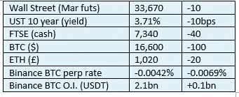

# 《好奇的密码》2022 年 11 月 17 日评论——传染

> 原文：<https://medium.com/coinmonks/curious-cryptos-commentary-17th-november-2022-contagion-aaaf4c3acb11?source=collection_archive---------34----------------------->

**TL；博士**

传染病。

**市场抢购**

**市场包装**

尽管风险市场的环境相对温和，但我认为加密市场复苏的空间很小，同时存在进一步蔓延的风险。见下文。

**好奇的 Cryptos 评论——传染一**

就在昨天，我表达了这样的希望:在 FTX 欺诈案惨败一个多星期后，我们可能会安然度过，不再有进一步的蔓延。我错了。

创世环球有两项主要业务，其中一项仍在运营。创世纪全球贸易公司是一家贸易和托管公司。截至昨日，机构贷款业务 Genesis Global Capital 实际上已被搁置。下面有请 Amanda Cowie，全球贸易和全球资本母公司 DCG(数字资本集团)通信和营销副总裁:

“今天，创世纪全球资本，创世纪的贷款业务，做出了艰难的决定，暂停赎回和新的贷款发放。这一决定是为了应对 FTX 内爆导致的极端市场混乱和行业信心丧失。”

Genesis Global Trading 受到早些时候 3AC 对冲基金倒闭的影响，损失高达 12 亿美元。该公司现在发现，它有 1.75 亿美元的资金被锁定在 FTX，要恢复这些资金需要数年时间。其母公司 Digital Currency Group 注入了 1.4 亿美元的股本，似乎填补了这个漏洞。

然而，全球资本的流动性和偿付能力受到持续撤资的威胁。

**好奇密码解说——传染二**

Gemini 是一家由文克莱沃斯双胞胎创建的集中式加密货币交易所，他们之前试图声称对脸书拥有版权。

Gemini 与 Genesis Global Capital 建立了合作伙伴关系，通过一个名为“earn”的项目，将客户的资金贷出，为客户赚取回报。那些资金现在被冻结了，Gemini 发表了一份声明:

“我们知道，Earn 计划的贷款合作伙伴 Genesis Global Capital，LLC (Genesis)已经暂停提款，无法在 5 个工作日的服务水平协议(SLA)内满足客户赎回要求。我们正在与 Genesis 团队合作，帮助客户尽快从 Earn 计划中赎回他们的资金。”

这意味着，尽管 Gemini 仍然功能齐全(至少目前如此),但他们零售客户的大部分资金现在无法获得，也不知道这种情况何时会改变。

**好奇的 Cryptos 评论——传染病三**

双子座有它自己的稳定币，可以预见的叫做 GUSD(双子座币)。

分散借贷平台 AAVE 的 GUSD 贷款利率昨日飙升至 80%以上，可能是由那些希望做空它的人的需求造成的，如果 Contagion II 导致双子座的大量资金外流，可能会危及其自身的生存。

我很高兴地告诉大家，这些贷款利率现在已经回到了 2%，GUSD 与美元挂钩的汇率似乎没有受到威胁，但除非双子银行对其储备和负债做出更明确的说明，否则这是一个值得关注的问题。

**好奇密码解说——传染四**

Genesis Global Capital 是 gray bit coin Trust 的流动性提供商，这是美国最接近 BTC 现金 ETF 的产品。

尽管信托拥有的基金没有风险，并且目前不需要流动性(对净资产价值的折让约为 40%，信托没有发行新股)，但这种关联只会对围绕灰度及其在加密领域的机构和零售投资产品套件的情绪产生负面影响。

**好奇的 Cryptos 解说——传染病五**

让我们希望不要…

**合规玩意儿**

触发警惕警告——如果任何读者在读完我的评论后，觉得自己“真的在颤抖”(正如一名达勒姆学生所声称的，他无法在情绪上应对不同的观点)，那么我只能建议你不要读，或者不要颤抖。这取决于你。

Cryptos——我的任何评论都不应该被视为参与 cryptos 的建议。我可能在不知道的情况下胡说八道。任何加密投资都必须被视为极高的风险，并被视为在出售前价值为零。

股票——只是为了说明这不是股票咨询服务。CCC 团队不提供任何形式的财务建议。本注释中对资产价格的任何引用都是为了简单地给出注释的上下文，并为与密码相关的某些股票的表现增添色彩。

为避免疑问，本通讯不是煽动购买密码，购买股票，甚至出售家庭成员希望购买密码或股票。

请注意，所有版权归好奇密码有限公司所有。

礼貌地要求偶尔分享和复制，你的愿望就会实现。

这封信或我们网站的新订户总是最受欢迎的。

[www.curiouscryptos.com](http://www.curiouscryptos.com)

[medium.com/@mark_curiouscryptos](mailto:medium.com/@mark_curiouscryptos)

> 交易新手？尝试[加密交易机器人](/coinmonks/crypto-trading-bot-c2ffce8acb2a)或[复制交易](/coinmonks/top-10-crypto-copy-trading-platforms-for-beginners-d0c37c7d698c)