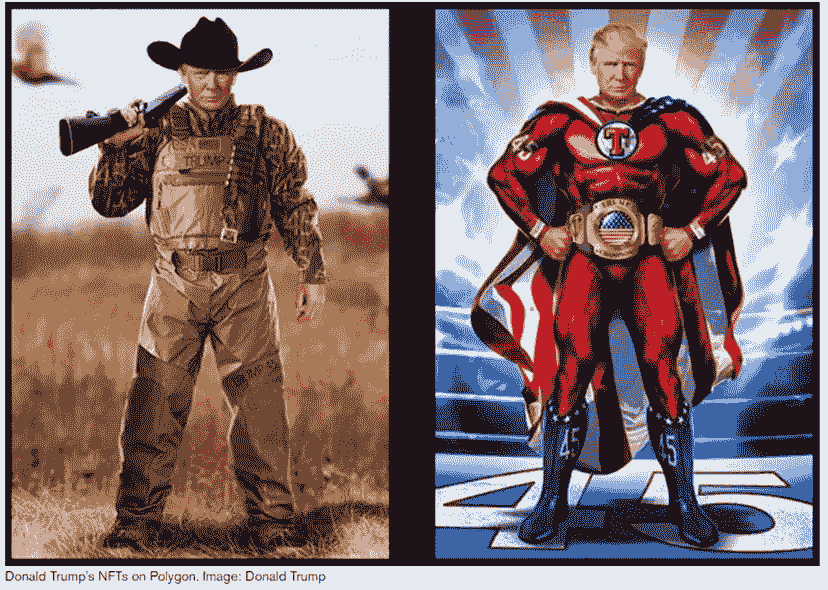

# 《好奇的密码》2022 年 12 月 18 日评论——特朗普

> 原文：<https://medium.com/coinmonks/curious-cryptos-commentary-18th-december-2022-trump-72e07cd5f54f?source=collection_archive---------23----------------------->

**TL；博士**

应大众要求，简单看一下川普·NFT 系列。

**市场抢购**

**市场包装**

对于风险市场来说，这是一个平静的周六。请注意，华尔街期货在周五推出，因此基差变动不完全准确，但对我们的目的来说足够接近。

**好奇的 Cryptos 评论——Trump 的 NFT 收藏**

似乎对特朗普的 NFT(不可替代代币)的胃口比预期的要大一些。

这是让这么多人兴奋的两个例子:

确实很可怕。

…

这个集合里有 45000 个 NFT(第 45 任总统，geddit？)，大概都是以普京式的姿势展示特朗普，模仿是奉承的最高形式等等。除了普京的亲信和马屁精组成的杀人圈子，以及精神变态的独裁者金正恩，世界上不可能有任何人认为以任何形式模仿普京是值得推荐的。

定价 99 美元，收益近 450 万美元，整个系列在短短几小时内销售一空。底价——二级市场上转售的最低报价——是原价的两倍多。

有一些具有非常罕见的特征，最贵的在 6 ETH 交易，当时接近 7500 美元。原因？这件 NFT 有 Trump 的数字签名，只是 72 件中的一件。二级市场的交易量超过了所有其他 NFT 藏品，至少目前如此。

那些购买了 45 个新制造的 NFT 的人保证获得一张与特朗普一起参加筹款晚宴的门票，这一提议显然让一些人难以抗拒。

Twitter 自然也参与了这一行动。我选择引用 LilMoonLambo 的话:

“唐纳德·川普推出了他的 NFT 系列。卖掉所有东西。熊市赢了。”

…

铸造过程中显然有几个初期问题，包括一个毁灭性的声明，即 NFT 被铸造到错误的公共地址。想象一下，你花 99 美元买了自己的特朗普 NFT，却发现它已经被别人买走了。

或许有人会认为这是一个幸运的突破。

对该收藏可信度的另一个打击是，如果它首先有任何可信度的话，有人声称收到造币费的管理员钱包预先铸造了 1000 个 NFT，其中最稀有的，因此也是最有价值的属性的比例过高——特别是前面提到的数字签名。

特朗普和犯规。谁会想到。

**合规的东西**

触发警报警告。

如果任何读者在读完我的评论后觉得他们“真的在颤抖”(这是一名达勒姆大学的学生提出的说法，他无法在情感上——当然也无法在智力上——应对罗德·利德尔表达的不同观点)，那么我只能建议你不要读，或者不要颤抖。这取决于你。

Cryptos——我的任何评论都不应该被视为参与 cryptos 的建议。我可能在不知道的情况下胡说八道。任何加密投资都必须被视为极高的风险，并被视为在出售前价值为零。

股票——只是为了说明这不是股票咨询服务。CCC 团队不提供任何形式的财务建议。本注释中对资产价格的任何引用都是为了简单地给出注释的上下文，并为与密码相关的某些股票的表现增添色彩。

为避免疑问，本通讯不是煽动购买密码，购买股票，甚至出售家庭成员希望购买密码或股票。

请注意，所有版权归好奇密码有限公司所有。

礼貌地要求偶尔分享和复制，你的愿望就会实现。

这封信或我们网站的新订户总是最受欢迎的。

[www.curiouscryptos.com](http://www.curiouscryptos.com)

medium.com/@mark_curiouscryptos

> 交易新手？试试[密码交易机器人](/coinmonks/crypto-trading-bot-c2ffce8acb2a)或[复制交易](/coinmonks/top-10-crypto-copy-trading-platforms-for-beginners-d0c37c7d698c)