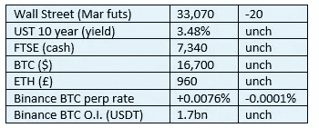
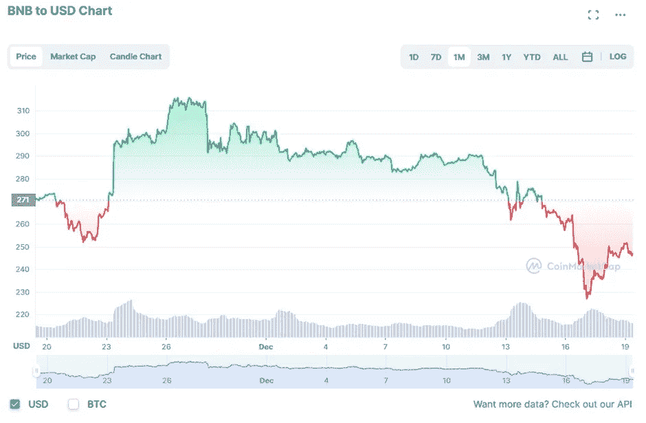

# 《好奇的密码》2022 年 12 月 19 日评论——OKEx.com

> 原文：<https://medium.com/coinmonks/curious-cryptos-commentary-19th-december-2022-okex-com-3a5863b74c1?source=collection_archive---------46----------------------->

**TL；博士**

围绕着这个秘密领域，大部分都是厄运和黑暗，但它就是它，我们保持着眼于长期。

**市场抢购**

**市场包装**

尽管大众媒体抓住一切可能的机会抨击加密——投资者对币安的健康或其他方面的担忧也并非完全没有道理——但 BNB(币安硬币上有自己的区块链)一个月的价格波动表明，FUD 有点过头了:

**好奇的 Cryptos 评论——下一张多米诺骨牌**

据报道，中央加密货币交易所 OKEx.com 已经停止取款。

这不是我特别熟悉的交流。

我的第一次参与是将 SBTC(超级比特币)从冷库转移到交易所。我拥有的 SBTC 是我在 2017/2018 年 BTC 硬叉狂潮期间获得的免费赠品，OKEx.com 是将这笔横财货币化的唯一可行途径。

我还在以狗为主题的 meme coin 胡说八道开始时买了一些 Kishu Inu，我还试图(后来证明不成功)通过这个平台出售一些 BABYDOGE。

我留在 OKEx.com 的剩余硬币——现在更名为 OKX.com——价值不到 20 美元，尽管我并不完全相信，为这个微小的名称变化而支付给营销顾问的可能高达 6 位数的支出是有史以来最明智的商业决定。

因此，从个人角度来看，如果 OKEx.com 加入其他失败的加密企业的行列，我会感到轻松。

但如果另一家交易所失败，这个隐秘的冬天将会持续更长时间。

**合规的东西**

触发警报警告。

如果任何读者在读完我的评论后觉得他们“真的在颤抖”(这是一名达勒姆大学的学生提出的说法，他无法在情感上——当然也无法在智力上——应对罗德·利德尔表达的不同观点)，那么我只能建议你不要读，或者不要颤抖。这取决于你。

Cryptos——我的任何评论都不应该被视为参与 cryptos 的建议。我可能在不知道的情况下胡说八道。任何加密投资都必须被视为极高的风险，并被视为在出售前价值为零。

股票——只是为了说明这不是股票咨询服务。CCC 团队不提供任何形式的财务建议。本注释中对资产价格的任何引用都是为了简单地给出注释的上下文，并为与密码相关的某些股票的表现增添色彩。

为避免疑问，本通讯不是煽动购买密码，购买股票，甚至出售家庭成员希望购买密码或股票。

请注意，所有版权归好奇密码有限公司所有。

礼貌地要求偶尔分享和复制，你的愿望就会实现。

这封信或我们网站的新订户总是最受欢迎的。

[www.curiouscryptos.com](http://www.curiouscryptos.com)

medium.com/@mark_curiouscryptos

> *交易新手？试试* [*密码交易机器人*](/coinmonks/crypto-trading-bot-c2ffce8acb2a) *或* [*复制交易*](/coinmonks/top-10-crypto-copy-trading-platforms-for-beginners-d0c37c7d698c)
> 
> *分散加密持股，了解* [*币安的替代方案*](https://coincodecap.com/binance-alternatives)
> 
> *加入 Coinmonks* [*电报频道*](https://t.me/coincodecap) *和* [*Youtube 频道*](https://www.youtube.com/c/coinmonks/videos) *获取每日* [*加密新闻*](http://coincodecap.com/)

# 另外，阅读

*   [复制交易](/coinmonks/top-10-crypto-copy-trading-platforms-for-beginners-d0c37c7d698c) | [加密税务软件](/coinmonks/crypto-tax-software-ed4b4810e338)
*   [网格交易](https://coincodecap.com/grid-trading) | [加密硬件钱包](/coinmonks/the-best-cryptocurrency-hardware-wallets-of-2020-e28b1c124069)
*   [密码电报信号](/coinmonks/top-3-telegram-channels-for-crypto-traders-in-2021-8385f4411ff4) | [密码交易机器人](/coinmonks/crypto-trading-bot-c2ffce8acb2a)
*   [最佳加密交易所](/coinmonks/crypto-exchange-dd2f9d6f3769) | [印度最佳加密交易所](/coinmonks/bitcoin-exchange-in-india-7f1fe79715c9)
*   开发人员的最佳加密 API
*   最佳[密码借贷平台](/coinmonks/top-5-crypto-lending-platforms-in-2020-that-you-need-to-know-a1b675cec3fa)
*   [免费加密信号](/coinmonks/free-crypto-signals-48b25e61a8da) | [加密交易机器人](/coinmonks/crypto-trading-bot-c2ffce8acb2a)
*   杠杆代币的终极指南