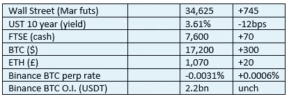

# 《好奇的密码》2022 年 12 月 1 日评论——保真

> 原文：<https://medium.com/coinmonks/curious-cryptos-commentary-1st-december-2022-fidelity-fe677efdab0b?source=collection_archive---------18----------------------->

**TL；博士**

富达是采用加密技术道路上的一盏明灯。

**市场抢购**

**市场包装 1**

BTC 连续两天获利超过 17，000 美元，没有杠杆空头被强制平仓的迹象，尽管我怀疑我们已经接近他们的痛点了。

债券市场正在发出通胀可能结束的信号，这不是因为央行最近的干预，而是因为西方即将经历的迫在眉睫、非常痛苦的衰退，而财政紧缩加剧了这种衰退。

那可不太好。

**市场包装 2**

国际金融研究所声称，全球债务目前已达 290 万亿美元。让我们再一次提醒自己一万亿美元看起来像什么:

[http://www.pagetutor.com/trillion/index.html](http://www.pagetutor.com/trillion/index.html)

现在，公开支持现代货币理论(又名魔术摇钱树)的所有人都能站出来接受统计吗？

不，我想没有。

…

在另一份报告中，在政客和央行行长中，支持封锁和 QE(量化宽松)同时结合的人和坚持权力的人之间似乎有接近 100%的相关性。

现在，公开支持这一明显具有破坏性的组合的所有人都能站出来接受统计吗？

不，我想没有。

**市场包装 3**

另一个完全相关的消息是，美国收益率曲线现在比几十年来更为倒置。

这种情况完全是失职。怎么可能有任何央行的行长实际上仍在担任这一职务？

**好奇密码的评论——保真和加密应用**

拥有 4.5 万亿 AUM(管理的资产)的资产管理公司富达长期以来一直是 cryptos 的支持者。出于正当的理由，它的名字在这些信件中频繁出现。对 cryptos 的承诺始于 2014 年，当时它在 BTC 建立了一个采矿业务。没有比这个决定更有远见的了。

现在我给大家带来一个消息，富达推出了它的第一个加密交易账户。

在富达拥有经纪账户的散户投资者现在可以以最低 1 美元的名义投资，免费买卖 BTC 和瑞士联邦理工学院的股票(成本包含在买卖报价中)。拥有 3200 万个零售账户，这为 cryptos 带来了新的受众，几乎没有执行风险，没有托管风险，并且这些客户熟悉交易平台。

我期待着阅读富达的季度更新，以了解这一举措的成功与否(剧透:非常成功)，但关键的测试是这一个。

零售投资领域的其他巨头，尤其是拥有 10 万亿 AUM 的贝莱德，还要多久才会步其后尘？

…

还有另一个要点需要注意。

尽管 BTC 和更广泛的加密市场经历了 12 个月的价格阵痛，企业和银行仍在建设他们的加密能力。

他们这样做不仅仅是为了好玩。

他们这样做是为了响应客户的需求，因为他们相信 cryptos 可以提供新的收入来源，并加强与客户的联系。

当对所有 cryptos 事物的热情回归时，正如不可避免的那样，将会有许多人希望他们继续发展他们对 cryptos 的知识，并在黑暗时期继续加深他们对 cryptos 的参与。

好奇的 Cryptos 评论——我怎么知道我是对的？

两位 ECB(欧洲央行)官员昨日发表了一篇题为“比特币的最后一战”的博客，时机恰到好处。

你可以在这里读到它，但我怀疑你们大多数人都有更好的事情要做:

[https://www . ECB . Europa . eu/press/blog/date/2022/html/ECB . blog 221130 ~ 5301 eecd 19 . en . html](https://www.ecb.europa.eu/press/blog/date/2022/html/ecb.blog221130~5301eecd19.en.html)

我特别喜欢这句话:

“对于比特币的支持者来说，表面上的(价格)稳定标志着通往新高度的道路上的喘息。然而，更有可能的是，这是人为诱导的走向无关紧要的最后一搏。”

哈，我听到这个笑得前仰后合。

另一个选项注释:

“由于比特币似乎既不适合作为支付系统，也不适合作为一种投资形式，因此从监管角度来看，它既不应该被视为支付系统，也不应该被合法化。”

当然，还有一些关于能源使用的废话，读起来像是英国《金融时报》记者写的。

…

由被定罪的罪犯克里斯蒂娜·拉加德领导的欧洲央行长期以来一直是 cryptos 的对手。作为一个机构，它担心失去一些过于广泛的控制，这是理所当然的。

出于某种难以理解的原因，欧洲央行流行的说法是，引入数字欧元将让密码消失。这种非同寻常的信念基于一个根本性的误解——欧洲央行每间办公室和每份工作中的官僚和技术官僚都认为 CBDCs(央行数字货币)是另一种形式的密码，而事实并非如此。

这种无知源于未能理解权力下放背后的概念所释放出的强大积极力量。

但是你付了钱，你有你的选择。

我坚信，在富达，冒险者和商业驱动者的意见将永远胜过那些在家工作、不会被解雇的官员们的意见，他们乐于在等待他们渴望已久的领取丰厚养老金的那一天时，陷入与知识无关的境地。

但是你完全有权不同意。

**合规玩意儿**

触发警报警告。

如果任何读者在读完我的评论后觉得他们“真的在颤抖”(这是一名达勒姆大学的学生提出的说法，他无法在情感上——当然也无法在智力上——应对罗德·利德尔表达的不同观点)，那么我只能建议你不要读，或者不要颤抖。这取决于你。

Cryptos——我的任何评论都不应该被视为参与 cryptos 的建议。我可能在不知道的情况下胡说八道。任何加密投资都必须被视为极高的风险，并被视为在出售前价值为零。

股票——只是为了说明这不是股票咨询服务。CCC 团队不提供任何形式的财务建议。本注释中对资产价格的任何引用都是为了简单地给出注释的上下文，并为与密码相关的某些股票的表现增添色彩。

为避免疑问，本通讯不是煽动购买密码，购买股票，甚至出售家庭成员希望购买密码或股票。

请注意，所有版权归好奇密码有限公司所有。

礼貌地要求偶尔分享和复制，你的愿望就会实现。

这封信或我们网站的新订户总是最受欢迎的。

[www.curiouscryptos.com](http://www.curiouscryptos.com)

medium.com/@mark_curiouscryptos

> 交易新手？试试[密码交易机器人](/coinmonks/crypto-trading-bot-c2ffce8acb2a)或[复制交易](/coinmonks/top-10-crypto-copy-trading-platforms-for-beginners-d0c37c7d698c)