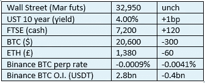
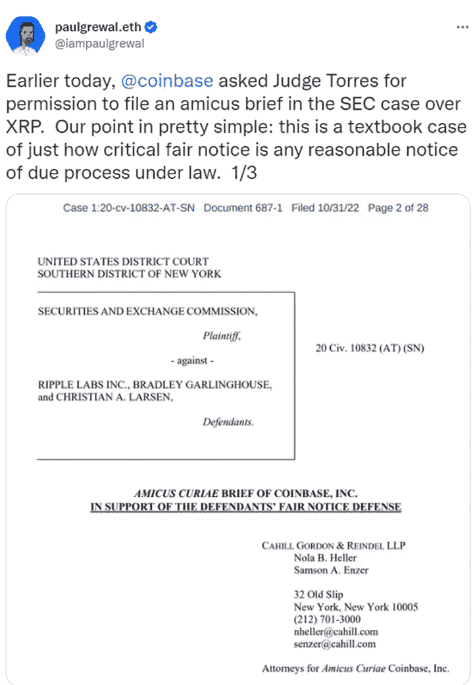

# 好奇的密码 2022 年 11 月 1 日评论

> 原文：<https://medium.com/coinmonks/curious-cryptos-commentary-1st-november-2022-b2433973466?source=collection_archive---------39----------------------->

**TL；博士**

赫斯特·皮尔斯对她自己机构的批评对 XRP (Ripple)和更广泛的密码行业来说是积极的。

**市场抢购**

**市场包装**

杠杆做空者认为，在最近几天几次尝试失败后，目前突破 2.1 万美元的上涨空间太大了。我总是对负的永久期货融资利率感到更舒服——这迎合了我的反向投资哲学。

**好奇的 Cryptos 评论——证券交易委员会委员 Hester Peirce**

密码爱好者认为 SEC(证券交易委员会)对密码的态度过于苛刻。他们声称，美国证券交易委员会未能履行自己的义务，而且在实施监管行动时也不一致。对证交会最不利的是，它被指控试图通过类似于在刑事司法系统中发展判例法的过程来发展立法框架，违反了所有以前的监管良好做法。

人们有理由相信，证交会主席加里詹斯勒(Gary Gensler)肩负着一个人的使命，那就是将证交会的职权范围扩大到法律授权范围之外。

密码爱好者当然是片面的观察者，愤世嫉俗者可能希望警告说，这些对 SEC 的指控是毫无根据的，只是出于掏空监管格局的愿望。

我强烈反对这种说法适用于除极端的加密最大化主义者之外的任何人，他们渴望一种狂野的西方方式，导致所有法定货币的有效消除，但尤其是美元。他们不知道他们想要什么。

…

密码爱好者刚刚招募了一个新的声音来反对 Gensler 和 SEC 的过度干预。这不是一个次要的声音，因为它是海丝特·皮尔斯，谁是证券交易委员会的专员，有效地使她的 Gensler 的老板。

赫斯特毫不留情地批评了当前的方法:

"加密被区别对待."

这让 Gensler 陷入了困境。

她指出，美国证券交易委员会不再遵循历史规范。在正常情况下，赫斯特解释了美国证券交易委员会通常是如何运作的:

“通常，当我们编写规则时，我们会提出一个建议。人们在和监管者对话；我们在和公众对话。这是一次非常健康的谈话。”

然而，关于密码:

“房间里没有别人。顾客不在房间里。竞争者不在房间里。监管机构有影响力，因为监管机构即将采取强制措施。这不是一种好的监管方式。”

砰！巴什！波什！这看起来很可疑，好像 Gensler 正在挣扎着离开地板。

Hester 进行干预的动机是，她担心 SEC 会支持他们目前的激进做法，这种担心即将成为现实，因为要求公开声明哪些密码是受 CFTC(商品和期货交易委员会)监管的商品的压力越来越大，而后者已经表现出与密码行业合作的真正意愿。

**好奇的 Cryptos 评论——这对 XRP (Ripple)意味着什么**

据 Ripple Labs，Inc .的首席执行官 Brad Garlinghouse 称，SEC 和 Ripple Labs，Inc .之间长达两年的关于 XRP 是证券还是商品的斗争可能会在 2023 年年中得到解决。这一决定的后果将由法院法官决定，将会产生深远的影响。

毫不夸张地说，未来十年美国密码产业的健康与否取决于这一决定。

这让海丝特的介入更有意思了。

比特币基地中央加密交易所最近提交了一份名为“法庭之友书状”的文件:

根据法庭之友摘要:

根据法庭之友摘要:

“鉴于美国证券交易委员会没有为加密货币行业制定规则，美国证券交易委员会在对成千上万种独特数字资产中的一种采取执法行动之前是否发出了公平通知的问题往往是高度事实密集型的，这使得它特别不适合在即决审判中进行裁决。”

Hester 在上文中重复了这里的中心观点 SEC 在为 cryptos 制定监管框架时没有采取应有的行动。海丝特的意见对法官来说很有分量。

**合规玩意儿**

触发警惕警告——如果任何读者在读完我的评论后，觉得自己“真的在颤抖”(正如一名达勒姆学生所声称的，他无法在情绪上应对不同的观点)，那么我只能建议你不要读，或者不要颤抖。这取决于你。

Cryptos——我的任何评论都不应该被视为参与 cryptos 的建议。我可能在不知道的情况下胡说八道。任何加密投资都必须被视为极高的风险，并被视为在出售前价值为零。

股票——只是为了说明这不是股票咨询服务。CCC 团队不提供任何形式的财务建议。本注释中对资产价格的任何引用都是为了简单地给出注释的上下文，并为与密码相关的某些股票的表现增添色彩。

为避免疑问，本通讯不是煽动购买密码，购买股票，甚至出售家庭成员希望购买密码或股票。

请注意，所有版权归好奇密码有限公司所有。

礼貌地要求偶尔分享和复制，你的愿望就会实现。

这封信或我们网站的新订户总是最受欢迎的。

[www.curiouscryptos.com](http://www.curiouscryptos.com)

medium.com/@mark_curiouscryptos

> 交易新手？试试[密码交易机器人](/coinmonks/crypto-trading-bot-c2ffce8acb2a)或[复制交易](/coinmonks/top-10-crypto-copy-trading-platforms-for-beginners-d0c37c7d698c)