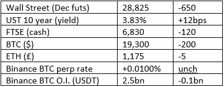
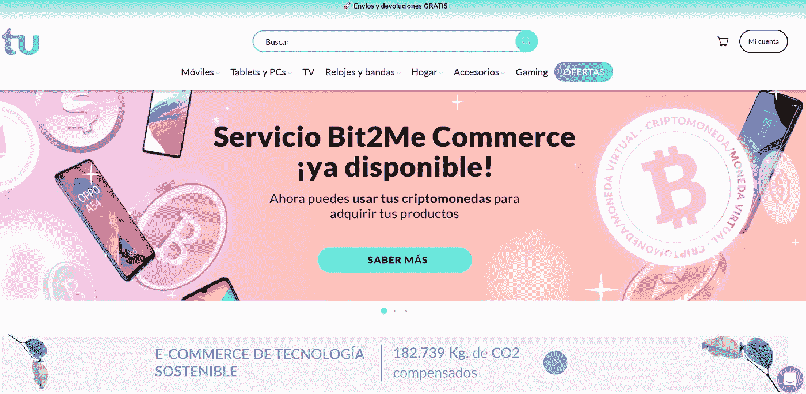

# 《好奇的密码》评论 2022 年 10 月 1 日

> 原文：<https://medium.com/coinmonks/curious-cryptos-commentary-1st-october-2022-6d57b029ffbf?source=collection_archive---------29----------------------->

**TL；博士**

企业对零售用密码的采用继续加快。

**市场抢购**

**市场包装**

标题还在继续，比如“…市场卷轴…”有人能告诉我这些标题指的是哪个市场吗？尽管我很努力，我还是找不到任何例子。不，在事件发生一周后，周末股市下跌 2%并不“令人震惊”。

**好奇的 Cryptos 评论——Telefonica 和其他新闻**

我昨天顺便提到，西班牙电信巨头 Telefonica 已经与 Bit2Me 合作，Bit2Me 显然是西班牙最大的中央加密货币交易所，但对我来说是新的，允许处理 BTC 和其他加密货币的交易，包括 ETH、LTC(莱特币)和 USDC 稳定币。参见[https://www.tu.com/](https://www.tu.com/):

我仍然经常感到惊讶的是，BTC 的标志还没有出现在所有的零售网站上，但这很快就会发生。看着你亚马逊…

Telefonica 已经在加密领域崭露头角，之前宣布与高通合作，探索元宇宙的商业机会:

“这项协议为客户提供了新的体验，融合了数字和模拟世界，重塑了元宇宙的商业、娱乐和通信。”

Telefonica 认真对待其在这一领域的义务，发布了一份讨论元宇宙的道德和伦理含义的白皮书。这是一篇关于这个主题的相对较短但内容丰富的文章，您可以在这里阅读:

[https://www . Telefonica . com/en/communication-room/the-social-and-ethical-challenges-of-the-the-元宇宙/](https://www.telefonica.com/en/communication-room/the-social-and-ethical-challenges-of-the-metaverse/) 。

我敦促你这样做。

…

西班牙人对密码的兴趣似乎延伸到了其他零售机构。

Vueling 是一家加泰罗尼亚人比我们这样的廉价航空用户更熟悉的航空公司，它已经与 BitPay 合作，允许在 13 种不同的密码中购买机票。令人惊讶的是，名单中还包括了 DOGE (Dogecoin)和 SHIB (Shib Inu)等模因币。

根据隐薯的说法:

BitPay 的营销副总裁梅里克·西奥博尔德表示，西班牙公司“认识到加密货币改变航空业的潜力，在全球范围内使支付更快、更安全、更便宜。"

vueling 还计划让客户使用元宇宙([https://www . prnewswire . com/news-releases/next-earth-partners-with-iomob-and-Vueling-airlines-to-expand-its-of-his-ever-first-transportation-layer-301542833 . html](https://www.prnewswire.com/news-releases/next-earth-partners-with-iomob-and-vueling-airlines-to-expand-its-metaverse-with-first-ever-transportation-layer-301542833.html))来预订旅行，正如 Vueling 的分销战略和联盟经理 Jesus Monzo 所承认的，这是该技术的一个明显而清晰的用例:

“将真实世界的旅程可视化，并使用元宇宙界面来选择和预订污染最小的旅行，这是前所未有的。”

…

古驰在 5 月份宣布，一些美国商店将接受 cryptos 作为支付方式，这一设施现已在全国推广。

这似乎是成功的，因为该公司最近宣布支付选择的范围将扩大到包括 ApeCoin(与 Bored Ape 游艇俱乐部 NFT 收藏有关)和 Euro Coin(USDC 的欧元兄弟)。在 BitPay 的支持下，这位首席执行官说:

“我们增加了 ApeCoin 和 Euro Coin，因为我们的奢侈品商业合作伙伴的客户提出了要求。他们提出要求，我们就交付了。”

**合规玩意儿**

触发警报警告——如果任何读者在读完我的评论后，觉得自己“真的在颤抖”(正如一名达勒姆大学的学生所声称的，他无法在情绪上应对 Rod Liddle 提出的不同观点),那么我只能建议你不要读，或者不要颤抖。这完全取决于你。

Cryptos——我的任何评论都不应该被视为参与 cryptos 的建议。我可能在不知道的情况下胡说八道。任何加密投资都必须被视为极高的风险，并被视为在出售前价值为零。

股票——只是为了说明这不是股票咨询服务。CCC 团队不提供任何形式的财务建议。本注释中对资产价格的任何引用都是为了简单地给出注释的上下文，并为与密码相关的某些股票的表现增添色彩。

为避免疑问，本通讯不是煽动购买密码，购买股票，甚至出售家庭成员希望购买密码或股票。

请注意，所有版权归好奇密码有限公司所有。

礼貌地请求分享和复制，你的愿望就会实现。

这封信或我们网站的新订户总是最受欢迎的。

【www.curiouscryptos.com 

 [## 马克·蒂姆西-中号

### 阅读马克·蒂姆西在媒体上的文章。每天，马克·蒂米斯和成千上万的其他声音都在阅读、写作和分享…

medium.com](/@mark_curiouscryptos) 

> 交易新手？试试[加密交易机器人](/coinmonks/crypto-trading-bot-c2ffce8acb2a)或者[复制交易](/coinmonks/top-10-crypto-copy-trading-platforms-for-beginners-d0c37c7d698c)