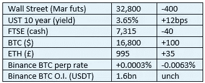

# 《好奇的密码》2022 年 12 月 20 日评论——美国

> 原文：<https://medium.com/coinmonks/curious-cryptos-commentary-20th-december-2022-the-u-s-4f987cec4099?source=collection_archive---------48----------------------->

**TL；博士**

关于“禁止”密码的疯狂言论在任何层面上都毫无意义。

**市场抢购**

**市场包装**

没有圣诞老人集会的迹象。2023 年风险资产预测中弥漫的悲观情绪开始激起全球反向投资者的兴趣。

**不定期系列—出版时间表**

由于圣诞节和旅行计划，CCC 的出版时间表可能会被打乱一段时间，从明天开始，你将不得不在没有我的情况下应付。

**好奇的 Cryptos 评论—美国**

谢罗德·布朗既是参议员，也是参议院银行委员会主席。在这个职位上，他有理由担心加密技术及其与传统金融系统的关系，以及 FTX 的欺诈性崩溃等事件是否对美国银行体系的稳定构成任何威胁。

他接受了全国广播公司的采访，在采访过程中，他提出了一些有效的观点，但在我看来，他也说了很多废话。

他准确地观察到，政治捐款的使用(我听说有 510 万美元给了乔·拜登，以支持他成功竞选总统)在 FTX 及其罪恶的首席执行官和创始人山姆·班克曼-弗里德周围创造了一种可信的印象。

班克曼-弗里德对他给民主党人的捐款大吵大闹，尽管他似乎也给共和党人捐了钱，但对后者却保持沉默。这些捐款中的一部分正被返还，以支持对那些将存款留在 FTX 的受困投资者的支付。就我个人而言，我认为每一笔政治捐款的每一分钱都应该归还，不管是谁收到的，但这似乎是一个不太可能的结果。

FTX 不是第一家，也不会是最后一家试图以这种方式讨好政界的公司。

布朗认为——这是正确的——立法和监管是必要的，但他的理由是没有根据的:

“去年一年半的大部分时间，我都在从事这项工作……试图让公众了解加密技术，以及它给我们国家的安全带来的危险……”

哦，亲爱的，你可以看到他在做什么。

布朗是一个非常偏激的加密革命观察者，他紧跟时代潮流:

“……对国家安全的威胁，从韩国网络犯罪到贩毒、贩卖人口和资助恐怖主义，以及所有可能来自加密的东西。”

这就好像他认为，在密码发明之前，朝鲜犯罪团伙、人口贩卖和恐怖主义是不存在的。

像我们这样的密码爱好者提出了一个支持密码的合理论点，反映了这一最新技术革命的积极潜力，同时也接受了人类取得的所有进步当然都有负面影响。

密码唱反调者只能谈论潜在的危害，而事实上他们应该更加努力地达到一个平衡的观点。不看双方，他们中毒的观点应该理想地把他们排除在对话之外。

…

在早些时候的一封公开信中，布朗确实采取了一种更理性的方法。你可以在这里阅读这封信([https://www . brown . Senate . gov/news room/press/release/sherrod-brown-to-treasury-we-need-work-on-crypto-legislation](https://www.brown.senate.gov/newsroom/press/release/sherrod-brown-to-treasury-we-need-to-work-together-on-crypto-legislation))但一个关键的声明是:

“……包括制定立法，授权监管机构了解并监督加密资产实体的附属机构和子公司的活动。”

不幸的是，他在采访中对此进行了反驳，称加密“应该被禁止”。这种漫不经心的谈论只会将加密业务推向别处。FTX 定居在巴哈马。如果该交易所及其姊妹对冲基金 Alameda Research 的总部设在美国，它的管理做法就不会被容忍。

这正是公开上市的加密货币交易所比特币基地的首席执行官 Brian Armstrong 在 Twitter 上回应加密怀疑论者参议员伊丽莎白·沃伦时提出的观点:

沃伦:

“一个最大的加密平台的崩溃表明，这个行业有多少是虚幻的。我们需要更积极的执法，我将继续推动 [@SECGov](https://twitter.com/SECGov) 执行法律以保护消费者和金融稳定。”

布莱恩:

“FTX.com 是不受美国证券交易委员会监管的离岸交易所。问题在于，SEC 未能在美国创造监管透明度，因此许多美国投资者(以及 95%的交易活动)转向了海外。为此惩罚美国公司毫无意义。”

**合规玩意儿**

触发警报警告。

如果任何读者在读完我的评论后觉得他们“真的在颤抖”(这是一名达勒姆大学的学生提出的说法，他无法在情感上——当然也无法在智力上——应对罗德·利德尔表达的不同观点)，那么我只能建议你不要读，或者不要颤抖。这取决于你。

Cryptos——我的任何评论都不应该被视为参与 cryptos 的建议。我可能在不知道的情况下胡说八道。任何加密投资都必须被视为极高的风险，并被视为在出售前价值为零。

股票——只是为了说明这不是股票咨询服务。CCC 团队不提供任何形式的财务建议。本注释中对资产价格的任何引用都是为了简单地给出注释的上下文，并为与密码相关的某些股票的表现增添色彩。

为避免疑问，本通讯不是煽动购买密码，购买股票，甚至出售家庭成员希望购买密码或股票。

请注意，所有版权归好奇密码有限公司所有。

礼貌地要求偶尔分享和复制，你的愿望就会实现。

这封信或我们网站的新订户总是最受欢迎的。

[www.curiouscryptos.com](http://www.curiouscryptos.com)

medium.com/@mark_curiouscryptos

> *交易新手？试试* [*密码交易机器人*](/coinmonks/crypto-trading-bot-c2ffce8acb2a) *或* [*复制交易*](/coinmonks/top-10-crypto-copy-trading-platforms-for-beginners-d0c37c7d698c)
> 
> *分散加密持股，了解* [*币安的替代方案*](https://coincodecap.com/binance-alternatives)
> 
> *加入 Coinmonks* [*电报频道*](https://t.me/coincodecap) *和* [*Youtube 频道*](https://www.youtube.com/c/coinmonks/videos) *获取每日* [*加密新闻*](http://coincodecap.com/)

# 另外，阅读

*   [复制交易](/coinmonks/top-10-crypto-copy-trading-platforms-for-beginners-d0c37c7d698c) | [加密税务软件](/coinmonks/crypto-tax-software-ed4b4810e338)
*   [网格交易](https://coincodecap.com/grid-trading) | [加密硬件钱包](/coinmonks/the-best-cryptocurrency-hardware-wallets-of-2020-e28b1c124069)
*   [密码电报信号](/coinmonks/top-3-telegram-channels-for-crypto-traders-in-2021-8385f4411ff4) | [密码交易机器人](/coinmonks/crypto-trading-bot-c2ffce8acb2a)
*   [最佳加密交易所](/coinmonks/crypto-exchange-dd2f9d6f3769) | [印度最佳加密交易所](/coinmonks/bitcoin-exchange-in-india-7f1fe79715c9)
*   面向开发者的最佳加密 API
*   最佳[密码借贷平台](/coinmonks/top-5-crypto-lending-platforms-in-2020-that-you-need-to-know-a1b675cec3fa)
*   [免费加密信号](/coinmonks/free-crypto-signals-48b25e61a8da) | [加密交易机器人](/coinmonks/crypto-trading-bot-c2ffce8acb2a)
*   [杠杆代币](/coinmonks/leveraged-token-3f5257808b22)终极指南