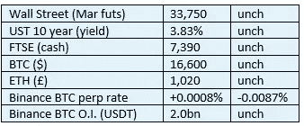

# 《好奇的密码》评论 2022 年 11 月 20 日——密码监视第 1 部分——简介

> 原文：<https://medium.com/coinmonks/curious-cryptos-commentary-20th-november-2022-staking-part-1-26ff83f2b08e?source=collection_archive---------34----------------------->

**TL；dr**

让我们从投资世界的广阔前景开始我们的投资之旅。

**市场快照**

**市场包装**

我认为，一天之内六次“开市”现在是表明市场对自己感到满意的记录(注意，除了 UST 以外，上述所有市场每周交易七天)。

唯一的变化来自杠杆儿童，他们在短期内又变得兴奋起来。

**好奇密码注释-密码桩第 1 部分-简介**

关于放置密码有很多噪音和混乱。我认为你必须永远记住两个关键点。

有很多机会通过下注来增加你的密码。

还有很多其他机会可以通过监视来丢失你所有的密码。

在接下来的一周，我希望我们都能做好更好的准备，充分利用前者，避免后者。

…

无论我多么崇拜分权的概念——一个人可以成为自己命运的主人的愿景(至少在财务意义上)——这个明显的(至少对我来说)乌托邦和 TradFi 一样都有黑暗的一面。

骗子、无赖、道德低下甚至价值低下的人，在我们生活的各个方面都比比皆是。密码世界对这些罪犯还没有免疫力。

如果你涉及密码，你会知道他们，你会讨厌他们的存在。但是，一旦你开始学习打桩的艺术，你就会更深地了解你的鄙夷，你也会了解这些野蛮的卑鄙小人是如何靠天真和贪婪为生的。

但这并不全是坏事，如果您致力于密码革命，那么有许多安全的方法来扩大您的投资。

我们可以潜水吗？

…

在我们开始之前，设定一些参数将是有用的。

“监视”一词在密码学中有非常广泛的定义。我们将尝试探索目前我们可以利用的所有方面。密码的奇妙之处在于，尽管我在本周开始时对可用的机会有一个相当清晰的看法，但最有可能的是，这个宇宙已经增长了。

密码的创新和发展的速度从未停止让我吃惊。

但回到基础上。

入股背后的核心概念是赚取所谓的“被动收入”。

这在某些方面——但绝不是全部——类似于从您的银行账户中赚取利息，这在很长一段时间内没有发生在任何人身上，但现在又开始变成一件事了。

在一个人可以进行投资的世界里，有很多可以定义的类别，当考虑自己的投资策略时，理解这些类别是很有用的。

…

例如，黄金长期以来被视为一种价值来源，一种维持财富平衡的方式。

大约有 200，000 吨黄金已经被开采，可能还有 25-50%尚未被挖掘出来。黄金在工业中所起的作用很小，但在珠宝中却起着重要作用。除此之外，它最大的用途是让中央银行储存在金库里，以给自己增加可信度，尽管前财政大臣戈登·布朗在上学时著名地跳过了经济学中的这一课。

为什么持有黄金会给各国央行带来可信度？

我不知道。

它没有收入——事实上，你必须支付存储成本。当用来为商品或服务讨价还价时，效率很低。它很容易引起强盗的注意(你可以看到我现在的想法)。金矿开采从来没有被描述为是环境友好的。

但是人类对黄金有着持久的，我相信是永无止境的迷恋。

说到底，当僵尸启示录降临到我们头上时，你是想要一堆金币，还是在你的包里放一根铅管？

我知道我更喜欢哪个。

…

还有其他有收益的投资机会。

政府债券是这一类的最好例子。如果你购买 10 年期 UST(美国政府债券)，你每年将获得近 4%的收益，债券到期时，你绝对可以收回你的钱。

你可以以非常相似的收益率购买 10 年期 BTPS(意大利政府债券)，但当然你可能会面临非常不相似的结果。

就连你在英国的高街银行——政府保证止损 8.5 万英镑，尽管财政部官员坚持反对，但上周的预算后，政府债务只会越来越高——现在也在为你支持其分裂的储备业务模式做出回报。

…

继政府债券之后，下一个最大的投资机会是公司债券，尽管这对于大多数人来说并不明显。也许这是我幸运地以此成就了一份略带口吃的职业生涯的原因之一。

除了 QE(量化宽松)——其唯一目标是让富人更富、穷人更穷的政策——导致的疯狂时期，公司债券的收益率大多准确反映了风险。这可能是唯一一个接近这一理想的金融市场。

我被债务资本市场吸引的另一个原因是。

…

当我们谈到股票和股份时，情况就完全不同了。

股票和股份是大家都非常熟悉的东西，但股票在金融基础中所占的份额却如此之小。

为什么关于股票的评论占据了流行的金融媒体？

我不知道。

你可以购买不支付股息的股票。你可以在每一个可能的机会购买向股东抛出现金的股票。你可以购买崩盘的股票——我确实拥有一些。你可以购买*******会飞的股票——我当然拥有其中一些。

但我仍然不明白，为什么金融媒体如此关注这种风险较高的企业融资。

有人能开导一下吗？

…

在我看来，对金融世界的这种非常简短的解释——坦率地说，非常折中的解释——为我们本周的旅程奠定了基础，让我们从我们的秘密仓库中获得收入。

**合规材料**

触发警惕警告——如果任何读者在读完我的评论后，觉得自己“真的在颤抖”(正如一名达勒姆学生所声称的，他无法在情绪上应对不同的观点)，那么我只能建议你不要读，或者不要颤抖。这取决于你。

Cryptos——我的任何评论都不应该被视为参与 cryptos 的建议。我可能在不知道的情况下胡说八道。任何加密投资都必须被视为极高的风险，并被视为在出售前价值为零。

股票——只是为了说明这不是股票咨询服务。CCC 团队不提供任何形式的财务建议。本注释中对资产价格的任何引用都是为了简单地给出注释的上下文，并为与密码相关的某些股票的表现增添色彩。

为避免疑问，本通讯不是煽动购买密码，购买股票，甚至出售家庭成员希望购买密码或股票。

请注意，所有版权归好奇密码有限公司所有。

礼貌地要求偶尔分享和复制，你的愿望就会实现。

这封信或我们网站的新订户总是最受欢迎的。

www.curiouscryptos.com

【medium.com/@mark_curiouscryptos 

> 交易新手？尝试[加密交易机器人](/coinmonks/crypto-trading-bot-c2ffce8acb2a)或[复制交易](/coinmonks/top-10-crypto-copy-trading-platforms-for-beginners-d0c37c7d698c)