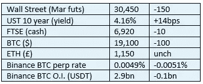

# 好奇的密码评论 2022 年 10 月 20 日

> 原文：<https://medium.com/coinmonks/curious-cryptos-commentary-20th-october-2022-bdee46d25e14?source=collection_archive---------43----------------------->

**TL；博士**

Glassnode Analytics 也认为低波动性不会持续太久。

**市场抢购**

**市场包装**

收益率不断攀升，风险资产岌岌可危。

**偶发系列——每日之星**

这不是我通常的首选出版物，但你不得不嘲笑它的腐烂生菜直播，问它是否会比利兹·特拉斯持续更长时间:

[https://www.youtube.com/watch?v=Sm-RE95lKJ0](https://www.youtube.com/watch?v=Sm-RE95lKJ0)

**好奇的 Cryptos 评论— Glassnode 分析和波动性**

我昨天提到，波动性处于两年低点，而且不太可能长期保持这种状态。

我应该去 Glassnode Analytics 看看他们的最新报告:

[https://insights . glass node . com/the-week-on chain-week-42-2022/](https://insights.glassnode.com/the-week-onchain-week-42-2022/)

这篇报道的标题泄露了这个游戏——“螺旋弹簧”。

用比我多得多的数据分析，也用更优雅的表达，Glassnode 得出了和我一样的结论

他们的出发点实际上和我的一样，尽管我的分析在那里嘎然而止:

接下来，该分析研究了实际波动率——与期权价格的隐含波动率相反，期权价格实际上处于历史低点:

根据 Glassnode:

“对于 BTC 市场来说，达到如此低的已实现波动性是非常罕见的，几乎所有以前的例子都是在高度波动之前发生的。在熊市中，1 周滚动波动率低于当前值 28%的历史例子，在价格双向大幅波动之前就出现过。

这差不多就是我昨天所说的。算是吧。

下一个要考虑的指标是 aSOPR，它衡量任何特定日期硬币的平均实现利润/损失。

高于 1.0 的数字表示正在获利，而低于 1.0 的数字表示正在亏损:

从心理学角度来说。当市场情绪积极时，人们可能会预期持有者会热衷于以之前的收购成本增持。当市场情绪消极时，人们可能会认为持有者会急于以收购成本脱手。

我认为后一个因素是过去几个月的主要驱动力，并将继续给市场带来压力，直到更广泛的投资领域看起来更加积极。我通过数百次加密对话了解自己，许多在牛市期间买入的加密所有者会抓住机会平仓。

就我个人而言，我认为这将是一个错误(不是投资建议)，尽管这是一种完全可以理解的情绪。

**合规的东西**

触发警惕警告——如果任何读者在读完我的评论后，觉得自己“真的在颤抖”(正如一名达勒姆学生所声称的，他无法在情绪上应对不同的观点)，那么我只能建议你不要读，或者不要颤抖。这取决于你。

Cryptos——我的任何评论都不应该被视为参与 cryptos 的建议。我可能在不知道的情况下胡说八道。任何加密投资都必须被视为极高的风险，并被视为在出售前价值为零。

股票——只是为了说明这不是股票咨询服务。CCC 团队不提供任何形式的财务建议。本注释中对资产价格的任何引用都是为了简单地给出注释的上下文，并为与密码相关的某些股票的表现增添色彩。

为避免疑问，本通讯不是煽动购买密码，购买股票，甚至出售家庭成员希望购买密码或股票。

请注意，所有版权归好奇密码有限公司所有。

礼貌地要求偶尔分享和复制，你的愿望就会实现。

这封信或我们网站的新订户总是最受欢迎的。

[www.curiouscryptos.com](http://www.curiouscryptos.com)

medium.com/@mark_curiouscryptos

> 交易新手？试试[密码交易机器人](/coinmonks/crypto-trading-bot-c2ffce8acb2a)或[复制交易](/coinmonks/top-10-crypto-copy-trading-platforms-for-beginners-d0c37c7d698c)