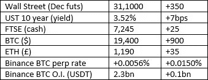

# 好奇的密码 2022 年 9 月 20 日评论

> 原文：<https://medium.com/coinmonks/curious-cryptos-commentary-20th-september-2022-9dfd2ccc372c?source=collection_archive---------46----------------------->

**TL；博士**

又一次 ETH 硬分叉更新。我保证我们很快会有新的进展。

**市场抢购**

**市场包装**

永久期货融资利率的大逆转，我昨天错误地报告为+0.0094%，而不是-0.0094%。抱歉。

昨天晚些时候，我们看到股票上涨，使 cryptos 重回绿色。两万美元再次出现在前挡风玻璃上。

**好奇的 Cryptos 评论——积极的价格预测**

在一片灰暗之中，让我们引用彭博公司高级商品策略师迈克·麦格隆的一句话来让自己振作起来:

“比特币对我来说，涨到 10 万美元只是时间问题。关键的事实是，采用和需求正在增加，除非你预计这种情况会逆转，但我认为这不会发生。它(BTC 的价格)会继续升值；现在只是时间问题。”

这很好，但他给出的时间框架是 2025 年，对我来说有点太长了。

**好奇 Cryptos 的解说— ETH 硬叉更新**

我知道我们一直在重温这个主题，但情况一直在变化，在 cryptos 的世界里没有明确的“如何做”指南，当然，除非有人阅读 CCC。

和以往一样，简单回顾一下是合适的。然而，如果你没有跟上合并的速度，或者没有跟上工作证明的硬分叉(有两个)，快速浏览一下最近的核心承诺([https://www.curiouscryptos.com/blog](https://www.curiouscryptos.com/blog))会给你带来无穷的好处。

合并进行得很顺利。合并前 ETH 的所有者在合并后处于完全相同的位置。

除了那些把 ETH 放在自己保管的钱包里和一些集中交易所里的人。日期为 9 月 17 日的 CCC 有更多细节([https://www . curiouscryptos . com/post/17-September-2022-2-eth-hard-forks](https://www.curiouscryptos.com/post/17th-september-2022-2-eth-hard-forks))在此不再赘述。

对于属于某些类别的 ETH 所有者，您现在也是 ETHW (ETH PoW)和 ETF(以太坊博览会)的自豪所有者。我们已经看到了如何在 MetaMask 中显示您的新硬币(同样是[https://www . curious cryptos . com/post/17-September-2022-2-eth-hard-forks](https://www.curiouscryptos.com/post/17th-september-2022-2-eth-hard-forks)),我们还看到了如何将 ETHW 货币化([https://www . curious cryptos . com/post/18-September-2022-eth-hard-fork](https://www.curiouscryptos.com/post/18th-september-2022-eth-hard-fork))。

我必须在此重申关于重演袭击可能性的警告。我听说过重放攻击的报告，但这些都被归咎于不正确的(和伪造的)链 id。

随便啦。如果您想出售 ETH，最佳做法是将您的 ETH 转移到一个新的钱包，或者先转移到一个集中的交易所。如果这看起来太麻烦，就把 ETHW 的价值一笔勾销吧。忽略它。假装什么都没发生过。

…

也有人问我关于 ETF 的问题，以及应该做些什么。由于 ETHW 目前在几个集中交易所的交易价格约为 6 美元，ETF 的情况有些模糊。

Huobi 的市场售价为 1.39 美元。存款需要特别的 120 个网络确认，但我只能假设这是合法的。如果我今天有时间卖掉我的 ETF，我会让你知道我的进展。

波洛涅克斯的市场价格约为 4.70 美元，这表明存在套利机会，而且利润丰厚。

不幸的是，Poloniex 不允许 ETF 的存款或提款，这意味着这个市场是一个需要抵押品的合成市场。进一步挖掘后，我发现了一份新闻稿，其中 Poloniex 表示，他们已经在其网站上将 ETHW 更名为 ETF，这向我表明，他们并不真正理解这是两种不同区块链上的两种不同硬币。也许我应该送他们的 CEO 一份免费的 CCC 来帮助他/她/他们？

这种困惑将解释 4.70 美元的价格，这与 ETF 和 ETHW 的真实中间价相差不远。Poloniex 上 ETF 合成形式的卖家相信新闻稿。Poloniex 上 ETF 合成形态的买家相信 Poloniex 会扭转他们不正确的决定。鉴于平均价格为 3.70 美元，Poloniex 上的买家目前赢得了这场争论。

**合规材料**

触发警报警告——如果任何读者在读完我的评论后，觉得自己“真的在颤抖”(正如一名达勒姆大学的学生所声称的，他无法在情绪上应对 Rod Liddle 提出的不同观点),那么我只能建议你不要读，或者不要颤抖。这完全取决于你。

Cryptos——我的任何评论都不应该被视为参与 cryptos 的建议。我可能在不知道的情况下胡说八道。任何加密投资都必须被视为极高的风险，并被视为在出售前价值为零。

股票——只是为了说明这不是股票咨询服务。CCC 团队不提供任何形式的财务建议。本注释中对资产价格的任何引用都是为了简单地给出注释的上下文，并为与密码相关的某些股票的表现增添色彩。

为避免疑问，本通讯不是煽动购买密码，购买股票，甚至出售家庭成员希望购买密码或股票。

请注意，所有版权归好奇密码有限公司所有。

礼貌地请求分享和复制，你的愿望就会实现。

这封信或我们网站的新订户总是最受欢迎的。

[www.curiouscryptos.com](http://www.curiouscryptos.com)

> 交易新手？试试[密码交易机器人](/coinmonks/crypto-trading-bot-c2ffce8acb2a)或者[复制交易](/coinmonks/top-10-crypto-copy-trading-platforms-for-beginners-d0c37c7d698c)