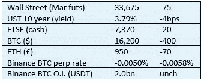

# 《好奇的密码》2022 年 11 月 21 日评论——灰度

> 原文：<https://medium.com/coinmonks/curious-cryptos-commentary-21st-november-2022-1b04ae55a850?source=collection_archive---------24----------------------->

**TL；博士**

我对灰度感到失望，我有点担心。

**市场抢购**

**市场包装**

对于 cryptos 来说，这是一个艰难的夜晚，BTC 短暂地失去了与 16 手柄的联系，这可能是由于对 DCG(数字资本集团)的持续猜测，是创世纪全球贸易和创世纪全球资本的母公司(见 CCC 2022 年 11 月 17 日)。如果你还记得的话，全球资本已经关上了大门，人们有理由担心全球贸易可能会紧随其后。DCG 还有另一个重要的稳定的商业运作——灰度。更多详情见下文。

**好奇的 Cryptos 评论——我对此很不高兴**

我一直是灰度的粉丝。

他们是 cryptos 的早期采用者，努力为零售和机构客户带来 cryptos 的投资机会，没有执行或保管风险。

他们以每年 2%的高额费用提供了这种卓越的服务，但公平地说，他们不断推动 SEC 将他们的信托转变为 ETF(交易所交易基金),这将为竞争对手打开闸门。竞争是一种远比任何政府强制法令更有效的降低成本的方式，无论是租金控制、2025 年后英国政府支出的据称削减，还是任何其他形式的强制。

灰度并不仅仅是出于善意而试图大幅削减自己的利润。

BTC 信托的交易价格比其资产低 50%左右，这为那些获得监管批准的人提供了参与机会，但这个群体不包括你我。更确切地说，如此大的折扣阻止了 grow 发行更多自己信托的股票，我毫不怀疑，高级管理层更愿意在整体回报率较低但上升空间较大的情况下发展业务，而不是坐在静止的业务堆上为那 2%的股份摸屁股。

…

但是现在我有点担心了。

自 FTX 欺诈案惨败以来，我们看到了对集中式加密货币交易所的“储备证明”的推动。

毫不奇怪，对灰度也提出了同样的要求。

到目前为止，他们的反应并不令人满意:

“比特币基地经常进行在线验证。出于安全考虑，我们不会通过加密的储备证明或其他高级加密会计程序公开此类链上钱包信息和确认信息。”

我应该在这里指出，比特币基地是灰度的监护人。

…

嗬哼。

这种说法对我来说毫无意义。

在公钥和私钥的加密世界中(更多细节请参见我们在 https://www.curiouscryptos.com/cccourses 举办的免费在线培训课程)，没有理由不公开自己的公钥。

灰度以一种完全没有说服力的方式解决了这个问题:

“我们知道，特别是前一点会让一些人失望，但其他人引发的恐慌不足以成为绕过复杂安全安排的理由，这些安排多年来一直确保我们投资者的资产安全。"

也许 50%的折扣告诉我们一些不好的事情。我真的不希望。

**好奇密码解说——密码赌注第二部**

我知道你们都非常渴望开始自己的个人标桩之旅，但我必须告诉你，第二部分——由于报告上述信息的紧迫性——已被推迟到明天。

事情就是这样，别想了。

**合规玩意儿**

触发警惕警告——如果任何读者在读完我的评论后，觉得自己“真的在颤抖”(正如一名达勒姆学生所声称的，他无法在情绪上应对不同的观点)，那么我只能建议你不要读，或者不要颤抖。这取决于你。

Cryptos——我的任何评论都不应该被视为参与 cryptos 的建议。我可能在不知道的情况下胡说八道。任何加密投资都必须被视为极高的风险，并被视为在出售前价值为零。

股票——只是为了说明这不是股票咨询服务。CCC 团队不提供任何形式的财务建议。本注释中对资产价格的任何引用都是为了简单地给出注释的上下文，并为与密码相关的某些股票的表现增添色彩。

为避免疑问，本通讯不是煽动购买密码，购买股票，甚至出售家庭成员希望购买密码或股票。

请注意，所有版权归好奇密码有限公司所有。

礼貌地要求偶尔分享和复制，你的愿望就会实现。

这封信或我们网站的新订户总是最受欢迎的。

[www.curiouscryptos.com](http://www.curiouscryptos.com)

[medium.com/@mark_curiouscryptos](mailto:medium.com/@mark_curiouscryptos)

> 交易新手？尝试[加密交易机器人](/coinmonks/crypto-trading-bot-c2ffce8acb2a)或[复制交易](/coinmonks/top-10-crypto-copy-trading-platforms-for-beginners-d0c37c7d698c)