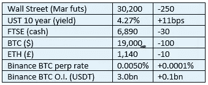

# 好奇的密码评论 2022 年 10 月 21 日

> 原文：<https://medium.com/coinmonks/curious-cryptos-commentary-21st-october-2022-473cdf2f9124?source=collection_archive---------35----------------------->

**TL；博士**

XRP(涟漪)更新。

**市场抢购**

**市场包装**

长期国债价格直线下跌。

这是所有主要新闻媒体在过去两周一直在尖叫的市场混乱吗？到目前为止，没有任何实际数据来支持他们耸人听闻和不准确的报道。

**偶然系列——经济学家**

以贬义的方式使用陈旧的比喻。好，好，好。

我的订阅被取消了。我敦促你也这样做。

**好奇 Cryptos 的评论——XRP(涟漪)更新**

简单回顾一下，回到时间的迷雾中——确切地说是 2020 年 12 月 22 日，当时 BTC 的股价在 20 出头——Ripple Labs 收到了美国证券交易委员会(SEC)的诉讼，声称该公司一直在以 XRP 的形式出售未注册证券。

这不是一个微不足道或晦涩难懂的指控。罚款和监禁都很严厉。这也可能对整个密码行业产生巨大的影响，我们将在后面讨论。

在这起诉讼的直接后果中，XRP 失去了其市值 280 亿美元的一半，尽管我注意到今天它又回到了 220 亿美元。

与此同时，这场法律斗争是由 Ripple Labs 非常公开地进行的，这是一个不寻常的事件转折。美国证券交易委员会非常强大，它的权威很少像现在这样受到挑战。无论你支持哪只狗，这都不是坏事——我们立法过程的透明度是我们西方自由主义司法哲学的重要基石。

…

Ripple Lab 的辩护似乎基于威廉·辛曼(William Hinman)在 2018 年发表的一篇演讲的背景，当时他正在美国证券交易委员会休假。

在那次演讲中，基于他个人对 BTC 和 ETH 去中心化程度的看法，他宣称它们是商品。特别是，他似乎承认，尽管联邦理工学院最初是一家证券公司，但其随后的去中心化使这一事实变得无关紧要。

这是一个有趣的立场，似乎与世界各地所有已知的监管和立法惯例不一致。

随便啦。

有人指控威廉·希曼妥协了，因为他以前的律师事务所保留了以太坊基金会作为客户。鉴于地球上每个人之间六度分隔的假设，这在我看来是一种荒谬而牵强的诽谤，但请不要向 XRP 福音派重复这一点。之后的几个星期，他们会对你我大喊大叫。

…

经过一场旷日持久的法庭斗争，证交会最终放弃了与威廉·希曼演讲相关的文件和电子邮件往来。

不幸的是，法院已经同意了 SEC 的要求，这份文件证据仍然保密，所以我们不能自己看。

然而，Ripple 总法律顾问斯图尔特·奥尔德罗蒂的最初反应并不留情:

“经过 18 个月和 6 次法庭指令后，我们终于有了辛曼文件(SEC 内部电子邮件和他臭名昭著的 2018 年演讲的草稿)。尽管(在证交会的坚持下)这些信息目前仍处于保密状态，但我可以说，为了获得这些信息，这场斗争是非常值得的。”

并且:

“我一直对我们的法律论点感觉良好，现在感觉更好了。我一直对证交会的策略感到不满，现在更是如此。”

Ripple 首席执行官布拉德·加林豪斯说:

“证交会希望你认为，它关心信息披露、透明度和清晰度。不要相信他们。当真相最终大白的时候，他们在这里的行为之可耻会让你震惊。”

我感觉我们已经接近结局了。

…

关键问题是这个。除了 XRP (*)的持有者之外，为什么我们中的任何人都关心呢？

贯穿整个 2022 年的一个主题是 SEC 对 BTC 和 ETH 以外的加密货币的监管地盘感。不过，在合并之后，甚至后者现在也进入了 SEC 主席加里·詹斯勒的视野。祝你好运。

美国最近提出的立法，特别是 Lummis-Gillibrand 法案(见 CCC 2022 年 6 月 8 日、9 日和 15 日以及许多其他法案)试图解决一个棘手的问题，即哪些密码是证券，哪些是商品。BTC 和瑞士法郎都是商品，这一点已经确定，但是关于所有其他硬币的争论还在继续。

证券法的出台是有充分理由的。他们在那里保护投资者，这显然是一件好事。

但正如我们从 Lummis-Gillibrand 法案(获得 CCC 的批准)中看到的那样，Howey 测试工具是否是证券非常难以应用于数字世界。它与 cryptos 的相关性是有争议的。

在我看来，更好的做法是，密码通常被认为是商品，除非特别是作为证券。

这将为立法和监管提供空间，与市场参与者一起制定专门适用于加密领域的规则，这些规则在鼓励和促进创新和发展的同时保护投资者。

这场 SEC 对 Ripple Labs 的诉讼是决定我们将走哪条路的重要途径。

…

对于更深入和有见地的历史，我衷心推荐这篇新闻，而不是我简短的涂鸦:

[https://decrypt . co/78153/ripple-inside-the-sec-case-that-can-make-or-break-the-crypto-industry](https://decrypt.co/78153/ripple-inside-the-sec-case-that-could-make-or-break-the-crypto-industry)

…

(*)出于披露目的，CCC 最近在 XRP 进行了第一笔投资，预计这一法律程序将取得积极成果。

**合规玩意儿**

触发警惕警告——如果任何读者在读完我的评论后，觉得自己“真的在颤抖”(正如一名达勒姆学生所声称的，他无法在情绪上应对不同的观点)，那么我只能建议你不要读，或者不要颤抖。这取决于你。

Cryptos——我的任何评论都不应该被视为参与 cryptos 的建议。我可能在不知道的情况下胡说八道。任何加密投资都必须被视为极高的风险，并被视为在出售前价值为零。

股票——只是为了说明这不是股票咨询服务。CCC 团队不提供任何形式的财务建议。本注释中对资产价格的任何引用都是为了简单地给出注释的上下文，并为与密码相关的某些股票的表现增添色彩。

为避免疑问，本通讯不是煽动购买密码，购买股票，甚至出售家庭成员希望购买密码或股票。

请注意，所有版权归好奇密码有限公司所有。

礼貌地要求偶尔分享和复制，你的愿望就会实现。

这封信或我们网站的新订户总是最受欢迎的。

[www.curiouscryptos.com](http://www.curiouscryptos.com)

medium.com/@mark_curiouscryptos

> 交易新手？试试[密码交易机器人](/coinmonks/crypto-trading-bot-c2ffce8acb2a)或[复制交易](/coinmonks/top-10-crypto-copy-trading-platforms-for-beginners-d0c37c7d698c)