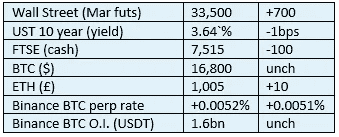

# 《好奇的密码》2022 年 12 月 22 日评论——又是美国

> 原文：<https://medium.com/coinmonks/curious-cryptos-commentary-22nd-december-2022-u-s-again-bf4eda2b34b1?source=collection_archive---------51----------------------->

**TL；博士**

对私有 stablecoins 的监管无疑会给密码支持者带来意想不到的好处。

**市场抢购**

**市场包装**

自近一周前跌破 17k 美元以来，BTC 一直处于非常狭窄的区间内。随着 BTC 矿业公司 Core Scientific 宣布破产，负面消息仍在打压市场人气。疯狂地试图筹集一些新的资金，这些资金不会完全消灭股东，并可能推迟租赁付款，直到 BTC 的价格回升，任何不会导致他们被迫出售 BTC 股票的决议都将是一件好事。

**偶遇系列——山姆·班克曼-弗里德**

诈骗犯和江湖骗子班克曼-弗里德抵达纽约法院，受到 FTX 和阿拉米达研究公司其他高管承认诈骗并正在与联邦政府合作的消息的欢迎。他不太可能再次离开监狱。

**好奇密码的评论——美国对稳定密码的监管**

参议员帕特·图米在下个月退休前的最后一次重要干预中，提出了一项直接针对稳定收入的新法案。Pat 之前已经表明了他对 stablecoins 的支持，他说:

“通过将美元数字化，并使其在全球范围内即时、几乎免费地可用，stablecoins 可以以各种方式在实体经济中广泛使用。”

有一些政客使用完全相同的论点支持 CBDCs(央行数字货币)，但他们中很少有人能被信任说真话——他们支持 CBDCs 的动机在各个层面上都要险恶得多。

这项名为 2022 年稳定硬币信托法案的立法有一些广泛而重要的目标，侧重于加强投资者保护，并建立对这些产品的信心。

所有稳定的债券必须由高质量的流动资产支持，这是对短期美国国债的一种长期说法(或至少是暗示)，短期美国国债现在提供超过 4%的体面收益率，期限最长为一年。鉴于其与美元价值的 100%相关性，以及本金和利息支付的 100%保证，成功的 stablecoins 无疑最有可能走上这条道路。

特别排除了算法支持的稳定点，如 UST。这种算法未能维持与美元的挂钩，导致了 UST 和卢娜的迅速和戏剧性的崩溃，这是 2022 年密码界的关键负面事件之一。要想详细而迅速地了解这些事件，你可以看看 2022 年 5 月在 https://www.curiouscryptos.com/[出版的几版 CCC。](https://www.curiouscryptos.com/)

在稳定币破产的情况下，稳定币持有者被指定为最优先的债权人。

授权的会计师事务所需要进行定期的公开审计，大概总部在美国。

稳定债券不会被归类为证券，尽管任何为稳定债券提供计息账户的组织都必须遵守证券法。

最后——这是有趣的一点——非银行机构可以发行稳定货币，只要它们遵守规则，并获得 OCC(货币监理署)颁发的联邦许可证。

…

如果这项立法获得通过和实施，我们可以看到在许多不同的区块链发行高质量的美元挂钩稳定货币的爆炸式增长，为商品和服务提供近乎即时和几乎免费的支付。

这对我们有两个非常积极的影响。

首先，从商业和零售的角度来看，这一发展将把一批全新的用户引入加密世界。这对 cryptos 的长期采用只会是积极的。

第二，在这种性质的监管制度下，私营稳定货币无疑会取得成功，因此不再需要公营稳定货币，即美元 CBDC。那些认为政府应该尽可能减少对我们生活的干预的人将会为这一举措大声欢呼。

**合规材料**

触发警报警告。

如果任何读者在读完我的评论后觉得他们“真的在颤抖”(这是一名达勒姆大学的学生提出的说法，他无法在情感上——当然也无法在智力上——应对罗德·利德尔表达的不同观点)，那么我只能建议你不要读，或者不要颤抖。这取决于你。

Cryptos——我的任何评论都不应该被视为参与 cryptos 的建议。我可能在不知道的情况下胡说八道。任何加密投资都必须被视为极高的风险，并被视为在出售前价值为零。

股票——只是为了说明这不是股票咨询服务。CCC 团队不提供任何形式的财务建议。本注释中对资产价格的任何引用都是为了简单地给出注释的上下文，并为与密码相关的某些股票的表现增添色彩。

为避免疑问，本通讯不是煽动购买密码，购买股票，甚至出售家庭成员希望购买密码或股票。

请注意，所有版权归好奇密码有限公司所有。

礼貌地要求偶尔分享和复制，你的愿望就会实现。

这封信或我们网站的新订户总是最受欢迎的。

【www.curiouscryptos.com 号

【medium.com/@mark_curiouscryptos 

> 交易新手？试试[加密交易机器人](/coinmonks/crypto-trading-bot-c2ffce8acb2a)或者[复制交易](/coinmonks/top-10-crypto-copy-trading-platforms-for-beginners-d0c37c7d698c)
> 
> 多样化的密码持有，了解[币安替代品](https://coincodecap.com/binance-alternatives)
> 
> 加入 Coinmonks [电报频道](https://t.me/coincodecap)和 [Youtube 频道](https://www.youtube.com/c/coinmonks/videos)获取每日[加密新闻](http://coincodecap.com/)

# 另外，阅读

*   [复制交易](/coinmonks/top-10-crypto-copy-trading-platforms-for-beginners-d0c37c7d698c) | [加密税务软件](/coinmonks/crypto-tax-software-ed4b4810e338)
*   [网格交易](https://coincodecap.com/grid-trading) | [加密硬件钱包](/coinmonks/the-best-cryptocurrency-hardware-wallets-of-2020-e28b1c124069)
*   [密码电报信号](/coinmonks/top-3-telegram-channels-for-crypto-traders-in-2021-8385f4411ff4) | [密码交易机器人](/coinmonks/crypto-trading-bot-c2ffce8acb2a)
*   [最佳加密交易所](/coinmonks/crypto-exchange-dd2f9d6f3769) | [印度最佳加密交易所](/coinmonks/bitcoin-exchange-in-india-7f1fe79715c9)
*   开发人员的最佳加密 API
*   最佳[密码借贷平台](/coinmonks/top-5-crypto-lending-platforms-in-2020-that-you-need-to-know-a1b675cec3fa)
*   [免费加密信号](/coinmonks/free-crypto-signals-48b25e61a8da) | [加密交易机器人](/coinmonks/crypto-trading-bot-c2ffce8acb2a)
*   [杠杆代币的终极指南](/coinmonks/leveraged-token-3f5257808b22)