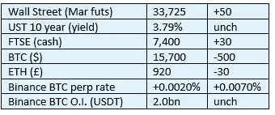
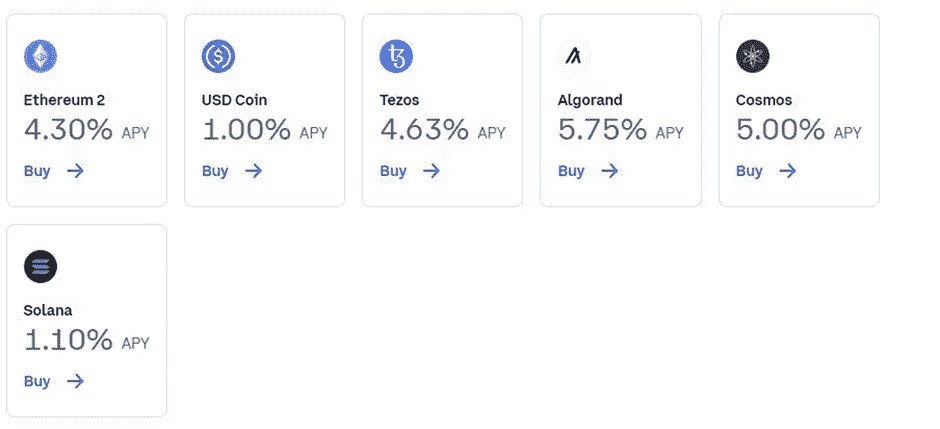
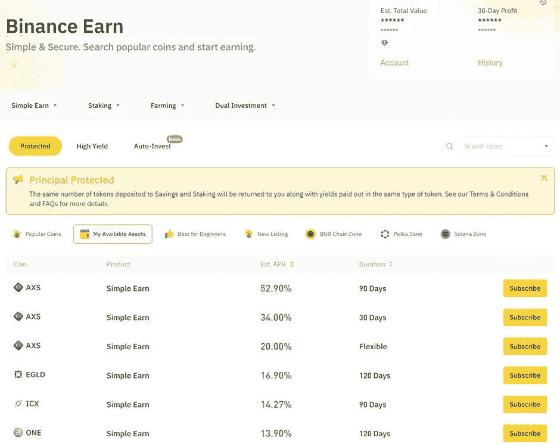

# 《好奇的密码》2022 年 11 月 22 日评论—密码标桩第二部分

> 原文：<https://medium.com/coinmonks/curious-cryptos-commentary-22nd-november-2022-crypto-staking-part-2-cf14da7df05b?source=collection_archive---------48----------------------->

【2022 年 11 月 22 日

合规的东西在我每日信件的末尾。

**TL；博士**

加密赌注第 2 部分着眼于加密货币交易的中央化世界。

**市场抢购**

**市场包装**

创世纪全球贸易公司即将倒闭的传言对加密价格造成了沉重的压力。甚至有人担心其母公司 DCG(数字货币集团)。当这样一个杰出的参与者的偿付能力受到质疑时，BTC 的价格没有合理的复苏前景。

**好奇密码的评论——加密赌注第 2 部分——集中与分散**

加密定位有两种主要形式——集中定位和分散定位。

两者各有优点，也各有缺点。集中下注是目前最简单的选择，尽管它也有自己独特的风险。我们将看看今天的中央化世界。

…

大多数(如果不是全部的话)中央加密货币交易所将会奖励你在交易所存放和存储你的加密货币。例如，这是比特币基地目前提供的服务:

我应该指出，当然是在 ETH 的情况下，也可能是在 XTZ (Tezos)的情况下。ALGO(algrand)和 ATOM (Cosmos)，比特币基地在比特币基地环境之外以分散的方式下注。但是现在，不要担心这个问题——我保证，在本周晚些时候的加密赌注指南中，一切都会变得清晰。

…

币安提供一种被称为“简单赚”的产品:

您将大量硬币中的任何一个存入其中一个计划，并选择在特定时期内冻结资金，或者保留在没有通知的情况下移除资金的灵活性。前者吸引了更高的利率——AXS(Axie Infinity)目前为 90 天的锁定期支付了超过 50%的年利率，但在最近几年已经超过了 100%。

同样，对 AXS 来说，币安自己也在以分散的方式把你的硬币押在币安生态系统的外部，从交易中获利。

对于大多数硬币，币安简单赚取支付几个百分点的年利率，然后这只是一个营销策略，由币安吸引客户存款。

…

所有其他集中式加密货币交易所将以类似的方式运作，所有硬币的利率大相径庭。

你最想问的问题是——风险是什么？

最重要的风险很简单。正如 FTX 最近的欺诈性惨败所证明的那样，如果你存放硬币的交易所破产——或者像多年前 Mt. Gox 那样被黑客攻击——你将失去多达 100%的加密资产，并且你期望取回的任何硬币在未来几年甚至几十年内都不会支付给你。

FTX 破产有几个原因，但我们知道的一件事是，客户存款被借给了 Alameda Research，它是一家对冲基金的姊妹公司，而且经营非常糟糕。我怀疑许多其他类似的企业也是这样做的。

我经常重复说，你永远不应该在一个集中的交易所储存超过 5-10%的密码，而且当你这样做的时候，你应该只使用比特币基地或币安。

…

根据 2022 年 11 月 17 日 CCC 的报道，上述风险的一个必然结果最近席卷了那些参加过 Gemini Earn 计划的人:

“Gemini 是一家由文克莱沃斯双胞胎创建的中央加密货币交易所，他们之前试图声称对脸书拥有版权。

Gemini 与 Genesis Global Capital 建立了合作伙伴关系，通过一个名为“earn”的项目，将客户的资金贷出，为客户赚取回报。那些资金现在被冻结了，Gemini 发表了一份声明:

“我们知道，Earn 计划的贷款合作伙伴 Genesis Global Capital，LLC (Genesis)已经暂停提款，无法在 5 个工作日的服务水平协议(SLA)内满足客户赎回要求。我们正在与 Genesis 团队合作，帮助客户尽快从 Earn 计划中赎回他们的资金。”

这意味着，尽管 Gemini 仍然功能齐全(至少目前如此),但他们零售客户的大部分资金现在无法获得，也不知道这种情况何时会改变。"

Gemini Earn 计划的订户签署了 Ts & Cs，明确表示他们的资金将被借出。我发现，居然有人会考虑签订这样一份协议，这真是不可思议。这样做的人对风险管理一无所知或了解。

…

如果你问我，我持有的密码有多大比例是押在比特币基地或币安的，答案非常简单。

确切地说是零，因为我相信风险大于潜在的回报，但这是个人决定——你必须自己拿主意。我在比特币基地或币安持有的唯一硬币是用于交易目的或作为短期投机袋，所有东西都被长期冷藏起来。

**合规材料**

触发警惕警告——如果任何读者在读完我的评论后，觉得自己“真的在颤抖”(正如一名达勒姆学生所声称的，他无法在情绪上应对不同的观点)，那么我只能建议你不要读，或者不要颤抖。这取决于你。

Cryptos——我的任何评论都不应该被视为参与 cryptos 的建议。我可能在不知道的情况下胡说八道。任何加密投资都必须被视为极高的风险，并被视为在出售前价值为零。

股票——只是为了说明这不是股票咨询服务。CCC 团队不提供任何形式的财务建议。本注释中对资产价格的任何引用都是为了简单地给出注释的上下文，并为与密码相关的某些股票的表现增添色彩。

为避免疑问，本通讯不是煽动购买密码，购买股票，甚至出售家庭成员希望购买密码或股票。

请注意，所有版权归好奇密码有限公司所有。

礼貌地要求偶尔分享和复制，你的愿望就会实现。

这封信或我们网站的新订户总是最受欢迎的。

[www.curiouscryptos.com](http://www.curiouscryptos.com)

medium.com/@mark_curiouscryptos

> 交易新手？试试[密码交易机器人](/coinmonks/crypto-trading-bot-c2ffce8acb2a)或[复制交易](/coinmonks/top-10-crypto-copy-trading-platforms-for-beginners-d0c37c7d698c)