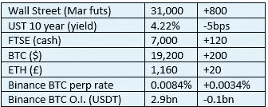

# 好奇的密码评论 2022 年 10 月 22 日

> 原文：<https://medium.com/coinmonks/curious-cryptos-commentary-22nd-october-2022-36bbdee91106?source=collection_archive---------39----------------------->

**TL；博士**

看起来我们有另一个 ETH 硬分叉潜在的走向我们。

**市场抢购**

**市场包装**

由长期利率波动推动的股票波动(不管谁碰巧在英国被称为 PM)并没有影响到 cryptos。

更多的这种价格行为，或者更准确地说，缺乏价格行为，将使我想要参与一些潜在更有利可图的事情。

**偶遇系列——好奇 Cryptos 的空投通告**

《CCAC》的第六版已于昨天发给订户。更多细节，请参考 2021 年 1 月 12 日和 2022 年 5 月 29 日好奇 Cryptos 的评论。

如果你想免费使用这项附加服务，请通过电子邮件告诉我。

**偶然系列——划船**

英国赛艇——英国赛艇比赛的规则制定者——规定变性运动员(任何性别)的睾丸激素水平必须低于 5 纳摩尔/升(每升 5 纳摩尔),才能作为女性参赛。

女性——我使用我们都理解的传统意义上的这个词——平均睾酮水平在 0.5 到 2.4 nmol/l 之间。

如果任何读者认为睾丸激素在从童年到成年的转变过程中不会带来身体和体型上的优势，而这些优势在大多数运动中脱颖而出，尤其是像划船、拳击和橄榄球这样的运动，那么坦白地说，你是在和布谷鸟生活在一起。

**好奇的 Cryptos 评论—技术分析(感谢牛奶之路)**

[https://www.milkroad.com/subscribe?ref=o5CmCFhBAK](https://www.milkroad.com/subscribe?ref=o5CmCFhBAK)

明白了。

**好奇 Cryptos 的解说——又一个 ETH 硬叉？**

合并前的 ETH 所有者——他们没有注意到 CCC 对出售新闻可能带来的好处的思考——现在也是 ETHW(以太坊作品)和 ETHF(以太坊博览会)的骄傲所有者。

看起来越来越有可能的是，ETH 的所有者将很快在他们的投资组合中用 ETHC(以太坊审查)和 ETHU(以太坊未审查)取代这些股份。

我应该指出，这种潜在的事件并没有迫在眉睫，ETHC 和埃图现在已经成为 cryptos 中公认的术语的一部分——我自己创造了它们，原因将变得很清楚。

…

老读者记得美国政府批准了 Tornado Cash(见 2022 年 8 月 10 日、12 日、16 日和 2022 年 9 月 28 日的 CCC 等)。

这一行动遭到了真正的自由主义者的恐惧，而另一部分人则幸灾乐祸。

作为背景，如果你懒得重读旧的 CCC(没有人会抱怨你不这样做)，Tornado Cash 是(几乎是)一个混合器。通过将许多输入混杂到钱包输出中，这是掩盖硬币来源的有效方法。

那些狭隘的人幼稚地认为，这种功能只能用于邪恶的目的，同时方便地忽略了 500 欧元钞票对毒品贩子是多么有用，而对其他任何人都是如此。

OFAC(外国资产办公室)试图关闭 Tornado Cash，效果有限，几乎肯定是立法过度，尽管这一假设的测试极不可能在法庭上解决。

显然，这样的制裁不会持续太久，现在它已经恢复运行([https://www.torndo.cash/](https://www.torndo.cash/))。

“龙卷风现金”只是一段代码，我们这些认识到去中心化给人类带来巨大好处、厌恶集权化有害后果的人，对这一结果感到高兴。

…

但是法律的手臂很长。大部分时间都是这样。

为区块链以太坊处理交易的节点位于世界各地，但其中相当一部分位于美国。由于害怕经济处罚，甚至更害怕在美国监狱中的时间，美国的节点正在审查与 Tornado Cash 公共地址相关的交易。

这在实践中意味着，如果基于美国的节点在 PoS(赌注证明)共识机制下被选择来创建下一个以太坊块，它将拒绝并入来自与 Tornado 现金相关联的钱包的硬币输出。这样的交易完全被忽略。

在上周的某个时候，超过 50%的验证节点已经接受了这个限制。

尽管 OFAC 的行为可能是非法的，当然也是越权的，但它正在实现其善意但被误导的目标。

…

这意味着，在某种程度上，我们已经有了 ETHC 和埃图，虽然两者现在可以互相替换。

这种可替代性到底有多可持续？

**合规玩意儿**

触发警惕警告——如果任何读者在读完我的评论后，觉得自己“真的在颤抖”(正如一名达勒姆学生所声称的，他无法在情绪上应对不同的观点)，那么我只能建议你不要读，或者不要颤抖。这取决于你。

Cryptos——我的任何评论都不应该被视为参与 cryptos 的建议。我可能在不知道的情况下胡说八道。任何加密投资都必须被视为极高的风险，并被视为在出售前价值为零。

股票——只是为了说明这不是股票咨询服务。CCC 团队不提供任何形式的财务建议。本注释中对资产价格的任何引用都是为了简单地给出注释的上下文，并为与密码相关的某些股票的表现增添色彩。

为避免疑问，本通讯不是煽动购买密码，购买股票，甚至出售家庭成员希望购买密码或股票。

请注意，所有版权归好奇密码有限公司所有。

礼貌地要求偶尔分享和复制，你的愿望就会实现。

这封信或我们网站的新订户总是最受欢迎的。

[www.curiouscryptos.com](http://www.curiouscryptos.com)

medium.com/@mark_curiouscryptos

> 交易新手？试试[密码交易机器人](/coinmonks/crypto-trading-bot-c2ffce8acb2a)或[复制交易](/coinmonks/top-10-crypto-copy-trading-platforms-for-beginners-d0c37c7d698c)