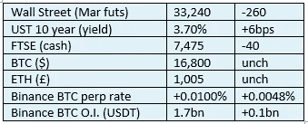

# 《好奇的密码》2022 年 12 月 23 日评论——印度

> 原文：<https://medium.com/coinmonks/curious-cryptos-commentary-23rd-december-2022-india-98594aa33da?source=collection_archive---------58----------------------->

**TL；博士**

印度央行(Reserve Bank of India)声称自己是世界上最脱离实际的央行。

**市场抢购**

**市场包装**

BTC 似乎在宣称自己是世界上最稳定的储备资产。

**好奇的 Cryptos 评论——印度**

Shaktikanta Das 是印度中央银行印度储备银行(RBI)的行长。

他不能被描述为一个密码支持者:

“加密货币对我们的宏观经济和金融稳定具有……巨大的内在风险。”

他采取了加密唱反调者的通常观点，即只考虑潜在的负面影响，而不承认或欣赏实际的正面影响。这可能是由于无知，缺乏智慧，害怕失去控制，或者只是为了自己的个人利益而喜欢混淆视听，但无论是什么原因，他都在损害自己的信誉。

> 从顶级交易者那里复制交易机器人。免费[试用](https://coincodecap.com/go/pionex-coinmonks)。

他想要的结果是可以预见的，尽管完全不切实际:

“我……认为应该禁止”。

然后，他重复了一个最近得到一些播放时间的论点，大概是这样的:

“……如果允许它增长——如果你试图监管它并允许它增长——请记住我的话，下一场金融危机将来自私人加密货币。”

我印象深刻的是，他的军械库中有一个如此精确的水晶球，但对于各国央行近期的行动，在此之前使用这样一个强大的武器或许会更明智。

…

毫无疑问，过度负债的政府、企业和个人的当前和潜在的长期金融危机是由于过去十年中所有政府和中央银行过度印钞造成的。

如果 Das 认为密码应该被禁止，因为他认为它们会导致金融危机，我很好奇他为什么没有对自己的机构使用同样的逻辑。毕竟，他的纳税人出资的养老金无疑是丰厚的。

他可能会认为主权国家需要一家央行作为最后贷款人，我会接受这一观点。

但这种认为央行在某种程度上独立于它们的出资人，并认为它们应该被允许在收益率曲线上参与批发市场利率操纵的观点，坦率地说是荒谬的，对普通人来说，远比密码更危险。

…

这里有一个美丽的讽刺。

BTC 是中本聪(他肯定不是幻想家克雷格·赖特)发明的，目的正是为了对抗央行的行动和它们无节制的印钞。

众所周知，有史以来第一个 BTC 区块提到了英国对其零售银行的纾困，这远远超出了最后贷款人的授权，并使英国成为此前私人机构的公共股东。让我们在这里明确一点，这不是一种政治立场。我很高兴在这一点上被纠正——但我不相信在人类历史上有任何银行国有导致更好结果的例子。

加密革命是对抗技术官僚和政治精英的必要壁垒，这些人试图按照自己的意愿而非现实来统治世界。

他们自作自受。

**合规材料**

触发警报警告。

如果任何读者在读完我的评论后觉得他们“真的在颤抖”(这是一名达勒姆大学的学生提出的说法，他无法在情感上——当然也无法在智力上——应对罗德·利德尔表达的不同观点)，那么我只能建议你不要读，或者不要颤抖。这取决于你。

Cryptos——我的任何评论都不应该被视为参与 cryptos 的建议。我可能在不知道的情况下胡说八道。任何加密投资都必须被视为极高的风险，并被视为在出售前价值为零。

股票——只是为了说明这不是股票咨询服务。CCC 团队不提供任何形式的财务建议。本注释中对资产价格的任何引用都是为了简单地给出注释的上下文，并为与密码相关的某些股票的表现增添色彩。

为避免疑问，本通讯不是煽动购买密码，购买股票，甚至出售家庭成员希望购买密码或股票。

请注意，所有版权归好奇密码有限公司所有。

礼貌地要求偶尔分享和复制，你的愿望就会实现。

这封信或我们网站的新订户总是最受欢迎的。

www.curiouscryptos.com

【medium.com/@mark_curiouscryptos 

> 加入 Coinmonks [电报频道](https://t.me/coincodecap)和 [Youtube 频道](https://www.youtube.com/c/coinmonks/videos)了解加密交易和投资

# 另外，阅读

*   [用信用卡购买密码的 10 个最佳地点](https://coincodecap.com/buy-crypto-with-credit-card)
*   [加拿大最佳加密交易机器人](https://coincodecap.com/5-best-crypto-trading-bots-in-canada) | [Bybit vs 币安](https://coincodecap.com/bybit-binance-moonxbt)
*   [阿联酋 5 大最佳加密交易所](https://coincodecap.com/best-crypto-exchanges-in-uae) | [SimpleSwap 点评](https://coincodecap.com/simpleswap-review)
*   购买 Dogecoin 的 7 种最佳方式
*   [最佳期货交易信号](https://coincodecap.com/futures-trading-signals) | [流动性交易所评论](https://coincodecap.com/liquid-exchange-review)