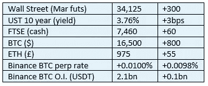

# 《好奇的密码》2022 年 11 月 23 日评论——创世纪

> 原文：<https://medium.com/coinmonks/curious-cryptos-commentary-23rd-november-2022-genesis-eeac495d058d?source=collection_archive---------26----------------------->

**TL；博士**

创世纪/DCG 号的最新情况，可能会变得很糟糕。

**市场抢购**

**市场包装**

永续期货市场恢复了平衡，因为市场似乎认为，最近的加息预测可能有点过头了。我们只能希望如此。

技术人员声称这是一个空头陷阱，但是在你得到你想要的结果之前，图表上没有多少曲线可以告诉我们创世纪情况的结果——见下文。

**偶遇系列—沙特？？？？**

嗯，这不会有助于 CCC 在阿根廷球迷标志 ARG 的投资。太典型了。第一届(现在也是唯一一届)世界杯，当我希望阿根廷赢得一些比赛时，这就发生了。

我可能会买一艘船，从斯坦利港出发，独自前往布宜诺斯艾利斯以示抗议。

那会教他们。

**好奇的 Cryptos 评论——创世纪更新**

创世纪全球资本——DCG(数字货币集团)旗下的借贷业务在 FTX 欺诈事件后暂停了客户提款。环球资本披露，FTX 银行冻结了 1.75 亿美元的客户资金。值得注意的是，这并不是 FTX 持有的最大一笔股份——其价值接近 2.5 亿美元，所有者尚未公开。

我真的希望 2.25 亿美元左右只代表该持有人的 5-10%的秘密储存，正如 CCC 所建议的那样。

环球资本已经任命投资银行莫里斯公司为其提供选择建议，以避免宣布破产。莫里斯公司参与了航海家数字破产程序。

DCG 现已宣布，将于 2023 年 5 月向环球资本(Global Capital)提供 5.75 亿美元贷款。鉴于 2022 年的预期收入仅为 8 亿美元，不难看出 DCG 在筹集资金偿还贷款方面可能会遇到一些问题。

如果环球资本(Global Capital)通过将其 5 亿美元的新股发行目标提高至 10 亿美元，避免了破产，那么这些公司可以自由地重新谈判贷款条款。如果环球资本被宣布资不抵债，你可以 100%肯定清算人会起诉 DCG 要求偿还，很可能会让 DCG 破产。

真是一团糟。

…

DCG 从 Global Capital 借入资金，用于股票回购和其他投资。

我们再一次看到杠杆在起作用，相关风险的结合残酷地加剧了这些问题。

TradFi 经常遇到同样的问题，但越来越明显的是，许多加密业务将从雇用具有 25 年以上投资银行经验的资深人士来帮助他们避免犯这些错误中受益匪浅。

我想知道谁想要我的简历？现在排好队。

…

这又把我们带回了灰度及其比特币信任的话题。

两天前，CCC 报告称，出于虚假和毫无意义的原因，gray 拒绝提供公开的储量证明。

gray 公司支持其 cryptos 信托的 cryptos 存放在比特币基地。

比特币基地是一家受法律、法规和季度审计约束的上市公司，它公开声明灰度储备一切正常。

这是非常令人鼓舞的消息。

**合规材料**

触发警惕警告——如果任何读者在读完我的评论后，觉得自己“真的在颤抖”(正如一名达勒姆学生所声称的，他无法在情绪上应对不同的观点)，那么我只能建议你不要读，或者不要颤抖。这取决于你。

Cryptos——我的任何评论都不应该被视为参与 cryptos 的建议。我可能在不知道的情况下胡说八道。任何加密投资都必须被视为极高的风险，并被视为在出售前价值为零。

股票——只是为了说明这不是股票咨询服务。CCC 团队不提供任何形式的财务建议。本注释中对资产价格的任何引用都是为了简单地给出注释的上下文，并为与密码相关的某些股票的表现增添色彩。

为避免疑问，本通讯不是煽动购买密码，购买股票，甚至出售家庭成员希望购买密码或股票。

请注意，所有版权归好奇密码有限公司所有。

礼貌地要求偶尔分享和复制，你的愿望就会实现。

这封信或我们网站的新订户总是最受欢迎的。

www.curiouscryptos.com

【medium.com/@mark_curiouscryptos 

> 交易新手？尝试[加密交易机器人](/coinmonks/crypto-trading-bot-c2ffce8acb2a)或[复制交易](/coinmonks/top-10-crypto-copy-trading-platforms-for-beginners-d0c37c7d698c)