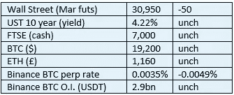

# 好奇的密码 2022 年 10 月 23 日评论

> 原文：<https://medium.com/coinmonks/curious-cryptos-commentary-23rd-october-2022-c850a52f4cbf?source=collection_archive---------24----------------------->

**TL；博士**

加密技术的应用继续快速发展。

**市场抢购**

**市场包装**

到目前为止，我们还从未在市场抢购中看到过五个 unches (*)。

尽管如此，大多数大型新闻媒体仍在兜售市场动荡的故事，大多数人——不熟悉如何跟踪市场本身——将继续相信这是对世界的真实和公平的描述，尽管这显然是错误的。

我们可以很容易地检验这个假设。

与迷你预算之前相比，你认为今天英镑是高了还是低了？

与迷你预算之前相比，你认为今天富时指数是高了还是低了？

答案如下，尽管全世界的反向投资者只需要相信他们的直觉。

**偶然系列—哦，我的天**

今天标志着卢顿镇回归维卡里奇路，这是自 2006 年以来首次有满座观众观看这场激烈的本地德比。

我第一次体验这个游戏是在 1979 年 12 月 26 日。0-0 直到伤停补时(那时候伤停补时可能只有一分钟或者更少，不像我们最近在主场对阵斯旺西时看到的 17 分钟)卢顿在 Rookery 的右手边有一个角球，那时是客场球迷的主场。

我的记忆——尽管可能因为中间的 43 年而有所减少——是一名对方球员跳过我们的防线，坚定地将球顶入球门的右上角。

远端变得疯狂。我想 12 岁的我可能哭了。

…

让我们希望今天不会重复这种情况。

**好奇密码的评论——密码采用**

尽管我们发现自己正处于持续的熊市之中，但真正的企业仍在继续将加密功能添加到他们的现实世界运营中。

对于今天的皈依者，我为你带来全球外汇巨头 Oanda([https://www.oanda.com/uk-en/](https://www.oanda.com/uk-en/))。

通过与受监管的区块链公司 Paxos Trust Foundation 合作，Oanda 应用程序和网站的用户现在可以轻松使用加密交易功能。

你可以在这里阅读新闻稿:

[https://www . prnewswire . com/news-releases/oanda-launchs-crypto-trading-service-in-the-us-301654737 . html](https://www.prnewswire.com/news-releases/oanda-launches-crypto-trading-service-in-the-us-301654737.html)

给你几条精选语录:

“此次发布标志着 OANDA 发展进入了一个激动人心的新阶段，为美国市场创造了重大机遇。随着寻求接触加密货币的美国人越来越多，数字资产应该成为活跃交易员和老练投资者统一交易体验的一部分，这一点变得越来越明显。”

Oanda 首席执行官 Gavin Bambury。

“机构投资进入 cryptos 和区块链技术的演变导致了一个稳定期，Schwab、Citadel 和 Fidelity 等主要参与者在 cryptoverse 中推出了新的数字资产产品。”

埃德莫亚，OANDA 的高级市场分析师。

…

我要在这里重复我的话，我不会为此道歉。

这些开发加密功能的公司投入了大量的现金和高级管理资源。

唯一的理由是，这些举措是为了响应客户的需求，这种需求与 BTC 的价格无关，每天都在增长。

…

(*)不，这并不是因为今天是周日。这些市场中唯一一个不是每周七天开放的是国债市场。所有其他市场的运作与任何工作日一样，尽管流动性减少，使得市场不变的可能性更小。

…

测验答案——是的，英镑和富时指数今天都上涨了，尽管后者的涨幅很小。

请注意，这些评论不应被解释为支持迷你预算，它们只是表达我的信念的一种方式，即市场报告的标准远远低于它应该达到的水平。

**合规材料**

触发警惕警告——如果任何读者在读完我的评论后，觉得自己“真的在颤抖”(正如一名达勒姆学生所声称的，他无法在情绪上应对不同的观点)，那么我只能建议你不要读，或者不要颤抖。这取决于你。

Cryptos——我的任何评论都不应该被视为参与 cryptos 的建议。我可能在不知道的情况下胡说八道。任何加密投资都必须被视为极高的风险，并被视为在出售前价值为零。

股票——只是为了说明这不是股票咨询服务。CCC 团队不提供任何形式的财务建议。本注释中对资产价格的任何引用都是为了简单地给出注释的上下文，并为与密码相关的某些股票的表现增添色彩。

为避免疑问，本通讯不是煽动购买密码，购买股票，甚至出售家庭成员希望购买密码或股票。

请注意，所有版权归好奇密码有限公司所有。

礼貌地要求偶尔分享和复制，你的愿望就会实现。

这封信或我们网站的新订户总是最受欢迎的。

www.curiouscryptos.com

【medium.com/@mark_curiouscryptos 

> 交易新手？试试[加密交易机器人](/coinmonks/crypto-trading-bot-c2ffce8acb2a)或者[复制交易](/coinmonks/top-10-crypto-copy-trading-platforms-for-beginners-d0c37c7d698c)